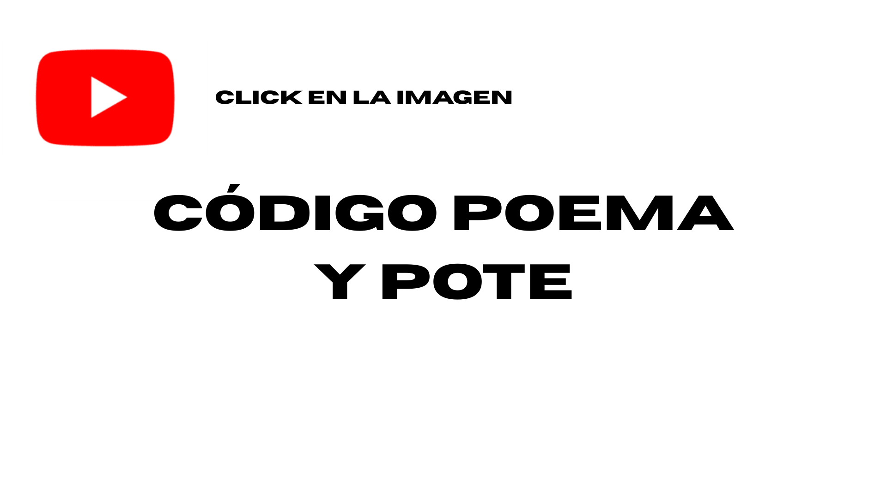

# proyecto-01

## Acerca del proyecto

- Grupo 01: 2al+

- Integrantes:
  - Dayana Pañitrur / [dayanapanitrur](https://github.com/dayanapanitrur)
  - Camila Ramírez / [Estrabismx](https://github.com/Estrabismx)
  - Bianka Vilchez / [biankavilchezs](https://github.com/biankavilchez)
  

## Licencia

Esta obra y su documentación están bajo una [Licencia Creative Commons Atribución-CompartirIgual 4.0 Internacional](https://creativecommons.org/licenses/by-sa/4.0/).

© 2026 [Dayana Pañitrur, Camila Ramírez, Bianka Vilchez]

<br>

## Poema

El poema elegido fue: 

$\textcolor{red}{When\ Our\ Two\ Souls\ Up}$


Por: 

$\textcolor{red}{Elizabeth\ Barrett\ Browning}$


Elizabeth Barret Browning nació en el año 1806 en Inglaterra. Reconocida por su reputación literaria, en una época en la cuál era poco frecuente que las mujeres fueran más reconocidas que los hombres en muchos contextos, pero por sobre todo en el ámbito académico, por las normas morales que existían sobre el rol de la mujer, Elizabeth estaba casada con Robert Browning, quién también era poeta. Su familia tenía una situación económica privilegiada, pero ella discrepaba con la mayoría de las ideas colonialistas que tenían, en contra de la esclavización que ellos mismos efectuaban y que les generaba el gran poder económico que tenían.

La obra de Elizabeth que elegimos se llama Soneto 22 y es parte de la colección *Sonetos del portugués*. Que data entre 1845 y 1846.

Según la *Academia de Poetas Americanos* el poema se encuentra en dominio público.

Interpretamos el poema como la intención de rehusarse a la muerte por la causa del amor. Desprenderse de lo terrenal implicaría dejar de sentir y vivir el amor romántico como se vive día a día, para someter amor al cielo y a la eternidad, lugar en el que ya no sería permitido el estar con su ser amado.

<br>

### Poema original  

<br>

When our two souls stand up erect and strong,

Face to face, silent, drawing nigh and nigher,

Until the lengthening wings break into fire

At either curvèd point,—what bitter wrong

Can the earth do to us, that we should not long

Be here contented? Think. In mounting higher,

The angels would press on us and aspire

To drop some golden orb of perfect song

Into our deep, dear silence. Let us stay

Rather on earth, Belovèd,—where the unfit

Contrarious moods of men recoil away

And isolate pure spirits, and permit

A place to stand and love in for a day,

With darkness and the death-hour rounding it.

<br>

> **Aviso de Dominio Público:** El material _When Our Two Souls Up_ utilizado en este repositorio se encuentra en el dominio público. Ha sido identificado como libre de restricciones bajo los derechos de autor (PDM 1.0).

<br>

<br>

### Poema traducido

<br>

**Cuando nuestras dos almas se eleven**

<br>

Cuando nuestras dos almas se eleven, firmes y fuertes,

frente a frente, en silencio, acercándose más y más, 

hasta que las alas que se alargan estallan en fuego 

en cada punta curva ¿qué mal amargo 

puede hacernos la tierra, que no debiéramos 

quedarnos aquí, contentos? Piénsalo. Al subir más alto, 

los ángeles nos oprimirían y aspirarían 

a dejar caer algún áureo orbe de canto perfecto

en nuestro hondo, querido silencio. Quedémonos

mejor en la tierra, Amado mío, donde los ánimos

contrarios e injustos de los hombres retroceden

y aíslan a los espíritus puros, y permiten

un lugar donde estar y amar por un día,

con la oscuridad y la hora de la muerte rodeándolo.

<br> 

> Traducción elaborada por Dayana Pañitrur, Camila Ramírez y Bianka Vilchez (2026).
>
> Distribuido bajo la licencia CC BY-SA 4.0. Para ver una copia de esta licencia, visita https://creativecommons.org/licenses/by-sa/4.0/

<br>

---

## Bill of materials

| Componente | Cantidad | Link de compra |
| :--- | :---: | ---: |
| Arduino UNO R4 Wifi | 1 | https://arduino.cl/products/arduino-uno-r4-wifi |
| Pantalla LCD Azul 16x02 | 1 | https://afel.cl/products/pantalla-lcd-azul-16x02 |
| Potenciómetro lineal (10k ohm) | 1 | https://afel.cl/products/potenciometro-10k-ohm |
| Botón pulsador | 2 | https://afel.cl/products/boton-tactil-tapa-12x12x7-3-interruptor |


### Pantalla LCD Azul 16X02

A diferencia de la mayoría de los grupos decidimos utilizar esta pantalla, debido a su mayor tamaño y por su configuración, ya que está pensada para solo mostrar texto, es más sencillo, sumado que posee un controlador estandarizado. Pero todo eso lo veremos ahora con las caracterisiticas de esta pantalla


> Directamente desde [Afel](https://afel.cl/products/pantalla-lcd-azul-16x02)

#### Caracteristicas

- **Formato** 16 caracteres por 2 lineas

- **Voltaje funcionamiento** 5V

- **Controlador** SPLC780D1 o compatible con HD44780

- **Retroiluminación (Backlight)** LED de color azul con caracteres blancos.

- **Interfaz** Paralela, configurable para operación de 4 bits u 8 bits.

- **Tipo de Pantalla** STN (Super-twisted Nematic) de tipo negativo.

- **Protocolo** HD44780 (Comunicación Paralela Nativa)

<br>

## Código

### Coreografía

1. Inicia el Arduino

2. El texto avanzará de manera continua hasta que se presionen los botones o se manipule el potenciómetro 

3. En caso de ser solo 1, el texto se congela y no sigue avanzando hasta que se deje de presionar

4. Si son los 2 botones, se detiene el texto y desaparece

5. Mientras esto ocurre, se consulta en qué sección del texto se encuentra

6. En base a la sección del texto mostrado, se visualizará una palabra clave

7. Al dejar de presionar un botón, vuelve a ocurrir el punto 3

8. Si se sueltan ambos botones, desaparece la palabra

9. Luego continúa avanzando el texto desde el mismo punto en el que quedó

10. En caso de ser manipulado el potenciómetro, se modificará la velocidad del texto (mientras más lejos del centro, más rápido el cambio)

11. Si se rota hacia la derecha avanza de manera normal solo variando la velocidad

12. Si se rota hacia la izquierda retrocede el texto, según qué tan lejos del centro esté

<br>

Además de esto realizamos el primer diagrama de flujo relacionado al funcionamiento del código


> Bastante básico en relación a la complejidad que posee el código

<br>


> Ahora podemos entender de mejor manera el funcionamiento del código

<br>


> Grafico que muestra la relación del potenciómetro con la velocidad del poema

<br>


## Proceso

### Referentes

1. [los vengadores mish](https://github.com/disenoUDP/dis8645-2025-2-procesos/tree/main/00-proyecto-01/grupo04)

Proyecto desarrollado en el curso el año pasado.

Este se carecterizo por trabajar y prototipar software online, similares a TinkerCad

Además nos llamó la atención el como desarrollan y explican su proceso, más allá de los resultados o los elementos que utilizaron para trabajar


<br>

2. [Francisco Roco - Arducover](https://www.tiktok.com/@aeroroco)

Esta persona consta en su perfil de diversos covers a canciones, realizados en un Arduino UNO R3

La peculiaridad es que además muestra la letra de las canciones en un display LCD Verde 16X02

En estos videos, por cada canción existe una visualización del texto difernete. Algo bastante llamativo a pode lograr 

Listado de algunos videos relevantes:

- [Mira Niñita](https://www.tiktok.com/@aeroroco/video/7682581195867163922)

- [Por que no se van](https://www.tiktok.com/@aeroroco/video/7667037271639526664)

- [Mienteme una vez](https://www.tiktok.com/@aeroroco/video/7627724582861950226)


<br>

3. [Wireless Altoids Display](https://atmega32-avr.com/wireless-altoids-display/)

Proyecto que utiliza un microntrolador para tener un visualizar de datos inalambrico utiliza tambien una pantalla del tipo LCD 16 x 02

A pesar de ser un proyecto enfocado en mostrar datos duros, nos comparte una visión de poder incluir y configurar una pantalla, tratando de salir de carcasas tan sofisticadas cuando no son necesarias


<br>

### Imagenes
|  |  |  |
|- | - | - |
|  |  |  | 
|  |  |  |
|  |  |


### Etapa inicial

#### **Poema descartado (copyright)**

> [!NOTE]
>
> Como inicio, el poema que elegimos fue "_cine_" de Victoria Ramírez Mansilla, el cual no concretamos su implementación por el **_Copyright_**. Sin embargo, nos ayudó a encaminar y aportó a expandir el marco conceptual del proyecto.

<br>

```txt

Cine - Victoria Ramírez Mansilla

luces bajas y escaleras de lava negra
me toman la mano y es una mano áspera
casi todas las manos de mujer son suaves

el deseo se me presenta como una cuenca
acomodo las palmas y ellas se adaptan
a las cosas que sospecho amar

me dejo llevar por el cordel
apenas logro concentrarme en la historia
mi pecho es un instrumento de viento
demasiado distante

quiero decir que admiro la manera
en que el cuello sostiene su cabeza

quiero decir que entiendo
la entrega de la fracción
de la fracción de la fracción.

```

El poema habla de dos personas en un cine: mientras se supone que ven la película, la persona que narra se distrae completamente tocando y observando a la otra (su mano, su cuello), sin poder concentrarse en la historia. Al final dice que solo logra recibir un poquito de esa cercanía, no todo.

Luego de comprender mejor el poema, decidimos hacer una lluvia de ideas con **acciones clave**, por ejemplo acciones típicas de un cine y cómo se visualizan. De esa lluvia de ideas seleccionamos algunos conjuntos.

<br>

**acciones típicas del cine de suspenso (lluvia de ideas):**

Aparecer lentamente, desaparecer lentamente, parpadear, interrumpirse, cortar, congelarse, acercarse/zoom, alejarse, temblar, vibrar, perder el foco, desenfocarse, repetirse, esperar, pausar, perseguir, seguir, observar, ocultar, revelar, fragmentar, distorsionar, desvanecer, acelerar, frenar, interrumpir abruptamente

<br>

**palabras clave visuales (lluvia de ideas):**

Tensión, silencio, espera, oscuridad, sombra, distancia, cercanía, secreto, duda, misterio, presencia, ausencia, rastro, huella, fragmento, vacío, eco, respiración, susurro, persecución, inquietud, anticipación, revelación, ocultamiento, interferencia

<br>

**Selección final:**

- congelarse
- pausar
- revelar
- fragmentar
- acelerar
- distancia
- cercanía
- respiración
- interferencia
- buscar alguna solución

Luego de nuestro trabajo conceptual y la lluvia de ideas, decidimos cambiar el poema a trabajar, ya que al encontrarse bajo **_Copyright_** no poseiamos las facultades para el uso del poema en en el contexto requerido. Como ya teníamos algo una idea encaminada, buscamos un poema que abordara la misma temática y donde pudiéramos utilizar nuestras palabras clave.

<br>

#### **Nuevo poema**

Elegimos un poema de Elizabeth Barret Browning, el cual cumple con los requerimientos en sus licencias (debido a la fecha de muerta de la autora pertenece al dominio público). Luego, hicimos nuestra propia traducción del poema.

<br>

Versión Original

```txt

Sonet XXII / When our two souls stand up - Elizabeth Barret Browning

When our two souls stand up erect and strong,
Face to face, silent, drawing nigh and nigher,
Until the lengthening wings break into fire
At either curvèd point,—what bitter wrong
Can the earth do to us, that we should not long
Be here contented? Think. In mounting higher,
The angels would press on us and aspire
To drop some golden orb of perfect song
Into our deep, dear silence. Let us stay
Rather on earth, Belovèd,—where the unfit
Contrarious moods of men recoil away
And isolate pure spirits, and permit
A place to stand and love in for a day,
With darkness and the death-hour rounding it.

```

<br>

Versión Traducida

```txt
Cuando nuestras dos almas se eleven, firmes y fuertes,
frente a frente, en silencio, acercándose más y más, 
hasta que las alas que se alargan estallan en fuego 
en cada punta curva ¿qué mal amargo 
puede hacernos la tierra, que no debiéramos 
quedarnos aquí, contentos? Piénsalo. Al subir más alto, 
los ángeles nos oprimirían y aspirarían 
a dejar caer algún áureo orbe de canto perfecto
en nuestro hondo, querido silencio. Quedémonos
mejor en la tierra, Amado mío, donde los ánimos
contrarios e injustos de los hombres retroceden
y aíslan a los espíritus puros, y permiten
un lugar donde estar y amar por un día,
con la oscuridad y la hora de la muerte rodeándolo.

```

La traducción se hizo por nosotras con apoyo de inteligencia artificial, se reemplazaron algunas palabras por otras que considerábamos más adecuadas.

[traduccion-poema-ia](./pdfs-ia/traduccion-poema.pdf)

> ![ATENTION]
>
> En chile, la ley n° 17.336 de propiedad intelectual protege solo las obras hechas por personas naturales, por lo que las obras creadas de forma 100% con ia entrarían en dominio público.


##### Relación entre el poema final y las ideas del proyecto

En este poema se aborda la relación entre el amor y el apego, se nos habla de dejar de lado la ídea de alcanzar el cielo catolico y quedarnos en un mundo terrenal lleno de _muerte_. Abandonar la idea de lo dívino y apegarnos a la realidad terrenal, todo esto por el amor romantico. 

Tomando este eje central de un amor que busca mantenerse impoluto y evitando la separación, es que desarrollamos la máquina visualizadora de poemas **_"2al+"_**. Acá se busca que 2 personas interactuen y pongan a prueba su conexión para poder dejar de lado una idea original, para poder llegar a su propio mundo (el que es representado por la aparición de un nuevo poema hecho a partir del original), además de que si una de las aprtes abandona la máquina en el proceso, el tiempo se congela (se detiene el texto)

<br>

En base a nuestras palabras clave y a de qué trata el texto, tomamos las siguientes decisiones:

- Para **aceleración**: decidimos trabajar con la velocidad del texto, cómo este se va a mostrar y a leer.
- Para **fragmentar - pausar - revelar**: pensamos en revelar fragmentos del texto mientras este va avanzando.
- Buscamos generar una acción que dependa de otra, para que juntas puedan formar algo nuevo.

Asignación de elementos a las acciones

- **Potenciómetro**: define la velocidad del poema, cómo este avanza o retrocede.
- **Botones**: presionando solo un botón, el texto se detiene y con dos botones. Una pulsación breve revela una palabra y manteniendo los dos botones presionados, se puede ver un poema nuevo.

### Pseudo código

#### **Listado de pasos**

1. Inicia el arduino.
2. El texto avanza de manera continua hasta que se presionen los botones o se manipule el potenciómetro.
3. Si se presiona solo 1 botón, el texto se congela y no sigue avanzando hasta que se deje de presionar.
4. Si se presionan los 2 botones, el texto se detiene y desaparece.
5. Mientras esto ocurre, se consulta en qué sección del texto se encuentra.
6. En base a la sección del texto mostrado, se visualiza una palabra clave.
7. Al dejar de presionar un botón, vuelve a ocurrir el punto 3.
8. Si se sueltan ambos botones, desaparece la palabra.
9. Luego continúa avanzando el texto desde el mismo punto en el que quedó.
10. En caso de ser manipulado el potenciómetro, se modifica la velocidad del texto (mientras más lejos del centro, más rápido el cambio).
11. Si se rota hacia la derecha, avanza de manera normal solo variando la velocidad.
12. Si se rota hacia la izquierda, retrocede el texto según qué tan lejos del centro esté.

<br>

##### Situaciones que podrían entrar en conflicto

- Botones presionados en distinto orden o con distinto timing**: qué pasa si se presiona primero A y luego B con unos milisegundos de diferencia — ¿debería contar como "2 botones" igual, o solo si están presionados exactamente al mismo tiempo?
- Límites del arreglo `versosPoema[]`**: qué ocurre si `versoActual` llega al último verso mientras el potenciómetro sigue "avanzando" — hay que definir si se detiene, hace loop, o muestra un mensaje de fin.
- **Potenciómetro en el centro exacto**: si "más lejos del centro = más rápido", hay que decidir qué pasa justo en el centro (¿velocidad 0, o un mínimo definido para que no quede completamente detenido?).
- Rebote de botones (debounce)**: una sola pulsación física puede leerse como varias si no se filtra, lo que podría hacer parpadear la palabra clave o saltar versos de más.
- **transición entre 1 botón y 2 botones**: si ya se está mostrando la palabra clave (1 botón) y se presiona el segundo, hay que definir si pasa directo a "texto desaparece" o si necesita soltar primero.

#### Estados de la máquina

1. **Texto Inicial**: Ocurre una sola vez al inicio y muestra el nombre y licencia del proyecto, además del nombre de la autora y del poema
2. **Poema original avanzando**: Se visualiza `versosPoema[]` avanzando de manera ordenada
3. **Poema original avanzando**: Se visualiza `versosPoema[]` retrocediendo verso por verso
4. **Poema original congelado**:  `versosPoema[]` detiene su desplazamiento y queda estático al presionar un solo botón
5. **Palabra clave de cada verso**: Aparece una palabra o frase relacionada al verso que se estaba visualizando. Esta aparecera al presionar 2 botónes de manera simultanea por menos de 2 segundos y durará 3 segundos en pantalla
6. **Nuevo poema**: El poema es reemplazado por otro, que está creado a partir de palabras del poema original. Será visible siempre que ambos botónes se activen en simultaneo por más de 2 segundos, desaparece si se deja de presionar uno de los botónes

<br>

#### Tabla palabras claves

| Verso completo | Palabra clave |
|--------------- | ------------- |
| Cuando nuestras dos almas se eleven, firmes y fuertes, | firme y fuerte |
| frente a frente, en silencio, acercandose mas y mas, | acercándose |
| hasta que las alas que se alargan estallan en fuego | estallan |
| en cada punta curva que mal amargo | en cada | 
| puede hacernos la tierra, que no debiéramos | tierra |
| quedarnos aqui, contentos? Piensalo. Al subir más alto, | contentos |
| los angeles nos oprimirian y aspirarian | oprimiran | 
| a dejar caer algun aureo orbe de canto perfecto | algun |
| en nuestro hondo, querido silencio. Quedemonos | silencio
| mejor en la tierra, Amado mio, donde los animos | amado mio
| contrarios e injustos de los hombres retroceden | injusto |
| y aislan a los espiritus puros, y permiten| aislan |
| un lugar donde estar y amar por un dia, | lugar | 
| con la oscuridad y la hora de la muerte rodeandolo. | muerte |

#### Variables y arreglos

```cpp
// poema principal, un verso por casilla
char *versosPoema[] = {
  "Cuando nuestras dos almas se eleven, firmes y fuertes,",
  "frente a frente, en silencio, acercandose mas y mas,",
  "hasta que las alas que se alargan estallan en fuego",
  "en cada punta curva que mal amargo",
  "puede hacernos la tierra, que no debieramos",
  "quedarnos aqui, contentos? Piensalo. Al subir mas alto,",
  "los angeles nos oprimirian y aspirarian",
  "a dejar caer algun aureo orbe de canto perfecto",
  "en nuestro hondo, querido silencio. Quedemonos",
  "mejor en la tierra, Amado mio, donde los animos",
  "contrarios e injustos de los hombres retroceden",
  "y aislan a los espiritus puros, y permiten",
  "un lugar donde estar y amar por un dia,",
  "con la oscuridad y la hora de la muerte rodeandolo.",
};
const int cantidadVersos = 14;

// segundo poema: se muestra mientras se mantienen ambos botones (> 2 seg)
char *segundoPoema[] = {
  "firme y fuerte",
  "acercandose",
  "estallan",
  "en cada",
  "tierra",
  "contentos",
  "oprimiran",
  "algun",
  "silencio",
  "amado mio",
  "injusto",
  "y aislan",
  "un lugar",
  "de la muerte",
};

// palabra por verso: aparece con pulsacion corta de ambos botones (<= 2 seg)
char *palabraVerso[] = {
  "firme y fuerte",
  "acercandose",
  "estallan",
  "en cada",
  "tierra",
  "contentos",
  "oprimiran",
  "algun",
  "silencio",
  "amado mio",
  "injusto",
  "aislan",   // nota: sin "y"
  "lugar",    // nota: sin "un"
  "muerte",   // nota: sin "de la"
};
``` 

##### Variables

```cpp
char *versosPoema[] = {
  "Cuando estan nuestras almas frente a frente,",
  "mudas, erguidas, fuertes, ya muy proximas,",
  "y sus alas se encienden al tocarse,",
};

bool botonA = true;        // true si el boton A esta presionado
bool botonB = true;        // true si el boton B esta presionado

const int botonAPin = 2;   // pin del boton A
const int botonBPin = 3;   // pin del boton B

int versoActual = 0;       // indice del verso actual
bool versoDetenido = false; // true si el texto esta congelado
bool palabraVisible = false; // true si la palabra clave esta en pantalla

char *palabrasClave[] = {
  "mano",
  "deseo",
  "cordel",
};

int posX = 128;             // posicion horizontal del texto
const int intervalo = 3000; // duracion de cada verso (ms)
unsigned long tiempoAnterior = 0; // ultimo momento actualizado (millis())
```

##### Funciones 

- `textoInicial()`
- `mostrarPoema()`
- `mostrarPalabra()`
- `mostrarNuevoPoema()`

### Codi-Gooooo

#### Texto inicial 

El código del proyecto nacio con una pequeña prueba, en la que se le solicito a Gemini la siguiente petición

```txt

Genera un código para Arduino IDE, en el cual se pueda imprimir en la pantalla "Prueba LCD" "Sistema OK"

Este código debe estar pensado para una pantalla LCD Verde de 16 caracteres en 2 filas. Considera el siguiente controlador SPLC780D1 o compatible con HD44780.

Además de encontrarme trabajando en un Arduino UNO R4 WIFI. Donde nos estamos conectando a esta pantalla mediante una protoboard, la cual ya se encuentra poblada con la pantalla.

El código debe venir con comentarios que indiquen que secciones corresponde a que elementos, además de mencionar como actua cada función y que se puede editar en sus variables

```

<br>

---

>[!TIP]
> $\color{green}{\text{Casilla desplegable 👁️}}$


<details>
<summary><b>Código Inicial en bruto por Gemini</b></summary>

<br>

```cpp
/* 
 * ============================================================================
 * CONTROL DE PANTALLA LCD 16x2 - ARDUINO UNO R4 WIFI
 * Controlador: SPLC780D1 / HD44780
 * ============================================================================
 */

// 1. INCLUSIÓN DE LIBRERÍAS
// Esta librería contiene todas las funciones necesarias para hablar con el controlador de la pantalla.
#include <LiquidCrystal.h>

// 2. CONFIGURACIÓN DE PINES (Variables Editables)
// Aquí definimos a qué pines digitales del Arduino UNO R4 WiFi conectaremos los pines de datos de la LCD.
// Puedes editar estos números si decides conectar los cables en otros pines digitales (ej. cambiar el 12 por un 8).
const int rs = 12; // Pin RS (Register Select) de la LCD conectado al pin 12 del Arduino
const int en = 11; // Pin EN (Enable) de la LCD conectado al pin 11 del Arduino
const int d4 = 5;  // Pin D4 de la LCD conectado al pin 5 del Arduino
const int d5 = 4;  // Pin D5 de la LCD conectado al pin 4 del Arduino
const int d6 = 3;  // Pin D6 de la LCD conectado al pin 3 del Arduino
const int d7 = 2;  // Pin D7 de la LCD conectado al pin 2 del Arduino

// 3. CREACIÓN DEL OBJETO LCD
// Se inicializa la librería pasando como parámetros las variables de los pines que definimos arriba.
// El orden de las variables debe mantenerse estrictamente así: (RS, EN, D4, D5, D6, D7).
LiquidCrystal lcd(rs, en, d4, d5, d6, d7);

// 4. CONFIGURACIÓN INICIAL (Se ejecuta una sola vez al encender o reiniciar el Arduino)
void setup() {
  
  // lcd.begin(columnas, filas);
  // Esta función le dice al Arduino las dimensiones de tu pantalla. 
  // Editable: Si en el futuro usas una pantalla de 20x4, cambiarías a lcd.begin(20, 4);
  lcd.begin(16, 2);

  // lcd.setCursor(columna, fila);
  // Mueve el cursor donde empezará a escribirse el texto. Ambas posiciones empiezan a contar desde el cero.
  // (0, 0) significa: primera columna (0), primera fila (0).
  lcd.setCursor(0, 0);
  
  // lcd.print("Texto");
  // Imprime el texto directamente en la pantalla a partir de donde dejamos el cursor.
  // Editable: Puedes cambiar "Prueba LCD" por cualquier mensaje (máximo 16 caracteres por fila).
  lcd.print("Prueba LCD");

  // Movemos el cursor a la primera columna (0) de la segunda fila (1).
  lcd.setCursor(0, 1);
  
  // Imprimimos el segundo mensaje.
  lcd.print("Sistema OK");
}

// 5. BUCLE PRINCIPAL (Se ejecuta en ciclo infinito)
void loop() {
  // Como solo queremos mostrar un mensaje estático, dejamos el loop vacío.
  // Aquí es donde agregarías código si quisieras que el texto parpadee, se desplace (scroll)
  // o si quisieras actualizar la pantalla con lecturas de un sensor o de la conexión WiFi.
}
```

</details>


> $\textcolor{red}{Código\ generado\ por\ Gemini\ SIC}$ Cualquier error de conceptos u ortografía corresponde al modelo IA
> Solo se está utilizando como referencia este código 

---

<br>

Este código, sumado a lo visto en clases nos ayudó a realizar nuestra primera prueba relacionada al proyecto, para esto nos fijamos en los siguientes elementos claves:

```cpp

#include <LiquidCrystal.h> 

```

- Tal como lo hicimos con la pantalla I2C, y la **biblioteca #Adafruit**, esta línea busca añadir el código necesario para poder comunicarse con el display y utilizar las funciones que sean necesarias.

```cpp

lcd.begin(16, 2);

```

- Acá se define el tamaño de la pantalla, ya que esta tipología de display utiliza en su mayoria un solo controlador, el cual está estandarizado, por consecuencia esta pantalla es bastante limitada y solo permite caracteres y un rango bastante limitado.

```cpp

 lcd.setCursor(0, 0);

```

- Acá podemos definir que sección de la pantalla se va a utilizar para visualizar el texto requerido. Donde el primer digito indica la columna y el segundo indica 

```cpp

lcd.print("Prueba LCD");

```

- Tal como ocurre con **Serial.print();**, esto renderiza el texto en nuestra pantalla

<br>

Ahora nos aventuramos a hacer nuestra propia versión en la que se muestren los siguientes elementos

1. [PLACEHOLDER] [Creative Commons BY-SA 4.0]

> Corresponde al nombre del proyecto, el cual aún no estaba definido. Además de la licencia correspondiente a este

2. [Cuando nuestras dos almas se eleven]

> El título del poema que se trabajó

3. [Elizabeth Barret Brown]

> Autora del poema

<br>

---

>[!TIP]
> $\color{green}{\text{Casilla desplegable 👁️}}$

<details>
<summary><b>Código Incial</b></summary>

```cpp

#include <LiquidCrystal.h>
LiquidCrystal lcd(12, 11, 5, 4, 3, 2);


char textoInicialA[] = "[PLACEHOLDER] - CC BY-SA 4.0";
char textoInicialB[] = "Cuando nuestras dos almas se eleven";
char textoInicialC[] = "ELIZABETH BARRETT BROWNING";

// ocurre al inicio una sola vez
void setup() {
  Serial.begin(9600);

  lcd.begin(16, 2);
}


//ocurre de manera repetida despues de setup
void loop(){

lcd.setCursor(0, 0);
  lcd.print(textoInicialA); // Imprimir en la primera línea
  
  // 5. Mover el cursor a la segunda línea (columna 0, fila 1)
  lcd.setCursor(0, 1);
  lcd.print(textoInicialB);    // Imprimir en la segunda línea

  lcd.clear();

  lcd.setCursor(0,0);
  lcd.print(textoInicialC);
}

```

</details>

<br>

[](https://youtube.com/shorts/IO0M2-vtWAo)

Acá surgieron diversos problemas que se aprecian en el video, el más evidente es que no se visualiza nada. Se aprecia una batalla por cada segmento por querer aparecer. 

Esto se solucionó mediante la busqueda de diversos ejemplos, en ellos descubirmos 2 funciones bastante útiles

```cpp

delay();

lcd.clear();

```

- La primera genera un intevalo de tiempo, que se mide en milisegundos (ejemplo 2000 equivale a 2 segundos), este busca que no ocurra ninguna función en ese intervalo

- Y la segunda realiza una _limpieza_ de la pantalla, es decir que borra todo lo que se visualice en ella

Ambas funciones juntas nos ayudan a que el poema se pueda visualizar por x cantidad de segundos, para luego ser borrada. Por lo que añadiendo ambos elementos el código quedó de la siguiente manera:

<br>

---

>[!TIP]
> $\color{green}{\text{Casilla desplegable 👁️}}$

<details>
<summary><b> Código Inicio Funcional</b></summary>

```cpp

#include <LiquidCrystal.h>

// versos del poema

char *versosPoema[] = {
  "Cuando estan nuestras almas frente a frente,", 
  "mudas, erguidas, fuertes, ya muy proximas,",
  "y sus alas se encienden al tocarse,",
  "en cada punta curva ¿qué mal amargo" ,
  "puede hacernos la tierra, que no debiéramos",
  "quedarnos aquí, contentos? Piénsalo. Al subir más alto,",
  "los ángeles nos oprimirían y aspirarían",
  "a dejar caer algún áureo orbe de canto perfecto",
  "en nuestro hondo, querido silencio. Quedémonos",
  "mejor en la tierra, Amado mío, donde los ánimos",
  "contrarios e injustos de los hombres retroceden",
  "y aíslan a los espíritus puros, y permiten",
  "un lugar donde estar y amar por un día,",
  "con la oscuridad y la hora de la muerte rodeándolo.",
};

// corresponde a los pines que utiliza la pantalla 
// pantalla lcd verde 16 x 02 con controlador SPLC780D1 o HD44780
LiquidCrystal lcd(12, 11, 5, 4, 3, 2);

// texto que se muestra al inciar el dispositivo
const char textoInicialCC[] = "[PLACEHOLDER] - CC BY-SA 4.0"; // licencia de uso, Creative Commons BY-SA 4.0
const char textoInicialTitulo[] = "Cuando nuestras dos almas se eleven"; // titulo del poema
const char textoInicialAutora[] = "Elizabeth Barret Brown"; // autora del poema

void setup() {
  lcd.begin(16, 2); //define el tamaño de la pantalla

  // --- PANTALLA 1: textoInicialCC / Creative Commons BY - SA --- 

  lcd.setCursor(0, 0); //define la seccion superior de la pantalla
  for(int i = 0; i < 16 && textoInicialCC[i] != '\0'; i++) {
    lcd.print(textoInicialCC[i]);
  }
  lcd.setCursor(0, 1); //define la seccion inferior de la pantalla
  lcd.print(textoInicialCC + 16); 
  
  delay(4000); 
  lcd.clear();


  // --- PANTALLA 2: Carrusel de textoInicialB en la fila inferior (0, 1) ---
  int largoB = strlen(textoInicialTitulo); // Calculamos el largo (35 letras)
  
  // Calculamos cuántos pasos debe avanzar para mostrarlo todo.
  // Si el texto es más corto de 16, no se mueve (0 pasos).
  int pasosTotales = (largoB > 16) ? (largoB - 16 + 3) : 0; // +3 para dejar unos espacios al final
  
  for(int pos = 0; pos <= pasosTotales; pos++) {
    lcd.setCursor(0, 1);
    
    // Imprimimos la "ventana" de 16 caracteres
    for(int i = 0; i < 16; i++) {
      if (pos + i < largoB) {
        lcd.print(textoInicialTitulo[pos + i]);
      } else {
        lcd.print(' '); // Rellena con espacios en blanco cuando se acaba el texto
      }
    }
    
    // Si estamos en el primer cuadro (pos = 0), hacemos una pausa más larga
    // para que el usuario pueda empezar a leer antes de que se mueva.
    if (pos == 0) {
      delay(2000); 
    } else {
      delay(350); // Velocidad del carrusel (350ms por letra)
    }
  }
  
  lcd.clear();


  // --- PANTALLA 3: textoInicialC ---
  lcd.setCursor(0, 0);
  for(int i = 0; i < 16 && textoInicialAutora[i] != '\0'; i++) {
    lcd.print(textoInicialAutora[i]);
  }
  lcd.setCursor(0, 1);
  lcd.print(textoInicialAutora + 16); 
  
  delay(4000); 
  lcd.clear();
}


void loop() {
  // put your main code here, to run repeatedly:

}

```

</details>

---

<br>

[](https://youtu.be/zpnbKxdgfW8)

<br>


<br>

#### Poema Completo

El siguiente gran paso fue añadir todo el poema para que se pueda visualizar luego de que termine el **_texto inicial_**, es decir el $\textcolor{turquoise}{void}$ $\textcolor{orange}{setup()}$

Por lo mismo, nos apoyamos de nuestro diagrama y listado de acciones para estructurar una secuencia, esta fue apoyada con los ejercicios realizados en clase. Quedando de la siguiente manera:

<br>

---

>[!TIP]
> $\color{green}{\text{Casilla desplegable 👁️}}$

<details>
<summary><b>Codigo con Poema primer intento </b></summary>

```cpp

#include <LiquidCrystal.h>

// versos del poema

char *versosPoema[] = {
  "Cuando estan nuestras almas frente a frente,", 
  "mudas, erguidas, fuertes, ya muy proximas,",
  "y sus alas se encienden al tocarse,",
  "en cada punta curva ¿qué mal amargo" ,
  "puede hacernos la tierra, que no debiéramos",
  "quedarnos aquí, contentos? Piénsalo. Al subir más alto,",
  "los ángeles nos oprimirían y aspirarían",
  "a dejar caer algún áureo orbe de canto perfecto",
  "en nuestro hondo, querido silencio. Quedémonos",
  "mejor en la tierra, Amado mío, donde los ánimos",
  "contrarios e injustos de los hombres retroceden",
  "y aíslan a los espíritus puros, y permiten",
  "un lugar donde estar y amar por un día,",
  "con la oscuridad y la hora de la muerte rodeándolo.",
};

// corresponde a los pines que utiliza la pantalla 
// pantalla lcd verde 16 x 02 con controlador SPLC780D1 o HD44780
LiquidCrystal lcd(12, 11, 5, 4, 3, 2);

// texto que se muestra al inciar el dispositivo
const char textoInicialCC[] = "[PLACEHOLDER] - CC BY-SA 4.0"; // licencia de uso, Creative Commons BY-SA 4.0
const char textoInicialTitulo[] = "Cuando nuestras dos almas se eleven"; // titulo del poema
const char textoInicialAutora[] = "Elizabeth Barret Brown"; // autora del poema

void setup() {
  lcd.begin(16, 2); //define el tamaño de la pantalla

  // --- PANTALLA 1: textoInicialCC / Creative Commons BY - SA --- 

  lcd.setCursor(0, 0); //define la seccion superior de la pantalla
  for(int i = 0; i < 16 && textoInicialCC[i] != '\0'; i++) {
    lcd.print(textoInicialCC[i]);
  }
  lcd.setCursor(0, 1); //define la seccion inferior de la pantalla
  lcd.print(textoInicialCC + 16); 
  
  delay(4000); 
  lcd.clear();


  // --- PANTALLA 2: Carrusel de textoInicialB en la fila inferior (0, 1) ---
  int largoB = strlen(textoInicialTitulo); // Calculamos el largo (35 letras)
  
  // Calculamos cuántos pasos debe avanzar para mostrarlo todo.
  // Si el texto es más corto de 16, no se mueve (0 pasos).
  int pasosTotales = (largoB > 16) ? (largoB - 16 + 3) : 0; // +3 para dejar unos espacios al final
  
  for(int pos = 0; pos <= pasosTotales; pos++) {
    lcd.setCursor(0, 1);
    
    // Imprimimos la "ventana" de 16 caracteres
    for(int i = 0; i < 16; i++) {
      if (pos + i < largoB) {
        lcd.print(textoInicialTitulo[pos + i]);
      } else {
        lcd.print(' '); // Rellena con espacios en blanco cuando se acaba el texto
      }
    }
    
    // Si estamos en el primer cuadro (pos = 0), hacemos una pausa más larga
    // para que el usuario pueda empezar a leer antes de que se mueva.
    if (pos == 0) {
      delay(2000); 
    } else {
      delay(350); // Velocidad del carrusel (350ms por letra)
    }
  }
  
  lcd.clear();


  // --- PANTALLA 3: textoInicialC ---
  lcd.setCursor(0, 0);
  for(int i = 0; i < 16 && textoInicialAutora[i] != '\0'; i++) {
    lcd.print(textoInicialAutora[i]);
  }
  lcd.setCursor(0, 1);
  lcd.print(textoInicialAutora + 16); 
  
  delay(4000); 
  lcd.clear();
}


void loop() { mostrarPoema()

	// Se comienza a visualizar el poema como una sola línea de texto 
	// que avanza, tal y como lo hace un carrete de película
	// al finalizar el poema, vuelve a reproducirse desde el inicio

char *versosPoema[]={
“Cuando nuestras dos almas se eleven, firmes y fuertes,”, 
 “frente a frente, en silencio, acercándose más y más,”,
 “hasta que las alas que se alargan estallan en fuego”, 
 “en cada punta curva ¿qué mal amargo”,
 “puede hacernos la tierra, que no debiéramos”,
 “quedarnos aquí, contentos? Piénsalo. Al subir más alto,”,
 “los ángeles nos oprimirían y aspirarían”,
 “a dejar caer algún áureo orbe de canto perfecto”,
 “en nuestro hondo, querido silencio. Quedémonos”,
 “mejor en la tierra, Amado mío, donde los ánimos”,
 “contrarios e injustos de los hombres retroceden”,
 “y aíslan a los espíritus puros, y permiten”,
 “un lugar donde estar y amar por un día,”,
 “con la oscuridad y la hora de la muerte rodeándolo.”,


```

</details>

---

<br>

El problema con esta versión fue que intentamos imprimir, cuando solo estamos definiendo una variable.

Para solucionarlo, tomamos como referencia el ejemplo que funciono anteriormente, sumado a esto. Le adjuntamos a Gemini la estructura de funcionamiento con los parámetros. Para esto le añadimos **###Coreografia** donde se añade el listado y el esquema

Por lo que llegamos al siguiente paso con:

<br>

---

<details>
<summary><b>Codigo con Poema funcional</b></summary>

```cpp

#include <LiquidCrystal.h>

// versos del poema
char *versosPoema[] = {
  "Cuando estan nuestras almas frente a frente,", 
  "mudas, erguidas, fuertes, ya muy proximas,",
  "y sus alas se encienden al tocarse,",
  "en cada punta curva ¿qué mal amargo",
  "puede hacernos la tierra, que no debiéramos",
  "quedarnos aquí, contentos? Piénsalo. Al subir más alto,",
  "los ángeles nos oprimirían y aspirarían",
  "a dejar caer algún áureo orbe de canto perfecto",
  "en nuestro hondo, querido silencio. Quedémonos",
  "mejor en la tierra, Amado mío, donde los ánimos",
  "contrarios e injustos de los hombres retroceden",
  "y aíslan a los espíritus puros, y permiten",
  "un lugar donde estar y amar por un día,",
  "con la oscuridad y la hora de la muerte rodeándolo."
};

// corresponde a los pines que utiliza la pantalla 
// pantalla lcd verde 16 x 02 con controlador SPLC780D1 o HD44780
LiquidCrystal lcd(12, 11, 5, 4, 3, 2);

// texto que se muestra al inciar el dispositivo
const char textoInicialCC[] = "[PLACEHOLDER] - CC BY-SA 4.0"; // licencia de uso, Creative Commons BY-SA 4.0
const char textoInicialTitulo[] = "Cuando nuestras dos almas se eleven"; // titulo del poema
const char textoInicialAutora[] = "Elizabeth Barret Brown"; // autora del poema

void setup() {
  lcd.begin(16, 2); //define el tamaño de la pantalla

  // --- PANTALLA 1: textoInicialCC / Creative Commons BY - SA --- 

  lcd.setCursor(0, 0); //define la seccion superior de la pantalla
  for(int i = 0; i < 16 && textoInicialCC[i] != '\0'; i++) {
    lcd.print(textoInicialCC[i]);
  }
  lcd.setCursor(0, 1); //define la seccion inferior de la pantalla
  lcd.print(textoInicialCC + 16); 
  
  delay(4000); 
  lcd.clear();


  // --- PANTALLA 2: Carrusel de textoInicialB en la fila inferior (0, 1) ---
  int largoB = strlen(textoInicialTitulo); // Calculamos el largo (35 letras)
  
  // Calculamos cuántos pasos debe avanzar para mostrarlo todo.
  // Si el texto es más corto de 16, no se mueve (0 pasos).
  int pasosTotales = (largoB > 16) ? (largoB - 16 + 3) : 0; // +3 para dejar unos espacios al final
  
  for(int pos = 0; pos <= pasosTotales; pos++) {
    lcd.setCursor(0, 1);
    
    // Imprimimos la "ventana" de 16 caracteres
    for(int i = 0; i < 16; i++) {
      if (pos + i < largoB) {
        lcd.print(textoInicialTitulo[pos + i]);
      } else {
        lcd.print(' '); // Rellena con espacios en blanco cuando se acaba el texto
      }
    }
    
    // Si estamos en el primer cuadro (pos = 0), hacemos una pausa más larga
    // para que el usuario pueda empezar a leer antes de que se mueva.
    if (pos == 0) {
      delay(2000); 
    } else {
      delay(350); // Velocidad del carrusel (350ms por letra)
    }
  }
  
  lcd.clear();


  // --- PANTALLA 3: textoInicialC ---
  lcd.setCursor(0, 0);
  for(int i = 0; i < 16 && textoInicialAutora[i] != '\0'; i++) {
    lcd.print(textoInicialAutora[i]);
  }
  lcd.setCursor(0, 1);
  lcd.print(textoInicialAutora + 16); 
  
  delay(4000); 
  lcd.clear();
}

void loop() {
  // Se comienza a visualizar el poema como una sola línea de texto 
  // que avanza, tal y como lo hace un carrete de película
  // al finalizar el poema, vuelve a reproducirse desde el inicio

  int totalVersos = sizeof(versosPoema) / sizeof(versosPoema[0]);

  for (int v = 0; v < totalVersos; v++) {
    int largoVerso = strlen(versosPoema[v]);
    int pasosTotales = (largoVerso > 16) ? (largoVerso - 16 + 3) : 0;

    for (int pos = 0; pos <= pasosTotales; pos++) {
      lcd.setCursor(0, 0);

      for (int i = 0; i < 16; i++) {
        if (pos + i < largoVerso) {
          lcd.print(versosPoema[v][pos + i]);
        } else {
          lcd.print(' ');
        }
      }

      if (pos == 0) {
        delay(1500);
      } else {
        delay(300);
      }
    }
    delay(800);
    lcd.clear();
  }
}

```

</details>


En esta versión aparece una función que determina el largo en carácteres de cada verso y le aplica un desplazamiento lateral en caso de necesitarlo, esto con el fin de visualizar todo el verso.

Luego de estos avances empezamos a plantear agregar los potenciometros...

#### Potenciómetro

[](https://youtube.com/shorts/qPF3jfDAklU)


Para lograrlo, establecimos el siguiente prompt: 

```txt

Tengo el siguiente código de Arduino IDE. Necesito que según el valor resultante de la función poteFiltrado(), pueda manipularse la velocidad del texto.

Considera que los valores ocurren dentro de un margen de 0 a 255. En base a esto, cuando el valor sea 127 o menos, el texto debe retroceder y la velocidad debe aumentar mientras más lejos de 127 se esté. Para el caso que sea mayor a 127, el texto debe avanzar y aumentar su velocidad según la misma lógica

Dime que estructura debo editar para añadirlo

```
<br>

---

>[!TIP]
> $\color{green}{\text{Casilla desplegable 👁️}}$

<details>
<summary><b>Código Potenciómetro</b></summary>

```cpp

#include <LiquidCrystal.h>

// versos del poema
const char *versosPoema[] = {
  "Cuando estan nuestras almas frente a frente,", 
  "mudas, erguidas, fuertes, ya muy proximas,",
  "y sus alas se encienden al tocarse,",
  "en cada punta curva ?que mal amargo",
  "puede hacernos la tierra, que no debiéramos",
  "quedarnos aqui, contentos? Piensalo. Al subir más alto,",
  "los angeles nos oprimirian y aspirarian",
  "a dejar caer algun aureo orbe de canto perfecto",
  "en nuestro hondo, querido silencio. Quedemonos",
  "mejor en la tierra, Amado mio, donde los animos",
  "contrarios e injustos de los hombres retroceden",
  "y aislan a los espiritus puros, y permiten",
  "un lugar donde estar y amar por un dia,",
  "con la oscuridad y la hora de la muerte rodeandolo."
};

// corresponde a los pines que utiliza la pantalla 
// pantalla lcd verde 16 x 02 con controlador SPLC780D1 o HD44780
LiquidCrystal lcd(12, 11, 5, 4, 3, 2);

// texto que se muestra al inciar el dispositivo
const char textoInicialCC[] = "[PLACEHOLDER] - CC BY-SA 4.0"; // licencia de uso, Creative Commons BY-SA 4.0
const char textoInicialTitulo[] = "Cuando nuestras dos almas se eleven"; // titulo del poema
const char textoInicialAutora[] = "Elizabeth Barret Brown"; // autora del poema


//------- variables pote ------
// variables y constantes
// para lectura potenciometro
const int potePatita = A0;
int poteLectura = -1;
int poteFiltrado = -1;

// funcion entera
// para tomar una variable entera original
// y dividirla por otro entero para perder resolucion
int filtrarConDivision(int valor, int divisor) {
  int resultado = valor / divisor;
  return resultado;
}
// ---- fin variables pote -----


// determinar dirección y calcular velocidad
// relacionada al desplazamiento del poema
  int direccion = 0; // variable asociada a si el texto avanza o retrocede
  int pausa = 0;
  int v = 0;
  int pos = 0; // variable que determina la posición del texto


// ----- inicio de funcionamiento ----

void setup() {
  
  Serial.begin(9600);
  lcd.begin(16, 2); //define el tamaño de la pantalla

  // --- texto inicial 1: textoInicialCC / Creative Commons BY - SA --- 

  lcd.setCursor(0, 0); //define la seccion superior de la pantalla
  for(int i = 0; i < 16 && textoInicialCC[i] != '\0'; i++) {
    lcd.print(textoInicialCC[i]);
  }
  lcd.setCursor(0, 1); //define la seccion inferior de la pantalla
  lcd.print(textoInicialCC + 16); 
  
  delay(4000); 
  lcd.clear();


  // --- texto inicial 2: Carrusel de textoInicialB en la fila inferior (0, 0) ---
  int largoB = strlen(textoInicialTitulo); // calculam el largo (35 letras)
  
  // calcula cuántos pasos debe avanzar para mostrarlo todo
  // si el texto es más corto de 16, no se mueve (0 pasos)
  int pasosTotales = (largoB > 16) ? (largoB - 16 + 3) : 0; // +3 para dejar unos espacios al final
  
  for(int pos = 0; pos <= pasosTotales; pos++) {
    lcd.setCursor(0, 0);
    
    // imprime la "ventana" de 16 caracteres
    for(int i = 0; i < 16; i++) {
      if (pos + i < largoB) {
        lcd.print(textoInicialTitulo[pos + i]);
      } else {
        lcd.print(' '); // rellena con espacios en blanco cuando se acaba el texto
      }
    }
    
    // si esta en el primer cuadro (pos = 0), hace una pausa más larga
    // para que se pueda empezar a leer antes de que se mueva
    if (pos == 0) {
      delay(2000); 
    } else {
      delay(500); // velocidad del carrusel (350ms por letra)
    }
  }
  
  lcd.clear();


  // --- texto inicial 3: textoInicialC / autora---
  lcd.setCursor(0, 0);
  for(int i = 0; i < 16 && textoInicialAutora[i] != '\0'; i++) {
    lcd.print(textoInicialAutora[i]);
  }
  lcd.setCursor(0, 1);
  lcd.print(textoInicialAutora + 16); 
  
  delay(4000); 
  lcd.clear();
}

void loop() {
 
  // ------ lectura pote --------
  // función para leer el potenciometro 
  // lectura de pin A0
  // conectar pin 2 de pote 
  // lectura va de 0 a 1024
  poteLectura = analogRead(potePatita);

  // division de lectura de pote
  // valor resultante va de 0 a 255
  poteFiltrado = filtrarConDivision(poteLectura, 4);

  // imprimir en el monitor serial el poteFiltrado
  Serial.print("valor filtrado ");
  Serial.println(poteFiltrado);
  // ------- fin lectura pote ---------

if (poteFiltrado >= 135) {
    direccion = 1; // Avanzar
    // Mapea desde 135 (el mínimo para avanzar) hasta 255 (velocidad máxima)
    pausa = map(poteFiltrado, 135, 255, 600, 50); 
  } 
  else if (poteFiltrado <= 120) {
    direccion = -1; // Retroceder
    // Mapea desde 120 (el mínimo para retroceder) hasta 0 (velocidad máxima en reversa)
    pausa = map(poteFiltrado, 120, 0, 600, 50); 
  } 
  else {
    direccion = 0; // Pausa / Zona muerta al centro (valores entre 121 y 134)
    pausa = 200;   // Pequeño delay de espera
  }

  // calcula el verso actual
  int totalVersos = sizeof(versosPoema) / sizeof(versosPoema[0]);
  int largoVerso = strlen(versosPoema[v]);
  int pasosTotales = (largoVerso > 16) ? (largoVerso - 16 + 3) : 0;

  //  imprimir el texto en la pantalla
  lcd.setCursor(0, 0);
  for (int i = 0; i < 16; i++) {
    if (pos + i < largoVerso && pos + i >= 0) {
      lcd.print(versosPoema[v][pos + i]);
    } else {
      lcd.print(' ');
    }
  }

  // 4. Aplicar la velocidad calculada
  delay(pausa);

  // 5. Actualizar la posición para el siguiente ciclo
  pos += direccion;

  // 6. Lógica para cambiar de verso si llegamos al límite (avanzando o retrocediendo)
  if (pos > pasosTotales) {
    // Si avanza más allá del verso actual, pasa al siguiente
    pos = 0;
    v++;
    if (v >= totalVersos) v = 0; // Vuelve al inicio si terminó el poema
    lcd.clear();
    delay(100); // Pausa visual al cambiar de línea
  } 
  else if (pos < 0) {
    // Si retrocede más allá del inicio, vuelve al verso anterior
    v--;
    if (v < 0) v = totalVersos - 1; // Va al último verso si retrocede desde el inicio
    
    // Recalcula el tamaño del nuevo verso para posicionarse al final de este
    largoVerso = strlen(versosPoema[v]);
    pasosTotales = (largoVerso > 16) ? (largoVerso - 16 + 3) : 0;
    pos = pasosTotales; 
    
    lcd.clear();
    delay(100);
  }
}

```

</details>

---

<br>

[](https://youtube.com/shorts/GtjCxBL5BN4)

Para lograr añadir el potenciómetro, utilizamos el ejercicio de ejemplo que tuvimos al inicio y trabajamos en base a ese valor. Este se le indicó a Gemini que lo tomara de referencia 

Otro punto importante fue que cambió la lógica detrás del como se visualiza el texto, ahora calcula si el poema avanza o retrocede (según la lectura del potenciómetro) y sumado al cálculo de posición indica como imprimir y desplazar el texto

<br>

#### Botones 

El prompt que se escribió a la IA para integrar los botones incluyó el código de *prueba_03.1*, con la intención de que no modificara nada del código que ya estábamos escribiendo.

prompt:

  *Estoy trabajando en un proyecto de arduino, para presentar un poema en una pantalla led, específicamente esta: Pantalla LCD Azul 16x02. Tengo un código inicial funcional.*

*A continuación te indico cuales son las cosas que queremos que pasen:*

1. *Inicia el Arduino*
2. *El texto versosPoema[] avanzará de manera continua hasta que se presionen los botones o se manipule el potenciómetro*
3. *En caso de ser solo 1, el texto se congela y no sigue avanzando hasta que se deje de presionar*
4. *Si son los 2 botones, se detiene el texto y desaparece*
5. *Mientras esto ocurre, se consulta en qué sección del texto se encuentra*
6. *Acción a: si los 2 botones se mantienen presionados menos de 1 segundo:*
   *En base a la sección del texto mostrado, se visualizará una palabra clave que nosotros elegimos por cada verso:*
   *"firme y fuerte", "acercandose", "estallan", "en cada", "tierra", "contentos", "oprimiran", "algun", "silencio", "amado mio", "injusto", "aislan", "lugar", "muerte"*
7. *Acción b: Si los 2 botones se mantienen presionados por más de 1 segundo: aparece un nuevo poema conformado por las palabras anteriores en una sola linea.*
8. *Para que esto ocurra sin interferencias considera esperar un tiempo mayor a 1 segundo (ej: 1,2 o 1,5) desde que se presionan ambos botones para definir cual de las dos posibles acciones ocurre según el tiempo accionado.*
9. *En el caso de que mientras esté ocurriendo la acción b se deje de presionar 1 solo botón, vuelve a versosPoema[] al punto donde quedó el verso congelado.*
10. *Pero si se sueltan ambos botones, desaparece el poemaNuevo[]*
11. *Luego continúa avanzando el versoPoema[] desde el punto exacto en el que quedó congelado*
12. *En caso de ser manipulado el potenciómetro, se modificará la velocidad del texto (mientras más lejos del centro, más rápido el cambio)*
12. *Si se rota hacia la derecha avanzá de manera normal solo variando la velocidad*
13. *Si se rota hacia la izquierda retrocede el texto, según qué tan lejos del centro esté.*

*Entonces:*

*a. ayúdame a integrar 2 botones, sin alterar otras cosas que no sean necesarias en el código. Y una vez listo indicame como realizar una prueba en thinkercad.*

*b. No borres los comentarios que ya están en el código original, ya que son importantes para nosotros entender que es lo que hemos hecho.*

<br>

---

> [!TIP]
> Casilla desplegable 👁️
 
 <details>
<summary> <b> Código botones </b> </summary>

[](https://youtube.com/shorts/WJUcuQjkYJc?feature=share)

```cpp
  #include <LiquidCrystal.h>

// versos del poema
const char *versosPoema[] = {
  "Cuando estan nuestras almas frente a frente,", 
  "mudas, erguidas, fuertes, ya muy proximas,",
  "y sus alas se encienden al tocarse,",
  "en cada punta curva ?que mal amargo",
  "puede hacernos la tierra, que no debiéramos",
  "quedarnos aqui, contentos? Piensalo. Al subir más alto,",
  "los angeles nos oprimirian y aspirarian",
  "a dejar caer algun aureo orbe de canto perfecto",
  "en nuestro hondo, querido silencio. Quedemonos",
  "mejor en la tierra, Amado mio, donde los animos",
  "contrarios e injustos de los hombres retroceden",
  "y aislan a los espiritus puros, y permiten",
  "un lugar donde estar y amar por un dia,",
  "con la oscuridad y la hora de la muerte rodeandolo."
};

// corresponde a los pines que utiliza la pantalla 
// pantalla lcd verde 16 x 02 con controlador SPLC780D1 o HD44780
LiquidCrystal lcd(12, 11, 5, 4, 3, 2);

// texto que se muestra al inciar el dispositivo
const char textoInicialCC[] = "[PLACEHOLDER] - CC BY-SA 4.0"; // licencia de uso, Creative Commons BY-SA 4.0
const char textoInicialTitulo[] = "Cuando nuestras dos almas se eleven"; // titulo del poema
const char textoInicialAutora[] = "Elizabeth Barret Brown"; // autora del poema

// --- variables para los botones y nuevas acciones ---
const int boton1Pin = 6;
const int boton2Pin = 7;
int estadoActual = 0; // 0: Normal, 1: Congelado (1 botón), 2: Dos botones presionados
unsigned long tiempoInicioDosBotones = 0;
unsigned long lastScrollNuevoPoema = 0;
int posNuevoPoema = 0;

// palabras clave por cada verso
const char *palabrasClave[] = {
  "firme y fuerte", "acercandose", "estallan", "en cada", "tierra", 
  "contentos", "oprimiran", "algun", "silencio", "amado mio", 
  "injusto", "aislan", "lugar", "muerte"
};

// nuevo poema conformado por las palabras clave
const char poemaNuevo[] = "firme y fuerte acercandose estallan en cada tierra contentos oprimiran algun silencio amado mio injusto aislan lugar muerte";


//------- variables pote ------
// variables y constantes
// para lectura potenciometro
const int potePatita = A0;
int poteLectura = -1;
int poteFiltrado = -1;

// funcion entera
// para tomar una variable entera original
// y dividirla por otro entero para perder resolucion
int filtrarConDivision(int valor, int divisor) {
  int resultado = valor / divisor;
  return resultado;
}
// ---- fin variables pote -----


// determinar dirección y calcular velocidad
// relacionada al desplazamiento del poema
int direccion = 0; // variable asociada a si el texto avanza o retrocede
int pausa = 0;
int v = 0;
int pos = 0; // variable que determina la posición del texto


// ----- inicio de funcionamiento ----

void setup() {
  
  Serial.begin(9600);
  lcd.begin(16, 2); //define el tamaño de la pantalla

  // Configuración de pines para los botones usando resistencias internas del Arduino
  pinMode(boton1Pin, INPUT_PULLUP);
  pinMode(boton2Pin, INPUT_PULLUP);

  // --- texto inicial 1: textoInicialCC / Creative Commons BY - SA --- 

  lcd.setCursor(0, 0); //define la seccion superior de la pantalla
  for(int i = 0; i < 16 && textoInicialCC[i] != '\0'; i++) {
    lcd.print(textoInicialCC[i]);
  }
  lcd.setCursor(0, 1); //define la seccion inferior de la pantalla
  lcd.print(textoInicialCC + 16); 
  
  delay(4000); 
  lcd.clear();


  // --- texto inicial 2: Carrusel de textoInicialB en la fila inferior (0, 0) ---
  int largoB = strlen(textoInicialTitulo); // calculam el largo (35 letras)
  
  // calcula cuántos pasos debe avanzar para mostrarlo todo
  // si el texto es más corto de 16, no se mueve (0 pasos)
  int pasosTotales = (largoB > 16) ? (largoB - 16 + 3) : 0; // +3 para dejar unos espacios al final
  
  for(int pos = 0; pos <= pasosTotales; pos++) {
    lcd.setCursor(0, 0);
    
    // imprime la "ventana" de 16 caracteres
    for(int i = 0; i < 16; i++) {
      if (pos + i < largoB) {
        lcd.print(textoInicialTitulo[pos + i]);
      } else {
        lcd.print(' '); // rellena con espacios en blanco cuando se acaba el texto
      }
    }
    
    // si esta en el primer cuadro (pos = 0), hace una pausa más larga
    // para que se pueda empezar a leer antes de que se mueva
    if (pos == 0) {
      delay(2000); 
    } else {
      delay(500); // velocidad del carrusel (350ms por letra)
    }
  }
  
  lcd.clear();


  // --- texto inicial 3: textoInicialC / autora---
  lcd.setCursor(0, 0);
  for(int i = 0; i < 16 && textoInicialAutora[i] != '\0'; i++) {
    lcd.print(textoInicialAutora[i]);
  }
  lcd.setCursor(0, 1);
  lcd.print(textoInicialAutora + 16); 
  
  delay(4000); 
  lcd.clear();
}

void loop() {
  
  // Lectura de los botones (LOW significa presionado porque usamos INPUT_PULLUP)
  bool b1 = digitalRead(boton1Pin) == LOW;
  bool b2 = digitalRead(boton2Pin) == LOW;

  // LÓGICA DE LOS BOTONES
  if (b1 && b2) {
    // Si se presionan ambos botones
    if (estadoActual != 2) {
      estadoActual = 2;
      tiempoInicioDosBotones = millis();
      lcd.clear(); // Borra el texto de golpe
      posNuevoPoema = 0; // Prepara el nuevo poema desde el inicio
      lastScrollNuevoPoema = millis();
    }

    unsigned long tiempoPresionado = millis() - tiempoInicioDosBotones;

    if (tiempoPresionado < 1200) { // Acción A: Menos de 1.2 segundos (1200 ms)
      lcd.setCursor(0, 0);
      lcd.print(palabrasClave[v]); // Muestra la palabra clave de la sección actual
      
      // Rellena el resto de la pantalla con espacios para que no quede basura visual
      for(int i = strlen(palabrasClave[v]); i < 16; i++) {
        lcd.print(' ');
      }
    } else { // Acción B: Más de 1.2 segundos (Nuevo poema largo que avanza)
      unsigned long currentMillis = millis();
      
      // Controla la velocidad a la que avanza el poema nuevo sin usar delay
      if (currentMillis - lastScrollNuevoPoema > 300) { 
        posNuevoPoema++;
        int largoPoemaNuevo = strlen(poemaNuevo);
        if (posNuevoPoema > largoPoemaNuevo - 16) {
          posNuevoPoema = 0; // Si llega al final, vuelve a empezar
        }
        lastScrollNuevoPoema = currentMillis;
      }

      lcd.setCursor(0, 0);
      for (int i = 0; i < 16; i++) {
        if (posNuevoPoema + i < strlen(poemaNuevo)) {
          lcd.print(poemaNuevo[posNuevoPoema + i]);
        } else {
          lcd.print(' ');
        }
      }
    }
    return; // Sale del loop para que no se ejecute el potenciómetro ni avance el verso normal
  } 
  else if (b1 || b2) {
    // Si se presiona solo 1 botón (o se soltó uno estando en la Acción B)
    if (estadoActual != 1) {
      estadoActual = 1;
      lcd.clear(); // Limpia para asegurar que se borre el poemaNuevo si veníamos de ahí
    }
    
    // Imprime el texto original tal cual estaba, congelado en su posición actual
    int largoVerso = strlen(versosPoema[v]);
    lcd.setCursor(0, 0);
    for (int i = 0; i < 16; i++) {
      if (pos + i < largoVerso && pos + i >= 0) {
        lcd.print(versosPoema[v][pos + i]);
      } else {
        lcd.print(' ');
      }
    }
    return; // Sale del loop para que no actualice la posición y se quede congelado
  } 
  else {
    // Ningún botón presionado: Funcionamiento normal con el potenciómetro
    if (estadoActual != 0) {
      estadoActual = 0;
      lcd.clear(); // Limpia la pantalla para quitar rastro de las acciones de botones
    }

    // ------ lectura pote --------
    // función para leer el potenciometro 
    // lectura de pin A0
    // conectar pin 2 de pote 
    // lectura va de 0 a 1024
    poteLectura = analogRead(potePatita);
  
    // division de lectura de pote
    // valor resultante va de 0 a 255
    poteFiltrado = filtrarConDivision(poteLectura, 4);
  
    // imprimir en el monitor serial el poteFiltrado
    Serial.print("valor filtrado ");
    Serial.println(poteFiltrado);
    // ------- fin lectura pote ---------
  
    if (poteFiltrado >= 135) {
      direccion = 1; // Avanzar
      // Mapea desde 135 (el mínimo para avanzar) hasta 255 (velocidad máxima)
      pausa = map(poteFiltrado, 135, 255, 600, 50); 
    } 
    else if (poteFiltrado <= 120) {
      direccion = -1; // Retroceder
      // Mapea desde 120 (el mínimo para retroceder) hasta 0 (velocidad máxima en reversa)
      pausa = map(poteFiltrado, 120, 0, 600, 50); 
    } 
    else {
      direccion = 0; // Pausa / Zona muerta al centro (valores entre 121 y 134)
      pausa = 200;   // Pequeño delay de espera
    }
  
    // calcula el verso actual
    int totalVersos = sizeof(versosPoema) / sizeof(versosPoema[0]);
    int largoVerso = strlen(versosPoema[v]);
    int pasosTotales = (largoVerso > 16) ? (largoVerso - 16 + 3) : 0;
  
    //  imprimir el texto en la pantalla
    lcd.setCursor(0, 0);
    for (int i = 0; i < 16; i++) {
      if (pos + i < largoVerso && pos + i >= 0) {
        lcd.print(versosPoema[v][pos + i]);
      } else {
        lcd.print(' ');
      }
    }
  
    // 4. Aplicar la velocidad calculada
    delay(pausa);
  
    // 5. Actualizar la posición para el siguiente ciclo
    pos += direccion;
  
    // 6. Lógica para cambiar de verso si llegamos al límite (avanzando o retrocediendo)
    if (pos > pasosTotales) {
      // Si avanza más allá del verso actual, pasa al siguiente
      pos = 0;
      v++;
      if (v >= totalVersos) v = 0; // Vuelve al inicio si terminó el poema
      lcd.clear();
      delay(100); // Pausa visual al cambiar de línea
    } 
    else if (pos < 0) {
      // Si retrocede más allá del inicio, vuelve al verso anterior
      v--;
      if (v < 0) v = totalVersos - 1; // Va al último verso si retrocede desde el inicio
      
      // Recalcula el tamaño del nuevo verso para posicionarse al final de este
      largoVerso = strlen(versosPoema[v]);
      pasosTotales = (largoVerso > 16) ? (largoVerso - 16 + 3) : 0;
      pos = pasosTotales; 
      
      lcd.clear();
      delay(100);
    }
  }
}
```
</details>

---

<br>

Aquí se definen las nuevas variables para ambos botones, en conjunto con las nuevas acciones. 

```cpp
// --- variables para los botones y nuevas acciones ---
const int boton1Pin = 6;
const int boton2Pin = 7;
int estadoActual = 0; // 0: Normal, 1: Congelado (1 botón), 2: Dos botones presionados
unsigned long tiempoInicioDosBotones = 0;
unsigned long lastScrollNuevoPoema = 0;
int posNuevoPoema = 0;

```

Además por predeterminado nos da los valores predeterminados de 6 y 7 para los pines en los que se conectará cada botón: 

```cpp

const int boton1Pin = 6;
const int boton2Pin = 7;

```

Lo cuál nos hizo darnos cuenta de que en el prompt no se mencionó que entradas utilizaríamos para conectar ambos botones.
Entonces en vez de cambiar la conexión física, cambiamos simplemente los valores por 8 y 9, que es dónde ya teníamos ambos botones:

```cpp

const int boton1Pin = 8;
const int boton2Pin = 9;

```

A continuación se definen las palabras claves correspondientes a cada verso, que se ejecutarán con la acción de presionar ambos botones rapidamente.

```cpp

const char *palabrasClave[] = {
  "firme y fuerte", "acercandose", "estallan", "en cada", "tierra", 
  "contentos", "oprimiran", "algun", "silencio", "amado mio", 
  "injusto", "aislan", "lugar", "muerte"
};

```

Otro cambio: ```HIGH``` por ```LOW```. No queríamos que los botones se mantuvieran constantemente presionados, si no que al presionarlos sucedieran las acciones que integramos con los botones.

```cpp

// Lectura de los botones (HIGH significa presionado porque usamos configuración pull-down)
  bool b1 = digitalRead(boton1Pin) == HIGH;
  bool b2 = digitalRead(boton2Pin) == HIGH;

```

Asignamos menos de 1 segundo para que ocurra la acción A, entonces cuando se presionen los botones por más de 1 segundo ocurre automáticamente la acción B.

```cpp

unsigned long tiempoPresionado = millis() - tiempoInicioDosBotones;

    if (tiempoPresionado < 1000) { // Acción A: Menos de 1 segundo (1000 ms)
      lcd.setCursor(0, 0);
      lcd.print(palabrasClave[v]); // Muestra la palabra clave de la sección actual
      
      // Rellena el resto de la pantalla con espacios para que no quede basura visual
      for(int i = strlen(palabrasClave[v]); i < 16; i++) {
        lcd.print(' ');
      }
    } else { // Acción B: Más de 1.0 segundos (Nuevo poema largo que avanza)
      unsigned long currentMillis = millis();

```

Dentro de la lógica también se encuentra la acción de presionar un solo botón, es decir, cuando el texto se queda congelado. 

```cpp   
    
    else if (b1 || b2) {
    // Si se presiona solo 1 botón (o se soltó uno estando en la Acción B)

    // NUEVO: Si venimos de soltar los dos botones y fue un toque corto, pausamos 3 segundos
    if (estadoActual == 2 && (millis() - tiempoInicioDosBotones) < 1200) {
      delay(3000); // Mantiene la palabra clave en pantalla exactamente 3 segundos
    }

    if (estadoActual != 1) {
      estadoActual = 1;
      lcd.clear(); // Limpia para asegurar que se borre el poemaNuevo si veníamos de ahí
    }
    
    // Imprime el texto original tal cual estaba, congelado en su posición actual
    int largoVerso = strlen(versosPoema[v]);
    lcd.setCursor(0, 0);
    for (int i = 0; i < 16; i++) {
      if (pos + i < largoVerso && pos + i >= 0) {
        lcd.print(versosPoema[v][pos + i]);
      } else {
        lcd.print(' ');
      }
    }
    return; // Sale del loop para que no actualice la posición y se quede congelado
  } 

    ```
    
Y al dejar de presionar el botón, el texto vuelve al último punto en que quedó congelado y pasa a funcionar nuevamente con el potenciómetro.
    
```cpp
    
    else {
    // Ningún botón presionado: Funcionamiento normal con el potenciómetro

    // Si venimos de soltar los dos botones y fue un toque corto
    if (estadoActual == 2 && (millis() - tiempoInicioDosBotones) < 1200) {
      delay(2000); // Mantiene la palabra clave en pantalla exactamente 2 segundos
    }
    
 ```


 Además, colocamos un delay de 2 segundos para que la palabra clave se logre leer al momento de aparecer en pantalla.

 <br>

 [](https://youtube.com/shorts/qPF3jfDAklU)

#### Resultado

Finalmente tenemos la última versión del código, se corrigieron los elementos relacionados al monitor serial:

```cpp

Serial.begin(9600);
    
Serial.print("valor filtrado ");
    
Serial.println(poteFiltrado);  
    
```
    
Estos elementos se conviertieron en comentario, ya que el Arduino no funcionara conectado a un computador que permita el uso del *Serial Monitor*, si no que, su alimentación corresponde a una *power bank*
    
Además de corregir el [PLACEHOLDER] que se ubica en en el voice setup(); En este se visualizará el nombre del proyecto, ***2al+***
    
Pasando de: 

```cpp

 lcd.setCursor(0, 0); //define la seccion superior de la pantalla
  for(int i = 0; i < 16 && textoInicialCC[i] != '\0'; i++) {
    lcd.print(textoInicialCC[i]);
  }
  lcd.setCursor(0, 1); //define la seccion inferior de la pantalla
  lcd.print(textoInicialCC + 16); 

```
                       
A esto:

```cpp

 lcd.setCursor(0, 0); //define la seccion superior de la pantalla
    lcd.print("2alm+");
  
  lcd.setCursor(0, 1); //define la seccion inferior de la pantalla
  lcd.print(textoInicialCC); 
  
  delay(4000); 
  lcd.clear();
                       
```
                       
Se edito de manera manual y más directamente la visualización del nombre del proyecto, ya que si manteniamos el *for()* de la versión anterior, la linea se iba a saturar de texto en la pantalla, de esta manera solucionamos el problema de manera directa, tal vez no tan eficiante pero más rapido
                       
Resultado final
                       
- [](https://youtu.be/S8riqjUto7U)
 
- [](https://youtube.com/shorts/CUCcAnlpkV4?feature=share)


 <br>
 
 Conexión representada en Tinkercad

[](https://youtu.be/ZCfgRzy07II)

>Link de [YouTube](https://youtu.be/ZCfgRzy07II)


                       
```cpp
                       
#include <LiquidCrystal.h>

// versos del poema
const char *versosPoema[] = {
  "Cuando estan nuestras almas frente a frente,", 
  "mudas, erguidas, fuertes, ya muy proximas,",
  "y sus alas se encienden al tocarse,",
  "en cada punta curva ?que mal amargo",
  "puede hacernos la tierra, que no debiéramos",
  "quedarnos aqui, contentos? Piensalo. Al subir más alto,",
  "los angeles nos oprimirian y aspirarian",
  "a dejar caer algun aureo orbe de canto perfecto",
  "en nuestro hondo, querido silencio. Quedemonos",
  "mejor en la tierra, Amado mio, donde los animos",
  "contrarios e injustos de los hombres retroceden",
  "y aislan a los espiritus puros, y permiten",
  "un lugar donde estar y amar por un dia,",
  "con la oscuridad y la hora de la muerte rodeandolo."
};

// corresponde a los pines que utiliza la pantalla 
// pantalla lcd verde 16 x 02 con controlador SPLC780D1 o HD44780
LiquidCrystal lcd(12, 11, 5, 4, 3, 2);

// texto que se muestra al inciar el dispositivo

const char textoInicialCC[] = "CC BY-SA 4.0"; // licencia de uso, Creative Commons BY-SA 4.0
const char textoInicialTitulo[] = "Cuando nuestras dos almas se eleven"; // titulo del poema
const char textoInicialAutora[] = "Elizabeth Barret Brown"; // autora del poema

// --- variables para los botones y nuevas acciones ---
const int boton1Pin = 8;
const int boton2Pin = 9;
int estadoActual = 0; // 0: Normal, 1: Congelado (1 botón), 2: Dos botones presionados
unsigned long tiempoInicioDosBotones = 0;
unsigned long lastScrollNuevoPoema = 0;
int posNuevoPoema = 0;

// palabras clave por cada verso
const char *palabrasClave[] = {
  "firme y fuerte", "acercandose", "estallan", "en cada", "tierra", 
  "contentos", "oprimiran", "algun", "silencio", "amado mio", 
  "injusto", "aislan", "lugar", "muerte"
};

// nuevo poema conformado por las palabras clave
const char poemaNuevo[] = "firme y fuerte acercandose estallan en cada tierra contentos oprimiran algun silencio amado mio injusto aislan lugar muerte";


//------- variables pote ------
// variables y constantes
// para lectura potenciometro
const int potePatita = A0;
int poteLectura = -1;
int poteFiltrado = -1;

// funcion entera
// para tomar una variable entera original
// y dividirla por otro entero para perder resolucion
int filtrarConDivision(int valor, int divisor) {
  int resultado = valor / divisor;
  return resultado;
}
// ---- fin variables pote -----


// determinar dirección y calcular velocidad
// relacionada al desplazamiento del poema
int direccion = 0; // variable asociada a si el texto avanza o retrocede
int pausa = 0;
int v = 0;
int pos = 0; // variable que determina la posición del texto


// ----- inicio de funcionamiento ----

void setup() {
  
 // Serial.begin(9600);
  lcd.begin(16, 2); //define el tamaño de la pantalla

  // Configuración de pines para los botones usando resistencias externas (pull-down)
  pinMode(boton1Pin, INPUT);
  pinMode(boton2Pin, INPUT);

  // --- texto inicial 1: textoInicialCC / Creative Commons BY - SA --- 

  lcd.setCursor(0, 0); //define la seccion superior de la pantalla
    lcd.print("2alm+");
  
  lcd.setCursor(0, 1); //define la seccion inferior de la pantalla
  lcd.print(textoInicialCC); 
  
  delay(4000); 
  lcd.clear();


  // --- texto inicial 2: Carrusel de textoInicialB en la fila inferior (0, 0) ---
  int largoB = strlen(textoInicialTitulo); // calculam el largo (35 letras)
  
  // calcula cuántos pasos debe avanzar para mostrarlo todo
  // si el texto es más corto de 16, no se mueve (0 pasos)
  int pasosTotales = (largoB > 16) ? (largoB - 16 + 3) : 0; // +3 para dejar unos espacios al final
  
  for(int pos = 0; pos <= pasosTotales; pos++) {
    lcd.setCursor(0, 0);
    
    // imprime la "ventana" de 16 caracteres
    for(int i = 0; i < 16; i++) {
      if (pos + i < largoB) {
        lcd.print(textoInicialTitulo[pos + i]);
      } else {
        lcd.print(' '); // rellena con espacios en blanco cuando se acaba el texto
      }
    }
    
    // si esta en el primer cuadro (pos = 0), hace una pausa más larga
    // para que se pueda empezar a leer antes de que se mueva
    if (pos == 0) {
      delay(2000); 
    } else {
      delay(500); // velocidad del carrusel (350ms por letra)
    }
  }
  
  lcd.clear();


  // --- texto inicial 3: textoInicialC / autora---
  lcd.setCursor(0, 0);
  for(int i = 0; i < 16 && textoInicialAutora[i] != '\0'; i++) {
    lcd.print(textoInicialAutora[i]);
  }
  lcd.setCursor(0, 1);
  lcd.print(textoInicialAutora + 16); 
  
  delay(4000); 
  lcd.clear();
}

void loop() {
  
  // Lectura de los botones (HIGH significa presionado porque usamos configuración pull-down)
  bool b1 = digitalRead(boton1Pin) == HIGH;
  bool b2 = digitalRead(boton2Pin) == HIGH;

  // LÓGICA DE LOS BOTONES
  if (b1 && b2) {
    // Si se presionan ambos botones
    if (estadoActual != 2) {
      estadoActual = 2;
      tiempoInicioDosBotones = millis();
      lcd.clear(); // Borra el texto de golpe
      posNuevoPoema = 0; // Prepara el nuevo poema desde el inicio
      lastScrollNuevoPoema = millis();
    }

    unsigned long tiempoPresionado = millis() - tiempoInicioDosBotones;

    if (tiempoPresionado < 1000) { // Acción A: Menos de 1 segundo (1000 ms)
      lcd.setCursor(0, 1);
      lcd.print(palabrasClave[v]); // Muestra la palabra clave de la sección actual
      
      // Rellena el resto de la pantalla con espacios para que no quede basura visual
      for(int i = strlen(palabrasClave[v]); i < 16; i++) {
        lcd.print(' ');
      }
    } else { // Acción B: Más de 1 segundo (Nuevo poema largo que avanza)
      unsigned long currentMillis = millis();
      
      // Controla la velocidad a la que avanza el poema nuevo sin usar delay
      if (currentMillis - lastScrollNuevoPoema > 300) { 
        posNuevoPoema++;
        int largoPoemaNuevo = strlen(poemaNuevo);
        if (posNuevoPoema > largoPoemaNuevo - 16) {
          posNuevoPoema = 0; // Si llega al final, vuelve a empezar
        }
        lastScrollNuevoPoema = currentMillis;
      }

      lcd.setCursor(0, 1);
      for (int i = 0; i < 16; i++) {
        if (posNuevoPoema + i < strlen(poemaNuevo)) {
          lcd.print(poemaNuevo[posNuevoPoema + i]);
        } else {
          lcd.print(' ');
        }
      }
    }
    return; // Sale del loop para que no se ejecute el potenciómetro ni avance el verso normal
  } 
  else if (b1 || b2) {
    // Si se presiona solo 1 botón (o se soltó uno estando en la Acción B)

    // NUEVO: Si venimos de soltar los dos botones y fue un toque corto, pausamos 3 segundos
    if (estadoActual == 2 && (millis() - tiempoInicioDosBotones) < 1200) {
      delay(3000); // Mantiene la palabra clave en pantalla exactamente 3 segundos
    }

    if (estadoActual != 1) {
      estadoActual = 1;
      lcd.clear(); // Limpia para asegurar que se borre el poemaNuevo si veníamos de ahí
    }
    
    // Imprime el texto original tal cual estaba, congelado en su posición actual
    int largoVerso = strlen(versosPoema[v]);
    lcd.setCursor(0, 0);
    for (int i = 0; i < 16; i++) {
      if (pos + i < largoVerso && pos + i >= 0) {
        lcd.print(versosPoema[v][pos + i]);
      } else {
        lcd.print(' ');
      }
    }
    return; // Sale del loop para que no actualice la posición y se quede congelado
  } 
  else {
    // Ningún botón presionado: Funcionamiento normal con el potenciómetro

    // Si venimos de soltar los dos botones y fue un toque corto
    if (estadoActual == 2 && (millis() - tiempoInicioDosBotones) < 1200) {
      delay(2000); // Mantiene la palabra clave en pantalla exactamente 2 segundos
    }

    if (estadoActual != 0) {
      estadoActual = 0;
      lcd.clear(); // Limpia la pantalla para quitar rastro de las acciones de botones
    }

    // ------ lectura pote --------
    // función para leer el potenciometro 
    // lectura de pin A0
    // conectar pin 2 de pote 
    // lectura va de 0 a 1024
    poteLectura = analogRead(potePatita);
  
    // division de lectura de pote
    // valor resultante va de 0 a 255
    poteFiltrado = filtrarConDivision(poteLectura, 4);
  
    // imprimir en el monitor serial el poteFiltrado
    //Serial.print("valor filtrado ");
    // Serial.println(poteFiltrado);
    // ------- fin lectura pote ---------
  
    if (poteFiltrado >= 135) {
      direccion = 1; // Avanzar
      // Mapea desde 135 (el mínimo para avanzar) hasta 255 (velocidad máxima)
      pausa = map(poteFiltrado, 135, 255, 600, 50); 
    } 
    else if (poteFiltrado <= 120) {
      direccion = -1; // Retroceder
      // Mapea desde 120 (el mínimo para retroceder) hasta 0 (velocidad máxima en reversa)
      pausa = map(poteFiltrado, 120, 0, 600, 50); 
    } 
    else {
      direccion = 0; // Pausa / Zona muerta al centro (valores entre 121 y 134)
      pausa = 200;   // Pequeño delay de espera
    }
  
    // calcula el verso actual
    int totalVersos = sizeof(versosPoema) / sizeof(versosPoema[0]);
    int largoVerso = strlen(versosPoema[v]);
    int pasosTotales = (largoVerso > 16) ? (largoVerso - 16 + 3) : 0;
  
    //  imprimir el texto en la pantalla
    lcd.setCursor(0, 0);
    for (int i = 0; i < 16; i++) {
      if (pos + i < largoVerso && pos + i >= 0) {
        lcd.print(versosPoema[v][pos + i]);
      } else {
        lcd.print(' ');
      }
    }
  
    // 4. Aplicar la velocidad calculada
    delay(pausa);
  
    // 5. Actualizar la posición para el siguiente ciclo
    pos += direccion;
  
    // 6. Lógica para cambiar de verso si llegamos al límite (avanzando o retrocediendo)
    if (pos > pasosTotales) {
      // Si avanza más allá del verso actual, pasa al siguiente
      pos = 0;
      v++;
      if (v >= totalVersos) v = 0; // Vuelve al inicio si terminó el poema
      lcd.clear();
      delay(100); // Pausa visual al cambiar de línea
    } 
    else if (pos < 0) {
      // Si retrocede más allá del inicio, vuelve al verso anterior
      v--;
      if (v < 0) v = totalVersos - 1; // Va al último verso si retrocede desde el inicio
      
      // Recalcula el tamaño del nuevo verso para posicionarse al final de este
      largoVerso = strlen(versosPoema[v]);
      pasosTotales = (largoVerso > 16) ? (largoVerso - 16 + 3) : 0;
      pos = pasosTotales; 
      
      lcd.clear();
      delay(100);
    }
  }
}

```
