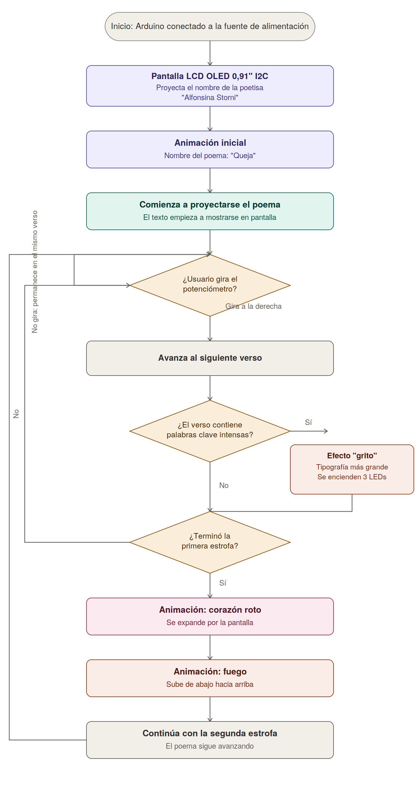
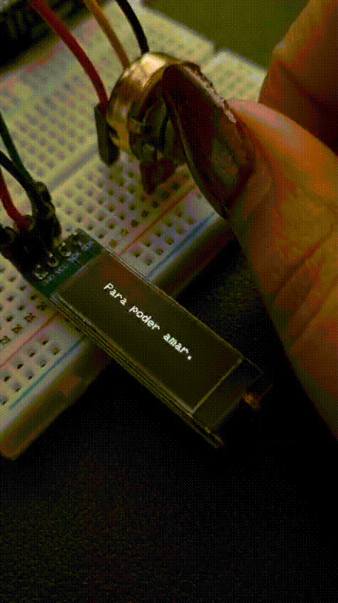
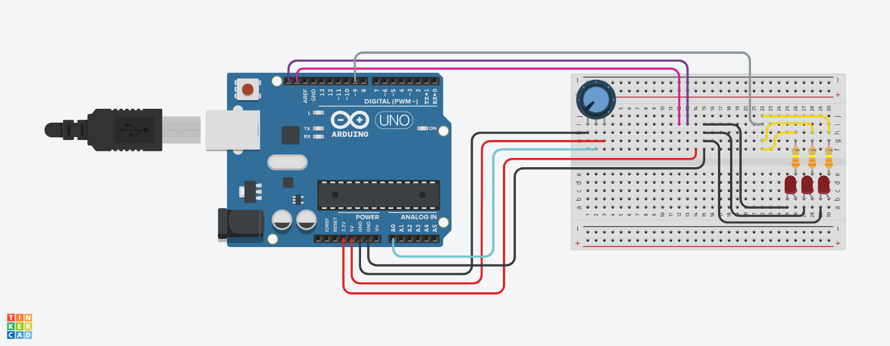
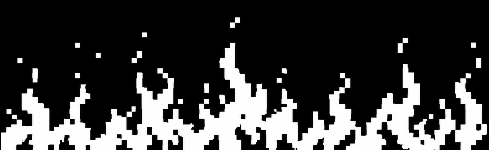
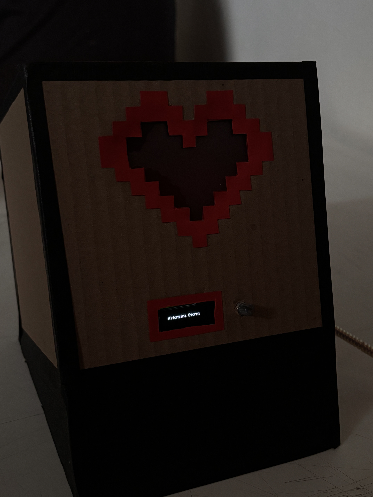
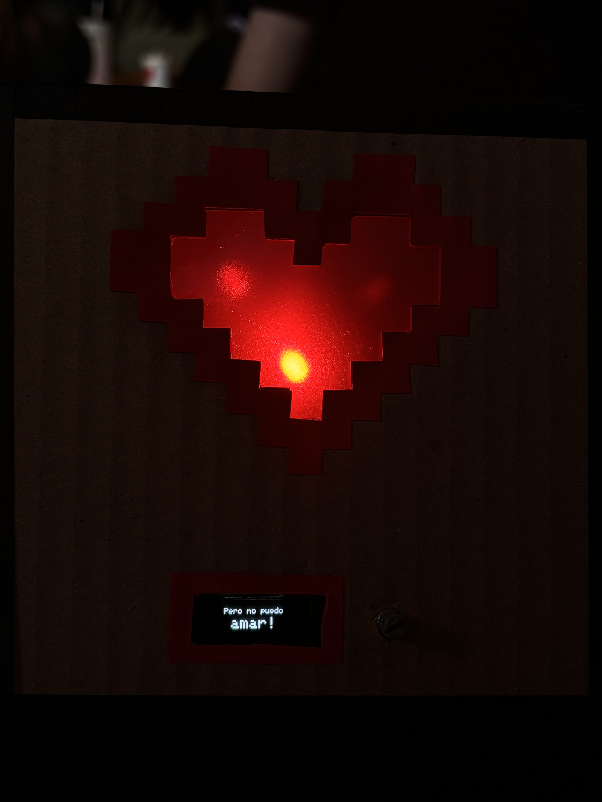
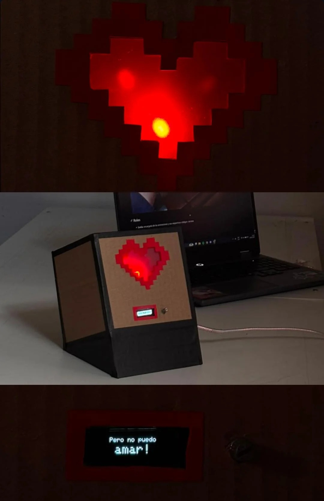
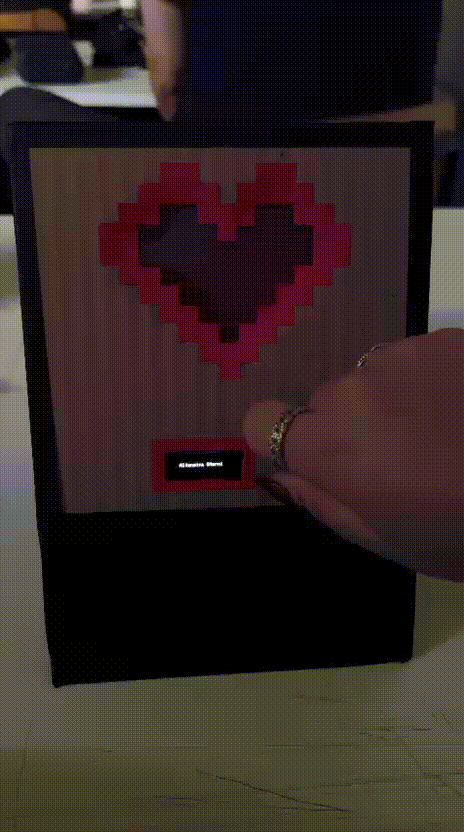

# Proyecto-1 / grupo-07

Fecha entrega: 2026-09-11

## Integrantes

Emilia Contreras / [hazzaily](https://github.com/hazzaily) / encargada de las animaciones y carcasa.

Monserrat Paredes / [Monserrat-Paredes](https://github.com/Monserrat-Paredes) / encargada de los códigos.

Katalina Riquelme / [riyakatalinaa](https://github.com/riyakatalinaa) / encargada de registro en github.


---


## Importante

Todas las imágenes y gifs son de nuestra autoría.

Todos los gifs e imágenes se encuentran subidos en la carpeta de "imagenes".

Códigos subidos por fecha en la carpeta "codigos".

Las conversacions con [Claude](https://claude.ai/) las podemos encontrar como [prompt-claude-codigo.pdf](https://github.com/disenoUDP/dis8645-2026-2-procesos-1/blob/main/00-proyecto-1/grupo-07/codigos/prompt-claude-codigo.pdf) y en [chats-claude-pt1](https://github.com/disenoUDP/dis8645-2026-2-procesos-1/tree/main/00-proyecto-1/grupo-07/codigos/chats-claude-pt1) en formato PDF.


---


## Poetisa escogida → **Alfonsina Storni**

Esta poetisa argentina nacida en 1892 en Suiza es uno de los íconos de la literatura posmodernista. Con una infancia difícil y con carencias y luego una vida con recurrentes enfermedades, su poesía está impregnada de lucha, audacia, amor y una reivindicación del género femenino. Algunos de sus poemas a resaltar son: ¡Adiós!, Alma desnuda, La caricia perdida, Razones y paisajes de amor, Queja, Tu dulzura, Dolor y Frente al mar.

Toda su obra refleja dramatismo, lucha y una audacia inusual para la época. Su temática es, sobre todo, amorosa, feminista y profunda, en donde se refleja un carácter singular, marcado muchas veces por la neurosis.

Su muerte, continúa la huella de su transgresora personalidad. Su trágico suicidio, en las aguas de la playa "La Perla", de Mar del Plata, el 25 de octubre de 1938, le permitió huir de una penosa enfermedad oncológica (crecimiento descontrolado y la multiplicación rápida de células anormales) y de la soledad que la invadía.

Información sacada de → https://www.poemas-del-alma.com/alfonsina-storni.htm#block-bio


---


## Licencia asociada a Alfonsina Storni

**Alfonsina Storni** nació en Suiza el 22 de Mayo de 1892 y murió el 25 de Octubre de 1938. Información rescatada de [Wikipedia](https://es.wikipedia.org/wiki/Alfonsina_Storni)

Y según la legislación Argentina [Ley 11723](https://www.argentina.gob.ar/normativa/nacional/42755/actualizacion?utm_source=chatgpt.com) después de 70 años del 01 de Enero del año siguiente la muerte de una persona, su obra se se vuelve de dominio público pagante, lo que significa que podría estar sujeta a que determinados usos de obras en dominio público pueden estar sujetos a declaración y al pago de un arancel ante el Fondo Nacional de las Artes. 

Para nuestra suerte, los 70 años se cumplieron en 2009, y la misma ley nos exenta de pagos debido a que en el artículo 36 nos dice que:

```
"Sin embargo, será lícita y estará exenta del pago de derechos de autor y de los intérpretes que establece el artículo 56, la representación, la ejecución y la recitación de obras literarias o artísticas ya publicadas, en actos públicos organizados por establecimientos de enseñanza, vinculados con el cumplimiento de sus fines educativos, planes y programas de estudio, siempre que el espectáculo no sea difundido fuera del lugar donde se realice y la concurrencia y la actuación de los intérpretes sea gratuita."
```

Así que podemos utilizar sus poemas con fines educativos.


---


## Poema escogido

Queja

Señor, mi queja es ésta,

Tú me comprenderás;

De amor me estoy muriendo,

Pero no puedo amar.


Persigo lo perfecto

En mí y en los demás,

Persigo lo perfecto

Para poder amar.


Me consumo en mi fuego,

¡Señor, piedad, piedad!

De amor me estoy muriendo,

¡Pero no puedo amar!.


Poema sacado de → https://www.cultura.gob.ar/9-poemas-imprescindibles-de-alfonsina-storni-8463/


---


## Análisis poema

El poema expresa un conflicto interno entre el deseo de amar y la incapacidad de hacerlo. Ella se siente “muriendo de amor”, pero al mismo tiempo no logra entregarse emocionalmente porque busca constantemente la perfección, tanto en ella misma como en los demás.

Expresa un amor frustrado y posiblemente no correspondido, pero principalmente muestra un conflicto interno: el deseo de amar, pero su búsqueda de la perfección le impide entregarse al amor.


---


## ¿Qué queremos que pase? (texto)

- Poner al comienzo el nombre de la poetisa Alfonsina Storni
- Cambio de dirección 1: Dirección inicial del texto (arriba hacia abajo)
- Cambio de dirección 2: de izquierda a derecha
- Que la velocidad del texto cambie según la perilla del potenciómetro (verso por verso).
- A través de un botón, tener la posibilidad de presionarlo y que se inviertan los colores mostrando las palabras claves representativas (palabras intensas).
- Que a ciertas palabras del poema se les pueda bajar o subir la opacidad con el potenciómetro.
- perfeccionismo = control = pausar/reanudar (botón)
- Cada palabra intensa que aparezca se encenderan leds rojos


## Paso a paso de que queremos que suceda

- Lo primero en proyectarse en la pantalla es el nombre de la poetisa "Alfonsina Storni"
- Se despliega la animación inicial con el nombre del poema "Queja"
- El poema comienza a proyectarse y avanza verso por verso de manera interactiva a medida que el usuario gira la perilla del potenciometro
- Al llegar a versos con palabras claves representativas (palabras intensas), el tamaño de la tipografía es mas grande que el resto del verso, para simular un efecto de "grito", esto hace que se enciendan 3 leds para intensificar estas palabras claves
- Despues de la primera estrofa, la pantalla reproduce una animación visual de un corazón roto expandiendose por la pantalla
- Entre medio de las dos primeras estrofas, la pantalla reproduce una animación visual de fuego subiendo de abajo hacia arriba


## Palabras claves representativas 

Como grupo decidimos destacar la parte emocional del poema, identificamos **palabras claves representativas** de mayor intensidad que actúan como puntos de mayor tensión.

Si bien todo el poema transmite una emoción constante, las **palabras claves** las representamos en un tamaño tipográfico más grande al resto del verso. Esta variación de escala busca simular visualmente la sensación de un **grito**, evitando el uso de mayúsculas para mantener la estética y ritmo del poema.

Como se puede apreciar en la imagen, las palabras subrayadas son las **palabras claves** que van en un tamaño mayor


---

## Diagrama de flujo




---


## Bill of Materials

|Componente|Cantidad|Precio|Link|
|---|---|---|---|
|Arduino UNO R4 WIFI|1|$32.990|<https://mcielectronics.cl/shop/product/arduino-uno-r4-minima/>|
|Pantalla LCD Oled 0,91" I2C|1|$3.990|<https://afel.cl/products/pantalla-lcd-oled-0-91?_pos=1&_sid=f1b122119&_ss=r>|
|Protoboard|1|$1.500|<https://afel.cl/products/mini-protoboard-400-puntos>|
|LEDS|3|$70|<https://afel.cl/products/diodo-led-5mm-ultrabrillante-rojo?_pos=10&_sid=9ca2bb29d&_ss=r>|
|Kit resistencias|3|$4.990|<https://afel.cl/products/kit-600-resistencias-1-4w-30-valores?_pos=1&_sid=aa6abbe0f&_ss=r>|
|Cables|10|$1.000|<https://afel.cl/products/pack-20-cables-de-conexion-macho-macho>|
|Potenciómetro B10k|1|$500|<https://afel.cl/products/potenciometro-10k-ohm>|
|Kit cables caimán|6|$3.000|<https://afel.cl/products/kit-10-cables-conectores-tipo-caiman?srsltid=AfmBOorPXCoNA5FfnVv3FukZopGL348V9KtyglGtKEOZ-cGqXj8U1g1_>|
|Pack cables Dupont|18|$2.500|<https://afel.cl/products/pack-60-cables-de-conexion?variant=45125231935640&country=CL&currency=CLP&utm_medium=product_sync&utm_source=google&utm_content=sag_organic&utm_campaign=sag_organic&utm_term=&utm_campaign=@+Smart+Shopping&utm_source=adwords&utm_medium=ppc&hsa_acc=1808722794&hsa_cam=18405560573&hsa_grp=&hsa_ad=&hsa_src=x&hsa_tgt=&hsa_kw=&hsa_mt=&hsa_net=adwords&hsa_ver=3&gad_source=1&gad_campaignid=17613659948&gbraid=0AAAAADBMsFQIbGQpkhnrUNPR5LmXeViHp&gclid=CjwKCAjwwfnUBhAtEiwAfQpAYgm7J5jNss5OV1btE3F0jvFZ52Ixl_uZo3bNBxeZTep7EVkxkVaXWRoC7ZAQAvD_BwE>|
|Cinta masking tape negro (carcasa)|1|$1.090|<https://librerialapaloma.cl/producto/scotch-de-papel-negro/>|
|Cartón reutilizado (carcasa)|2|-|-|
|Acrílico reutilizado (carcasa)|1|-|-|


---


## Proceso código → Evolución del proyecto (resumen)


El proyecto evolucionó progresivamente desde la reproducción de un poema en el monitor serial hacia una experiencia visual e interactiva, incorporando jerarquía tipográfica, control manual y animaciones vinculadas al contenido emocional de la obra.


| Versión | Fecha | Etapa | Cambios principales | Objetivo |
|:---:|:---:|---|---|---|
| **Código 1** | 28 ago. | Poema base | Reproducción del poema en el **Serial Monitor**, mediante un loop. Código base modificado a partir del código entregado en clases. | Crear la primera versión funcional del poema. |
| **Código 2** | 1 sept. | Pantalla OLED | Se incorpora una pantalla **OLED 0,91" I2C**. El poema comienza a visualizarse físicamente y los versos cambian automáticamente cada 2 segundos. | Llevar el poema desde el monitor serial a la pantalla. |
| **Código 3** | 2 sept. | Jerarquía visual | Se destacan determinadas **palabras clave e intensas** del poema mediante un tamaño mayor, mientras el resto mantiene un tamaño normal. | Representar visualmente la intensidad emocional del poema. |
| **Código 4** | 3 sept. | Interacción | Se incorpora un **potenciómetro** para controlar manualmente el avance de los versos, reemplazando el avance automático. | tener control total del ritmo del poema. |
| **Código 4.2** | 3 sept. | cambio visual | Se agrega el **nombre de la poetisa**, al comienzo del poema, se centra y alinea el texto y se establece una jerarquía tipográfica: palabras clave de **16 px** y texto normal de **8 px**. | Mejorar la composición y legibilidad en pantalla. |
| **Código 5** | 4 sept. | Optimización | Se detectan problemas de espacio en pantalla. Se reduce la cantidad de palabras destacadas para asegurar que todos los versos sean visibles correctamente. | Terminar de adaptar el poema al formato de la pantalla. |
| **Código 5.2** | 4 sept. | Prueba de animación | Se incorpora una primera animación. El resultado no se adapta correctamente a las dimensiones de la pantalla. | Explorar la incorporación de movimiento y detectar limitaciones técnicas. |
| **Código 6** | 6 sept. | **Animación 1🎬** | Animación del título **“Queja”**, utilizada como introducción después del nombre de la poetisa. | Introducir visualmente el poema en pantalla. |
| **Código 7** | 7 sept. | **Animación 2💔** + 3 LEDs rojos| Animación de un **corazón roto**, vinculada al verso "Pero no puedo amar" después de la primera estrofa se agregan 3 LEDs rojos, que se encienden cada vez que aparecen las palabras clave e intensas del poema. | Reforzar la carga emocional del poema mediante una respuesta visual y física sincronizada con el poema. |
| **Código 8** | 7 sept. | **Animación 3🔥** | Animación de **fuego**, relacionada con el verso "Me consumo en mi fuego" después de la segunda estrofa. | Representar visualmente la intensidad y el consumo emocional. |


---


## Registro de imágenes y gifs por código

Código 1: Reproducción del poema en el **Serial Monitor**, mediante un loop. Código base modificado a partir del código entregado en clases.

código visto en clase y modificado con nuestros versos del poema "queja"


---


Código 2: Llevar el poema desde el monitor serial a la pantalla.

Se incorpora una pantalla OLED 0,91" I2C. El poema comienza a visualizarse físicamente y los versos cambian automáticamente cada 2 segundos.

Conexión física de la Pantalla LCD Oled 0,91" I2C:

SCK/SCL → reloj (cable azul)

SDA → datos (cable verde)

GND → tierra (cable negro)

VCC → voltaje (cable rojo)


La parte que efectivamente "proyecta" el poema en la pantalla es la función mostrarVerso(), específicamente estas líneas:


Para continuar nos preguntamos que queriamos que apareciera especificamente y se nos ocurrieron varias cosas.

Potenciometro B10K: cambiar la velocidad del poema al mover la perilla

El poema ya vendrá con ciertas palabras en grande cómo si estuvieran gritando, seran palabras que hablen del poema y representen su intensidad


---


Código 3: Representar visualmente la intensidad emocional del poema.

Se destacan determinadas palabras clave e intensas del poema mediante un tamaño mayor, mientras el resto mantiene un tamaño normal.


---


Código 4: Añadir potenciómetro para controlar manualmente el avance de los versos.

Se incorpora un potenciómetro para controlar manualmente el avance de los versos, reemplazando el avance automático.

Conexión física del potenciómetro B10K:

Pata izquierda → GND (cable negro)

Pata derecha → 5V (cable rojo)

Pata del medio → A0 (cable amarillo)


PROBLEMA: los versos del poema siguen una velocidad determinada y mientras muevo la perilla del potenciómetro solo acelera el paso de los versos, pero no tengo el control total del movimiento.


---


Código 4.2: Mejorar la composición y legibilidad en pantalla.

Se agrega el nombre de la poetisa, al comienzo del poema, se centra y alinea el texto y se establece una jerarquía tipográfica: palabras clave de 16 px y texto normal de 8 px.

PROBLEMA: En los versos del poema en la linea 95 en pantalla se ve así:

"piedad", // 10: ¡Señor, piedad, piedad! (agranda las dos apariciones) → se corta por espacio en pantalla, al ser 2 palabras de mayor tamaño

deberia aparecer:

```cpp
// agrandar las palabras “Piedad, piedad!” 
  "¡Señor, piedad, piedad!",
```
foto problema +


---


Código 5: Terminar de adaptar el poema al formato de la pantalla.

Se detectan problemas de espacio en pantalla. Se reduce la cantidad de palabras destacadas para asegurar que todos los versos sean visibles correctamente.

se arregla el problema del codigo 4.2 y queda de esta manera:

```cpp
// agrandar la palabra “piedad!” 
  "¡Señor, piedad, piedad!",
```


---


Código 5.2: Prueba de animación fallida.

se utilizo bitmaps para transformar imagenes a código: <https://tools.stonez56.com/u8g2/getBitmap.php>

Buscamos que la animación fluya y en ese momento uno no puedo controlar el texto, porque esta corriendo la animación, la idea es que pase solo una vez, que no ser en loop, luego de esto uno puede seguir controlando el poema con el potenciómetro.

Se incorpora una primera animación. El resultado no se adapta correctamente a las dimensiones de la pantalla.

Esta animación no funciono del todo, ya que en pantalla "se ve chica" porque el arte de las llamas fue generado/exportado ocupando solo una franja angosta en el centro, no porque tu código la esté encogiendo.





---


Código 6: Animación 1 del título **“Queja”**, utilizada como introducción después del nombre de la poetisa.


---


Código 7: Animación 2 de un **corazón roto**, se busca reforzar la carga emocional del poema mediante una respuesta visual y física sincronizada con el poema.

Animación de un corazón roto, vinculada al verso "Pero no puedo amar" después de la primera estrofa se agregan 3 LEDs rojos, que se encienden cada vez que aparecen las palabras clave e intensas del poema.


---


Código 8: Animación de **fuego**, relacionada con el verso "Me consumo en mi fuego" después de la segunda estrofa. Busca Representar visualmente la intensidad y el consumo emocional.


---


## Circuito del proyecto en TinkerCAD

Para generar la siguiente imagen utilizamos la página [TinkerCAD](https://www.tinkercad.com/) que nos ayuda a esquematizar lo que queremos hacer, además de tener la capacidad de simular el circuito:



No pudimos encontrar una pantalla similar dentro de la galería así que quejamos el espacio en blanco, pero funciona así:

 - h12 = SDA
 - h13 = SCK
 - h14 = VCC
 - h15 = GND


---


## Animaciones

Animación 1: después del nombre de la poetisa de Alfonsina Storni, titulo "Queja"

**gif de la animación**


---


Animación 2: después de la primera estrofa, corazón roto

**gif de la animación**


---


Animación 3: después de la segunda estrofa, llamas

**gif de la animación**


---


## Frames animaciones

Frames de la animación de queja.


Frames de la animación de corazón.


Frame de la animación de llama.




---


## Herramienta para animaciones pixel a pixel

No logramos encontrar imágenes adecuadas para lo que estábamos buscando representar, es por esto que buscamos una solución para poder desarrollar nuestros "frames" desde cero para generar las animaciones.

Es así que llegamos a [Pixelorama](https://pixelorama.org/) que es una aplicación que se utiliza para generar animaciones pixel a pixel, la cual tiene distintas formas de descargar y nosotras la descargamos desde su GitHub.

Captura de pantalla de la aplicación Pixelorama mientras hacía los frames de llamas.


Captura de pantalla de la aplicación Pixelorama mientras hacía los frames de corazón.


Captura de pantalla de la aplicación Pixelorama mientras hacía los frames de queja.


---


## Herramienta para animaciones en arduino (bitmap)

Esta herramienta nos la enseño Seba (grande Seba c:), y se llama [Stonez56](https://tools.stonez56.com/u8g2/getBitmap.php) y sirve para ingresar una imagen en el formato y que la reescriba pixel por pixel para generar una imagen en arduino.

Captura de pantalla de la página convirtiendo una imagen en bitmap pt. 1.


Captura de pantalla de la página convirtiendo una imagen en bitmap pt. 2.


Captura de pantalla de la página convirtiendo una imagen en bitmap pt. 3.


---


## Proceso de carcasa

Imágenes del proceso de la carcasa.


Imagen del proceso de la carcasa pt. 2.


---


## Resultado carcasa

Imagen de la carcasa final.











## Bibliografía

Alfonsina Storni - Sus poemas, biografía y galería de fotos. (s. f.). <https://www.poemas-del-alma.com/alfonsina-storni.htm#block-bio>

colaboradores de Wikipedia. (2026, 21 agosto). Alfonsina Storni. Wikipedia, la Enciclopedia Libre. <https://es.wikipedia.org/wiki/Alfonsina_Storni>

Argentina.gob.ar. (1933, 30 septiembre). Argentina.gob.ar. <https://www.argentina.gob.ar/normativa/nacional/42755/actualizacion?utm_source=chatgpt.com>

Gob.ar. (S/f). Recuperado el 11 de septiembre de 2026, de <https://www.cultura.gob.ar/9-poemas-imprescindibles-de-alfonsina-storni-8463/>

Stonez. (s/f). Image to bitmap converter. Stonez56 創客工坊. Recuperado el 11 de septiembre de 2026, de <https://tools.stonez56.com/u8g2/getBitmap.php>

Pixelorama, your free & open source sprite editor. (s/f). Pixelorama.org. Recuperado el 11 de septiembre de 2026, de <https://pixelorama.org/>

Stonez. (s. f.). Image to Bitmap Converter for Arduino & U8g2 | Stonez56. Stonez56 創客工坊. <https://tools.stonez56.com/u8g2/getBitmap.php>

Tinkercad. (s. f.). Tinkercad. <https://www.tinkercad.com/>


