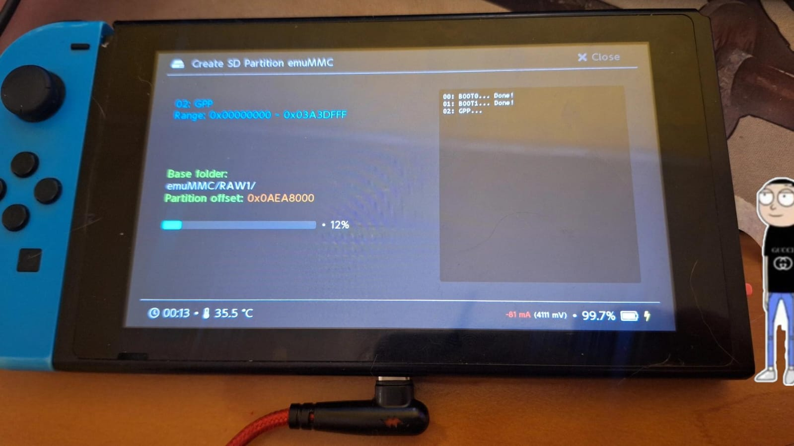

# sesion-05a

## apuntes sesión

## encargos

**Nintendo Switch con magia, usando método RCM**

### Sustancia primera y segunda 
* **¿Qué es esto en sí mismo?**
* **Sustancia primera:** Esta consola física e individual concreta que está sobre la mesa.
* **Sustancia segunda:** Consola de videojuegos electrónica portátil/híbrida.

### Cantidad
* **¿Cuánto, de qué tamaño o cuántas partes?**
* **Análisis del objeto:**
  * **Dimensiones continuas:** Aproximadamente $102\text{ mm} \times 239\text{ mm} \times 13.9\text{ mm}$ (con Joy-Cons acoplados); masa cercana a los $398\text{ g}$.
  * **Cantidad discreta/numérica:** 1 tableta central, 2 mandos desacoplables, 1 tarjeta MicroSD de $128\text{ GB}$, 1 cable USB-C conectado.
  * **Magnitud de almacenamiento:** Partición *eMMC* de $32\text{ GB}$  y una partición *EmuNAND* delimitada de $29.8\text{ GB}$.

### Cualidad
* **¿Cómo es, qué propiedades accidentales posee?**
* **Análisis del objeto:**
  * **Físicas:** Acabado negro mate, bordes redondeados, pantalla de cristal liso, botones con respuesta táctil.
  * **Técnicas/Funcionales:** En modo RCM (*Recovery Mode*) con pantalla negra retroiluminada; versión vulnerable por hardware mediante un JIG en el conector del Joy-Con derecho.
  * **Térmicas:** Tibia al tacto en la zona del disipador de calor y salida de aire superior, $35.8\text{ C}$.

### Relación
* **¿Respecto a qué o a quién se vincula o compara?**
* **Análisis del objeto:**
  * **Jerarquía de datos:** Subordinada como cliente USB al ordenador que transmite el binario (*host/master*).
  * **Propiedad y legalidad:** Propiedad del usuario, reservo mi derecho de hablar hasta tener abogado.
  * **Comparación:** Más pesada que un teléfono móvil, pero sustancialmente menos potente que una play 5 de sobremesa.

### Lugar
* **¿Dónde se encuentra?**
* **Análisis del objeto:**
  * Sobre el el escritorio de trabajo, situada a $15\text{ cm}$ del ordenador y junto a teclado, moouse y mousepad.

### Tiempo
* **¿Cuándo existe o se sitúa temporalmente?**
* **Análisis del objeto:**
  * En el instante de la inyección del binario `fusee.bin`; en su noveno año tras haber salido de fábrica (modelo original V1 sin parchear) y emocionalmente, en Navidad de 2017.

### Posición o Postura
* **¿Cómo están dispuestas sus partes y su cuerpo?**
* **Análisis del objeto:**
  * Descansando horizontalmente pantalla mirando el techo, sin Joy-Con derecho acoplado a al riel lateral, apoyada sobre su carcasa posterior.

### Hábito o Posesión
* **¿Qué porta o qué tiene puesto exteriormente?**
* **Análisis del objeto:**
  * Tiene insertada una plantilla metálica/plástica en el riel derecho (*RCM jig* en el pin 10).
  * Porta un cable USB-C rojo en su puerto inferior, en su parte trasera tiene stickers de My Melody (creo).

### Acción
* **¿Qué hace activamente sobre su entorno o sobre otro ente?**
* **Análisis del objeto:**
  * Transmite una señal de handshake USB hacia el PC.
  * Disipa calor residual por la ranura de ventilación superior mediante su extractor de aire.
  * Drena corriente eléctrica desde el USB del ordenador para alimentar su circuito de carga.

### Pasión
**¿Qué cambio, fuerza o efecto recibe de un agente externo?**
* **Análisis del objeto:**
  * Está siendo puenteada físicamente en el riel de controles.
  * Recibe un desbordamiento de búfer (*buffer overflow*) que corrompe la ejecución normal de su memoria bootROM.
  * Es modificada en su estructura de arranque por la intervención manual y técnica del usuario.
## lectura
