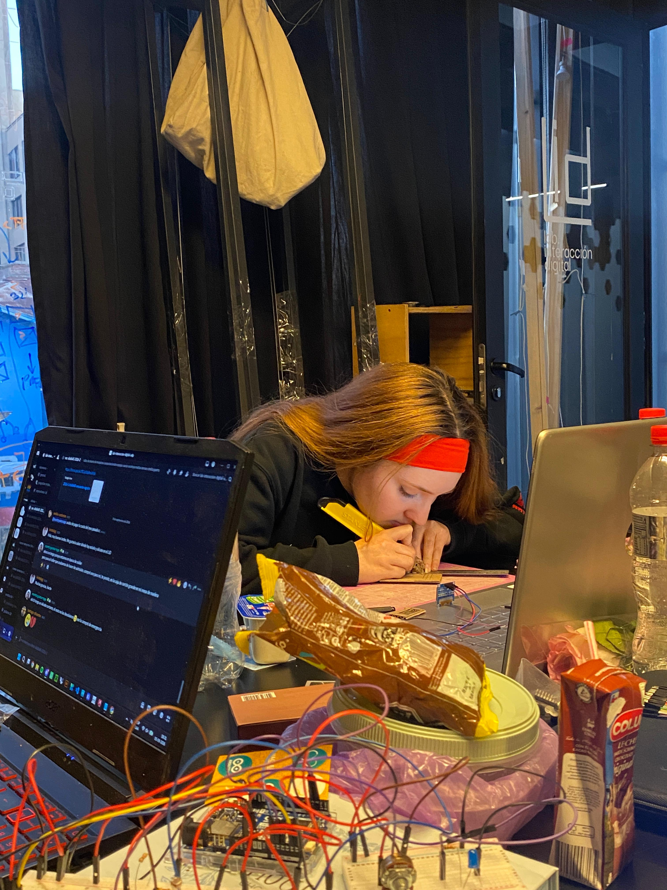
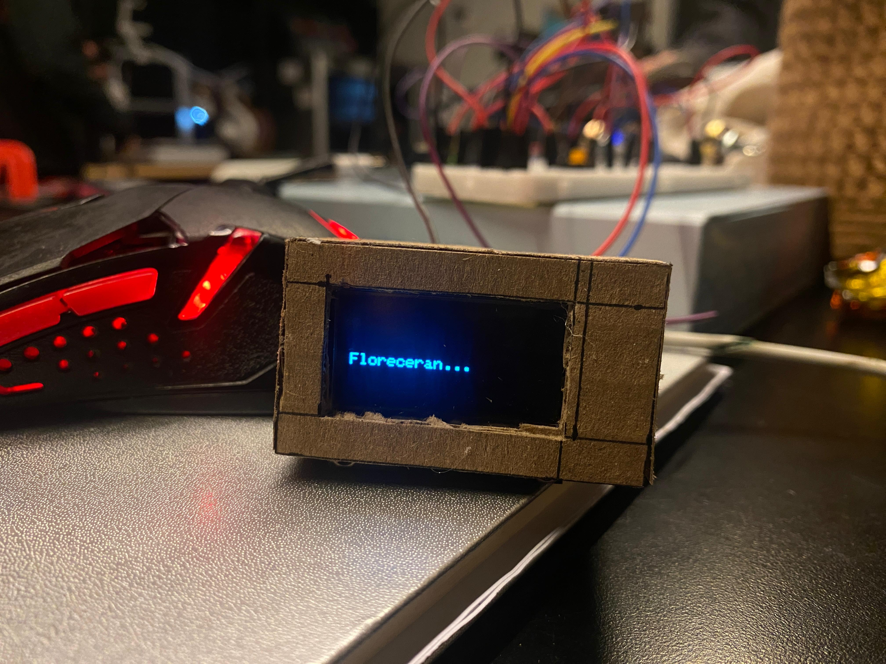
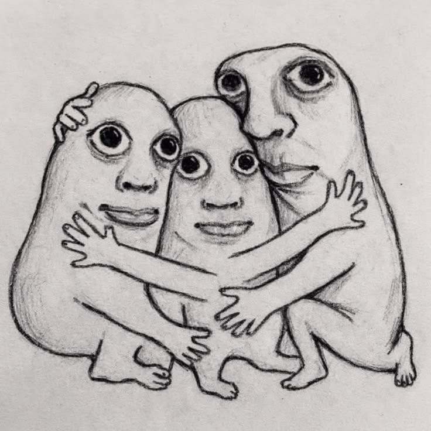
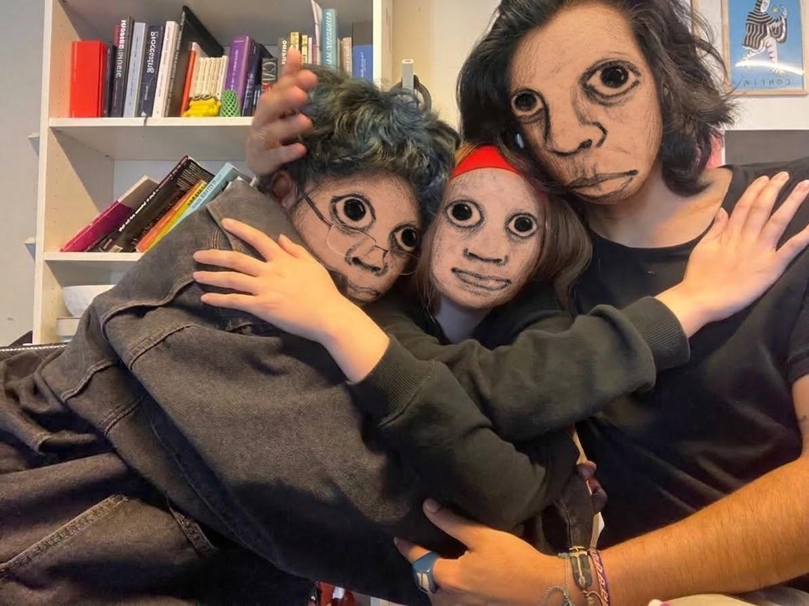
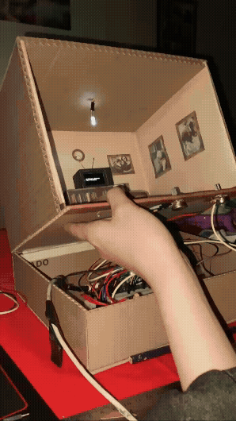

# sesion-04b
Hola profe Aarón, Misa y Emi. Espero que se encuentren bien.
El día de hoy continuamos trabajando en el proyecto 01.

## apuntes sesión
Aquí creamos la case de nuestro proyecto, y el orden en el que iban a ir a los elementos:

Fotitos del proceso:

Este fue el resultado:

