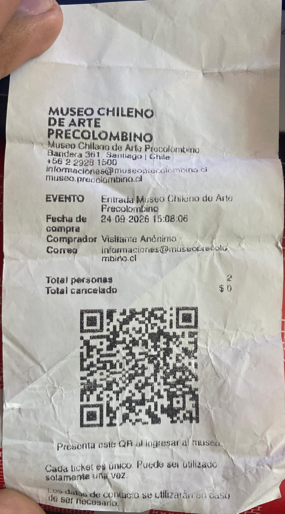

# sesion-06a

## apuntes sesión

## encargos
seleccionar un objeto y clasificarlo según las categorías del ser de aristóteles  
[Las 10 categorías del ser](https://es.scribd.com/document/463976784/CATEGORIAS-DEL-SER#google_vignette)

### Objeto escogido: Boleto de entrada al museo de arte precolombino 

## lectura
