# sesion-04b

2026-09-04

## apuntes sesión

Llegó Misaaa (grande Misaaa) c:

## Primer intento de animación

Spoiler: no funcionó. O sea, sí, pero no.

Comenzando a trabajar las animaciones nos dimos cuenta de que ninguna imagen nos convencía del todo, al menos de las que había en pinterest. Así que decidimos ir hacía una IA para ver si nos podía ayudar.

En este caso, a quién escogimos fue ChatGPT, al cual le preguntamos:

```
"holaaa, podrías ayudarme a generar una imagen que pueda utilizar para una animación de llamas de fuego para una pantalla de 128x32 oled (0.91") en formato horizontal."
```

A lo que nos dio esto:


Y cuando intentamos probarlo nos dimos cuenta de que no calzaba en la pantalla, y además, iba a resultar en negativo, por lo que le pedimos que invirtiera los colores:

```
" puedes invertir los colores?"
```

Y nos dio esto:

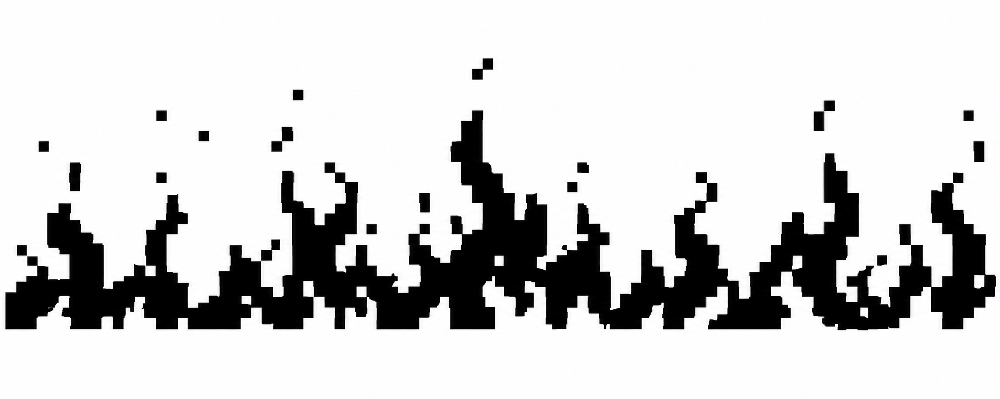

Cuando lo pasamos por [Stonez56](https://tools.stonez56.com/u8g2/getBitmap.php) no dimos cuneta de que era un poco pequeña la imagen para la pantalla, pero aún así lo intentamos.

**Código del primer intento de la animación llamas:** todo esto se encuentra dentro del archivo animacionLlamas.h en la carpeta [2026-09-04](https://github.com/disenoUDP/dis8645-2026-2-procesos-1/tree/main/00-proyecto-1/grupo-07/codigos/2026-09-04) dentro de la carpeta de nuestro proyecto.

```cpp
 // frame 0

 // Bitmap generated for 128x32 display
// Image: intentoAnimacion01
// Method: Ordered (Bayer)
// Format: 128x32, 1 bit/pixel, LSB first

#ifndef INTENTOANIMACION01_BITMAP_H
#define INTENTOANIMACION01_BITMAP_H

// Width: 128
// Height: 32

static const unsigned char PROGMEM intentoAnimacion00_bitmap[512] = {
  0x00,0x00,0x00,0x00,0x00,0x00,0x00,0x00,0x00,0x00,0x00,0x00,0x00,0x00,0x00,0x00,
  0x00,0x00,0x00,0x00,0x00,0x00,0x00,0x00,0x00,0x00,0x00,0x00,0x00,0x00,0x00,0x00,
  0x00,0x00,0x00,0x00,0x00,0x00,0x00,0x00,0x00,0x00,0x00,0x00,0x00,0x00,0x00,0x00,
  0x00,0x00,0x00,0x00,0x00,0x00,0x00,0x00,0x00,0x00,0x00,0x00,0x00,0x00,0x00,0x00,
  0x00,0x00,0x00,0x00,0x00,0x00,0x00,0x00,0x00,0x00,0x00,0x00,0x00,0x00,0x00,0x00,
  0x00,0x00,0x00,0x00,0x00,0x00,0x00,0x00,0x00,0x00,0x00,0x00,0x00,0x00,0x00,0x00,
  0x00,0x00,0x00,0x00,0x00,0x00,0x00,0x00,0x00,0x00,0x00,0x00,0x00,0x00,0x00,0x00,
  0x00,0x00,0x00,0x00,0x00,0x00,0x00,0x00,0x00,0x00,0x00,0x00,0x00,0x00,0x00,0x00,
  0x00,0x00,0x00,0x00,0x00,0x00,0x00,0x00,0x00,0x00,0x00,0x00,0x00,0x00,0x00,0x00,
  0x00,0x00,0x00,0x00,0x00,0x00,0x00,0x00,0x00,0x00,0x00,0x00,0x00,0x00,0x00,0x00,
  0x00,0x00,0x00,0x00,0x00,0x00,0x00,0x00,0x00,0x00,0x00,0x00,0x00,0x00,0x00,0x00,
  0x00,0x00,0x00,0x00,0x00,0x00,0x00,0x00,0x00,0x00,0x00,0x00,0x00,0x00,0x00,0x00,
  0x00,0x00,0x00,0x00,0x00,0x00,0x00,0x00,0x00,0x00,0x00,0x00,0x00,0x00,0x00,0x00,
  0x00,0x00,0x00,0x00,0x00,0x00,0x00,0x00,0x00,0x00,0x00,0x00,0x00,0x00,0x00,0x00,
  0x00,0x00,0x00,0x00,0x00,0x00,0x00,0x00,0x00,0x00,0x00,0x00,0x00,0x00,0x00,0x00,
  0x00,0x00,0x00,0x00,0x00,0x00,0x00,0x00,0x00,0x00,0x00,0x00,0x00,0x00,0x00,0x00,
  0x00,0x00,0x00,0x00,0x00,0x00,0x00,0x00,0x00,0x00,0x00,0x00,0x00,0x00,0x00,0x00,
  0x00,0x00,0x00,0x00,0x00,0x00,0x00,0x00,0x00,0x00,0x00,0x00,0x00,0x00,0x00,0x00,
  0x00,0x00,0x00,0x00,0x00,0x00,0x00,0x00,0x00,0x00,0x00,0x00,0x00,0x00,0x00,0x00,
  0x00,0x00,0x00,0x00,0x00,0x00,0x00,0x00,0x00,0x00,0x00,0x00,0x00,0x00,0x00,0x00,
  0x00,0x00,0x00,0x00,0x00,0x00,0x00,0x00,0x00,0x00,0x00,0x00,0x00,0x00,0x00,0x00,
  0x00,0x00,0x00,0x00,0x00,0x00,0x00,0x00,0x00,0x00,0x00,0x00,0x00,0x00,0x00,0x00,
  0x00,0x00,0x00,0x00,0x00,0x00,0x00,0x00,0x00,0x00,0x00,0x00,0x00,0x00,0x00,0x00,
  0x00,0x00,0x00,0x00,0x00,0x00,0x00,0x00,0x00,0x00,0x00,0x00,0x00,0x00,0x00,0x00,
  0x00,0x00,0x00,0x00,0x00,0x00,0x00,0x00,0x00,0x00,0x00,0x00,0x00,0x00,0x00,0x00,
  0x00,0x00,0x00,0x00,0x00,0x00,0x00,0x00,0x00,0x00,0x00,0x00,0x00,0x00,0x00,0x00,
  0x00,0x00,0x00,0x00,0x00,0x00,0x00,0x00,0x00,0x00,0x00,0x00,0x00,0x00,0x00,0x00,
  0x00,0x00,0x00,0x00,0x00,0x00,0x00,0x00,0x00,0x00,0x00,0x00,0x00,0x00,0x00,0x00,
  0x00,0x00,0x00,0x00,0x00,0x00,0x00,0x00,0x00,0x00,0x00,0x00,0x00,0x00,0x00,0x00,
  0x00,0x00,0x00,0x00,0x00,0x00,0x00,0x00,0x00,0x00,0x00,0x00,0x00,0x00,0x00,0x00,
  0x00,0x00,0x00,0x00,0x00,0x00,0x00,0x00,0x00,0x00,0x00,0x00,0x00,0x00,0x00,0x00,
  0x00,0x00,0x00,0x00,0x00,0x00,0x00,0x00,0x00,0x00,0x00,0x00,0x00,0x00,0x00,0x00
};

 // (...) 31 frames más tarde
 // frame 32

 // Bitmap generated for 128x32 display
// Image: intentoAnimacion01
// Method: Ordered (Bayer)
// Format: 128x32, 1 bit/pixel, LSB first


// Width: 128
// Height: 32

static const unsigned char PROGMEM intentoAnimacion32_bitmap[512] = {
  0x00,0x00,0x00,0x00,0x00,0x00,0x00,0x00,0x00,0x00,0x00,0x00,0x00,0x00,0x00,0x00,
  0x00,0x00,0x00,0x00,0x00,0x00,0x00,0x00,0x00,0x00,0x00,0x00,0x00,0x00,0x00,0x00,
  0x00,0x00,0x00,0x00,0x00,0x00,0x00,0x00,0x00,0x00,0x00,0x00,0x00,0x00,0x00,0x00,
  0x00,0x00,0x00,0x00,0x00,0x00,0x00,0x00,0x00,0x00,0x00,0x00,0x00,0x00,0x00,0x00,
  0x00,0x00,0x00,0x00,0x00,0x00,0x00,0x00,0x00,0x00,0x00,0x00,0x00,0x00,0x00,0x00,
  0x00,0x00,0x00,0x00,0x00,0x00,0x00,0x00,0x00,0x00,0x00,0x00,0x00,0x00,0x00,0x00,
  0x00,0x00,0x00,0x00,0x00,0x00,0x00,0x00,0x00,0x00,0x00,0x00,0x00,0x00,0x00,0x00,
  0x00,0x00,0x00,0x00,0x00,0x00,0x00,0x00,0x00,0x00,0x00,0x00,0x00,0x00,0x00,0x00,
  0x00,0x00,0x00,0x00,0x00,0x00,0x00,0x00,0x00,0x00,0x00,0x00,0x00,0x00,0x00,0x00,
  0x00,0x00,0x00,0x00,0x00,0x00,0x00,0x00,0x00,0x00,0x00,0x00,0x00,0x00,0x00,0x00,
  0x00,0x00,0x00,0x00,0x00,0x00,0x00,0x00,0x00,0x00,0x00,0x00,0x00,0x00,0x00,0x00,
  0x00,0x00,0x00,0x00,0x00,0x00,0x00,0x00,0x00,0x00,0x00,0x00,0x00,0x00,0x00,0x00,
  0x00,0x00,0x00,0x00,0x00,0x00,0x00,0x00,0x00,0x00,0x00,0x00,0x00,0x00,0x00,0x00,
  0x00,0x00,0x00,0x00,0x00,0x00,0x00,0x00,0x00,0x00,0x00,0x00,0x00,0x00,0x00,0x00,
  0x00,0x00,0x00,0x00,0x00,0x00,0x00,0x00,0x00,0x00,0x00,0x00,0x00,0x00,0x00,0x00,
  0x00,0x00,0x00,0x00,0x00,0x00,0x00,0x00,0x00,0x00,0x00,0x00,0x00,0x00,0x00,0x00,
  0x00,0x00,0x00,0x00,0x00,0x00,0x00,0x00,0x00,0x00,0x00,0x00,0x00,0x00,0x00,0x00,
  0x00,0x00,0x00,0x00,0x00,0x00,0x00,0x00,0x00,0x00,0x00,0x00,0x00,0x00,0x00,0x00,
  0x00,0x00,0x00,0x00,0x00,0x00,0x00,0x00,0x00,0x00,0x00,0x00,0x00,0x00,0x00,0x00,
  0x00,0x00,0x00,0x00,0x00,0x00,0x00,0x00,0x00,0x00,0x00,0x00,0x00,0x00,0x00,0x00,
  0x00,0x00,0x00,0x00,0x00,0x00,0x00,0x00,0x00,0x00,0x00,0x00,0x00,0x00,0x00,0x00,
  0x00,0x00,0x00,0x00,0x00,0x00,0x00,0x00,0x00,0x00,0x00,0x00,0x00,0x00,0x00,0x00,
  0x00,0x00,0x00,0x00,0x00,0x00,0x00,0x00,0x00,0x00,0x00,0x00,0x00,0x00,0x00,0x00,
  0x00,0x00,0x00,0x00,0x00,0x00,0x00,0x00,0x00,0x00,0x00,0x00,0x00,0x00,0x00,0x00,
  0x00,0x00,0x00,0x00,0x00,0x00,0x00,0x00,0x00,0x00,0x00,0x00,0x00,0x00,0x00,0x00,
  0x00,0x00,0x00,0x00,0x00,0x00,0x00,0x00,0x00,0x00,0x00,0x00,0x00,0x00,0x00,0x00,
  0x00,0x00,0x00,0x00,0x00,0x00,0x00,0x00,0x00,0x00,0x00,0x00,0x00,0x00,0x00,0x00,
  0x00,0x00,0x00,0x00,0x00,0x00,0x00,0x00,0x00,0x00,0x00,0x00,0x00,0x00,0x00,0x00,
  0x00,0x00,0x00,0x00,0x00,0x00,0x00,0x00,0x00,0x00,0x00,0x00,0x00,0x00,0x00,0x00,
  0x00,0x00,0x00,0x00,0x00,0x00,0x00,0x00,0x00,0x00,0x00,0x00,0x00,0x00,0x00,0x00,
  0x00,0x00,0x00,0x00,0x00,0x00,0x00,0x00,0x00,0x00,0x00,0x00,0x00,0x00,0x00,0x00,
  0x00,0x00,0x00,0x00,0x00,0x00,0x00,0x00,0x00,0x00,0x00,0x00,0x00,0x00,0x00,0x00
};

const unsigned char* const framesLlamas[] = {
  intentoAnimacion00_bitmap,  intentoAnimacion01_bitmap,  intentoAnimacion02_bitmap,
  intentoAnimacion03_bitmap,  intentoAnimacion04_bitmap,  intentoAnimacion05_bitmap,
  intentoAnimacion06_bitmap,  intentoAnimacion07_bitmap,  intentoAnimacion08_bitmap,
  intentoAnimacion09_bitmap,  intentoAnimacion10_bitmap,  intentoAnimacion11_bitmap,
  intentoAnimacion12_bitmap,  intentoAnimacion13_bitmap,  intentoAnimacion14_bitmap,
  intentoAnimacion15_bitmap,  intentoAnimacion16_bitmap,  intentoAnimacion17_bitmap,
  intentoAnimacion18_bitmap,  intentoAnimacion19_bitmap,  intentoAnimacion20_bitmap,
  intentoAnimacion21_bitmap,  intentoAnimacion22_bitmap,  intentoAnimacion23_bitmap,
  intentoAnimacion24_bitmap,  intentoAnimacion25_bitmap,  intentoAnimacion26_bitmap,
  intentoAnimacion27_bitmap,  intentoAnimacion28_bitmap,  intentoAnimacion29_bitmap,
  intentoAnimacion30_bitmap,  intentoAnimacion31_bitmap,  intentoAnimacion32_bitmap
};
 
const int numFramesLlamas = sizeof(framesLlamas) / sizeof(framesLlamas[0]);
 
// Delay entre frames (ms). Ajustalo a gusto para hacer la llama más lenta o más rápida.
const int frameDelayLlamas = 60;
 
#endif // ANIMACIONLLAMAS_H

```

En este intento, lo que resultó fue esto:


## Segundo intento de animación llamas

Spoiler: Este sí resultó

Para esté probamos una nueva estrategia, que fue conseguir una aplicación o plataforma que nos permitiera hacer los frames de cada animación desde 0. Es así que llegamos a [Pixelorama](https://pixelorama.org/) y la explicaré más abajo, al igual que [Stonez56](https://tools.stonez56.com/u8g2/getBitmap.php)

Entonces, dentro de esta plataforma creamos un nuevo lienzo sobre el que hicimos esto:

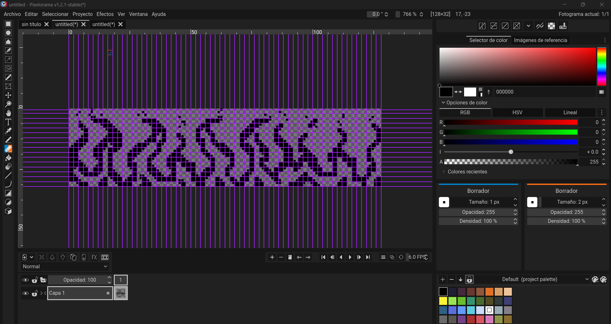

Y el resultado fue este:

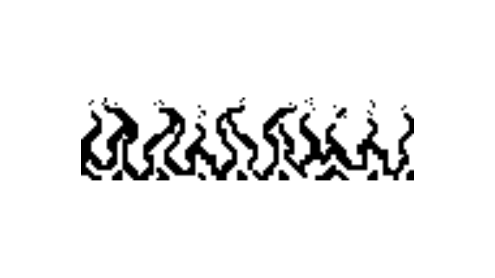

**Código del segundo intento de la animación llamas:** todo esto se encuentra dentro del archivo animacionLlamas.h en la carpeta [2026-09-06](https://github.com/disenoUDP/dis8645-2026-2-procesos-1/tree/main/00-proyecto-1/grupo-07/codigos/2026-09-06) dentro de la carpeta de nuestro proyecto.

```cpp
 // frame 0

 // Bitmap generated for 128x32 display
// Image: intentoAnimacion01
// Method: Ordered (Bayer)
// Format: 128x32, 1 bit/pixel, LSB first

#ifndef INTENTOANIMACION00_BITMAP_H
#define INTENTOANIMACION00_BITMAP_H

// Width: 128
// Height: 32

static const unsigned char PROGMEM intentoAnimacion00_bitmap[512] = {
  0x00,0x00,0x00,0x00,0x00,0x00,0x00,0x00,0x00,0x00,0x00,0x00,0x00,0x00,0x00,0x00,
  0x00,0x00,0x00,0x00,0x00,0x00,0x00,0x00,0x00,0x00,0x00,0x00,0x00,0x00,0x00,0x00,
  0x00,0x00,0x00,0x00,0x00,0x00,0x00,0x00,0x00,0x00,0x00,0x00,0x00,0x00,0x00,0x00,
  0x00,0x00,0x00,0x00,0x00,0x00,0x00,0x00,0x00,0x00,0x00,0x00,0x00,0x00,0x00,0x00,
  0x00,0x00,0x00,0x00,0x00,0x00,0x00,0x00,0x00,0x00,0x00,0x00,0x00,0x00,0x00,0x00,
  0x00,0x00,0x00,0x00,0x00,0x00,0x00,0x00,0x00,0x00,0x00,0x00,0x00,0x00,0x00,0x00,
  0x00,0x00,0x00,0x00,0x00,0x00,0x00,0x00,0x00,0x00,0x00,0x00,0x00,0x00,0x00,0x00,
  0x00,0x00,0x00,0x00,0x00,0x00,0x00,0x00,0x00,0x00,0x00,0x00,0x00,0x00,0x00,0x00,
  0x00,0x00,0x00,0x00,0x00,0x00,0x00,0x00,0x00,0x00,0x00,0x00,0x00,0x00,0x00,0x00,
  0x00,0x00,0x00,0x00,0x00,0x00,0x00,0x00,0x00,0x00,0x00,0x00,0x00,0x00,0x00,0x00,
  0x00,0x00,0x00,0x00,0x00,0x00,0x00,0x00,0x00,0x00,0x00,0x00,0x00,0x00,0x00,0x00,
  0x00,0x00,0x00,0x00,0x00,0x00,0x00,0x00,0x00,0x00,0x00,0x00,0x00,0x00,0x00,0x00,
  0x00,0x00,0x00,0x00,0x00,0x00,0x00,0x00,0x00,0x00,0x00,0x00,0x00,0x00,0x00,0x00,
  0x00,0x00,0x00,0x00,0x00,0x00,0x00,0x00,0x00,0x00,0x00,0x00,0x00,0x00,0x00,0x00,
  0x00,0x00,0x00,0x00,0x00,0x00,0x00,0x00,0x00,0x00,0x00,0x00,0x00,0x00,0x00,0x00,
  0x00,0x00,0x00,0x00,0x00,0x00,0x00,0x00,0x00,0x00,0x00,0x00,0x00,0x00,0x00,0x00,
  0x00,0x00,0x00,0x00,0x00,0x00,0x00,0x00,0x00,0x00,0x00,0x00,0x00,0x00,0x00,0x00,
  0x00,0x00,0x00,0x00,0x00,0x00,0x00,0x00,0x00,0x00,0x00,0x00,0x00,0x00,0x00,0x00,
  0x00,0x00,0x00,0x00,0x00,0x00,0x00,0x00,0x00,0x00,0x00,0x00,0x00,0x00,0x00,0x00,
  0x00,0x00,0x00,0x00,0x00,0x00,0x00,0x00,0x00,0x00,0x00,0x00,0x00,0x00,0x00,0x00,
  0x00,0x00,0x00,0x00,0x00,0x00,0x00,0x00,0x00,0x00,0x00,0x00,0x00,0x00,0x00,0x00,
  0x00,0x00,0x00,0x00,0x00,0x00,0x00,0x00,0x00,0x00,0x00,0x00,0x00,0x00,0x00,0x00,
  0x00,0x00,0x00,0x00,0x00,0x00,0x00,0x00,0x00,0x00,0x00,0x00,0x00,0x00,0x00,0x00,
  0x00,0x00,0x00,0x00,0x00,0x00,0x00,0x00,0x00,0x00,0x00,0x00,0x00,0x00,0x00,0x00,
  0x00,0x00,0x00,0x00,0x00,0x00,0x00,0x00,0x00,0x00,0x00,0x00,0x00,0x00,0x00,0x00,
  0x00,0x00,0x00,0x00,0x00,0x00,0x00,0x00,0x00,0x00,0x00,0x00,0x00,0x00,0x00,0x00,
  0x00,0x00,0x00,0x00,0x00,0x00,0x00,0x00,0x00,0x00,0x00,0x00,0x00,0x00,0x00,0x00,
  0x00,0x00,0x00,0x00,0x00,0x00,0x00,0x00,0x00,0x00,0x00,0x00,0x00,0x00,0x00,0x00,
  0x00,0x00,0x00,0x00,0x00,0x00,0x00,0x00,0x00,0x00,0x00,0x00,0x00,0x00,0x00,0x00,
  0x00,0x00,0x00,0x00,0x00,0x00,0x00,0x00,0x00,0x00,0x00,0x00,0x00,0x00,0x00,0x00,
  0x00,0x00,0x00,0x00,0x00,0x00,0x00,0x00,0x00,0x00,0x00,0x00,0x00,0x00,0x00,0x00,
  0x00,0x00,0x00,0x00,0x00,0x00,0x00,0x00,0x00,0x00,0x00,0x00,0x00,0x00,0x00,0x00
};

 // (...) 31 frames más tarde

 // frame 32

 // Bitmap generated for 128x32 display
// Image: intentoAnimacion01
// Method: Ordered (Bayer)
// Format: 128x32, 1 bit/pixel, LSB first


// Width: 128
// Height: 32

static const unsigned char PROGMEM intentoAnimacion32_bitmap[512] = {
  0x00,0x00,0x00,0x00,0x00,0x00,0x00,0x00,0x00,0x00,0x00,0x00,0x00,0x00,0x00,0x00,
  0x00,0x00,0x00,0x00,0x00,0x00,0x00,0x00,0x00,0x00,0x00,0x00,0x00,0x00,0x00,0x00,
  0x00,0x00,0x00,0x00,0x00,0x00,0x00,0x00,0x00,0x00,0x00,0x00,0x00,0x00,0x00,0x00,
  0x00,0x00,0x00,0x00,0x00,0x00,0x00,0x00,0x00,0x00,0x00,0x00,0x00,0x00,0x00,0x00,
  0x00,0x00,0x00,0x00,0x00,0x00,0x00,0x00,0x00,0x00,0x00,0x00,0x00,0x00,0x00,0x00,
  0x00,0x00,0x00,0x00,0x00,0x00,0x00,0x00,0x00,0x00,0x00,0x00,0x00,0x00,0x00,0x00,
  0x00,0x00,0x00,0x00,0x00,0x00,0x00,0x00,0x00,0x00,0x00,0x00,0x00,0x00,0x00,0x00,
  0x00,0x00,0x00,0x00,0x00,0x00,0x00,0x00,0x00,0x00,0x00,0x00,0x00,0x00,0x00,0x00,
  0x00,0x00,0x00,0x00,0x00,0x00,0x00,0x00,0x00,0x00,0x00,0x00,0x00,0x00,0x00,0x00,
  0x00,0x00,0x00,0x00,0x00,0x00,0x00,0x00,0x00,0x00,0x00,0x00,0x00,0x00,0x00,0x00,
  0x00,0x00,0x00,0x00,0x00,0x00,0x00,0x00,0x00,0x00,0x00,0x00,0x00,0x00,0x00,0x00,
  0x00,0x00,0x00,0x00,0x00,0x00,0x00,0x00,0x00,0x00,0x00,0x00,0x00,0x00,0x00,0x00,
  0x00,0x00,0x00,0x00,0x00,0x00,0x00,0x00,0x00,0x00,0x00,0x00,0x00,0x00,0x00,0x00,
  0x00,0x00,0x00,0x00,0x00,0x00,0x00,0x00,0x00,0x00,0x00,0x00,0x00,0x00,0x00,0x00,
  0x00,0x00,0x00,0x00,0x00,0x00,0x00,0x00,0x00,0x00,0x00,0x00,0x00,0x00,0x00,0x00,
  0x00,0x00,0x00,0x00,0x00,0x00,0x00,0x00,0x00,0x00,0x00,0x00,0x00,0x00,0x00,0x00,
  0x00,0x00,0x00,0x00,0x00,0x00,0x00,0x00,0x00,0x00,0x00,0x00,0x00,0x00,0x00,0x00,
  0x00,0x00,0x00,0x00,0x00,0x00,0x00,0x00,0x00,0x00,0x00,0x00,0x00,0x00,0x00,0x00,
  0x00,0x00,0x00,0x00,0x00,0x00,0x00,0x00,0x00,0x00,0x00,0x00,0x00,0x00,0x00,0x00,
  0x00,0x00,0x00,0x00,0x00,0x00,0x00,0x00,0x00,0x00,0x00,0x00,0x00,0x00,0x00,0x00,
  0x00,0x00,0x00,0x00,0x00,0x00,0x00,0x00,0x00,0x00,0x00,0x00,0x00,0x00,0x00,0x00,
  0x00,0x00,0x00,0x00,0x00,0x00,0x00,0x00,0x00,0x00,0x00,0x00,0x00,0x00,0x00,0x00,
  0x00,0x00,0x00,0x00,0x00,0x00,0x00,0x00,0x00,0x00,0x00,0x00,0x00,0x00,0x00,0x00,
  0x00,0x00,0x00,0x00,0x00,0x00,0x00,0x00,0x00,0x00,0x00,0x00,0x00,0x00,0x00,0x00,
  0x00,0x00,0x00,0x00,0x00,0x00,0x00,0x00,0x00,0x00,0x00,0x00,0x00,0x00,0x00,0x00,
  0x00,0x00,0x00,0x00,0x00,0x00,0x00,0x00,0x00,0x00,0x00,0x00,0x00,0x00,0x00,0x00,
  0x00,0x00,0x00,0x00,0x00,0x00,0x00,0x00,0x00,0x00,0x00,0x00,0x00,0x00,0x00,0x00,
  0x00,0x00,0x00,0x00,0x00,0x00,0x00,0x00,0x00,0x00,0x00,0x00,0x00,0x00,0x00,0x00,
  0x00,0x00,0x00,0x00,0x00,0x00,0x00,0x00,0x00,0x00,0x00,0x00,0x00,0x00,0x00,0x00,
  0x00,0x00,0x00,0x00,0x00,0x00,0x00,0x00,0x00,0x00,0x00,0x00,0x00,0x00,0x00,0x00,
  0x00,0x00,0x00,0x00,0x00,0x00,0x00,0x00,0x00,0x00,0x00,0x00,0x00,0x00,0x00,0x00,
  0x00,0x00,0x00,0x00,0x00,0x00,0x00,0x00,0x00,0x00,0x00,0x00,0x00,0x00,0x00,0x00
};

const unsigned char* const framesLlamas[] = {
  intentoAnimacion00_bitmap,  intentoAnimacion01_bitmap,  intentoAnimacion02_bitmap,
  intentoAnimacion03_bitmap,  intentoAnimacion04_bitmap,  intentoAnimacion05_bitmap,
  intentoAnimacion06_bitmap,  intentoAnimacion07_bitmap,  intentoAnimacion08_bitmap,
  intentoAnimacion09_bitmap,  intentoAnimacion10_bitmap,  intentoAnimacion11_bitmap,
  intentoAnimacion12_bitmap,  intentoAnimacion13_bitmap,  intentoAnimacion14_bitmap
};
 
const int numFramesLlamas = sizeof(framesLlamas) / sizeof(framesLlamas[0]);
 
// Delay entre frames (ms). Ajustalo a gusto para hacer la llama más lenta o más rápida.
const int frameDelayLlamas = 60;
 
#endif // ANIMACIONLLAMAS_H
```

A pesar de que esta versión también cuenta con 33 frames (0-32), sólo utilizamos 15 (0-14):

```cpp
const unsigned char* const framesLlamas[] = {
  intentoAnimacion00_bitmap,  intentoAnimacion01_bitmap,  intentoAnimacion02_bitmap,
  intentoAnimacion03_bitmap,  intentoAnimacion04_bitmap,  intentoAnimacion05_bitmap,
  intentoAnimacion06_bitmap,  intentoAnimacion07_bitmap,  intentoAnimacion08_bitmap,
  intentoAnimacion09_bitmap,  intentoAnimacion10_bitmap,  intentoAnimacion11_bitmap,
  intentoAnimacion12_bitmap,  intentoAnimacion13_bitmap,  intentoAnimacion14_bitmap
};
```

Aquí podemos ver cómo se reproduce en la pantalla una vez listo:

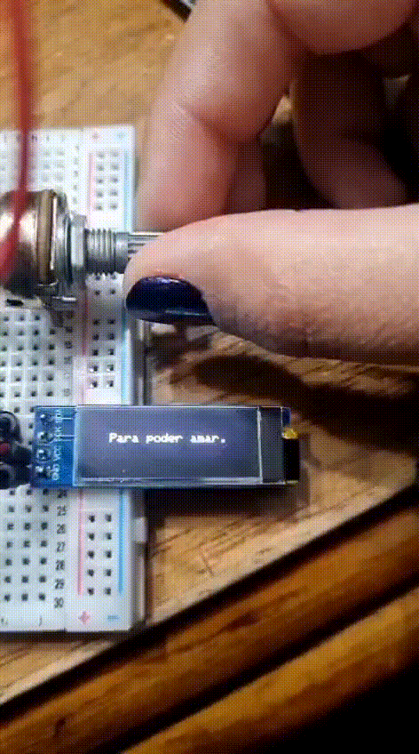

## Incorporación de la animación "Queja"

Para esto, ya había utilizado con anterioridad la aplicación de Pixelorama, por lo que fue más fácil hacer esta nueva animación.

En este caso quisimos agregar una animación que diga el nombre del poema, que viene luego del nombre de la poetisa.

Aquí podemos ver el proceso en la aplicación:

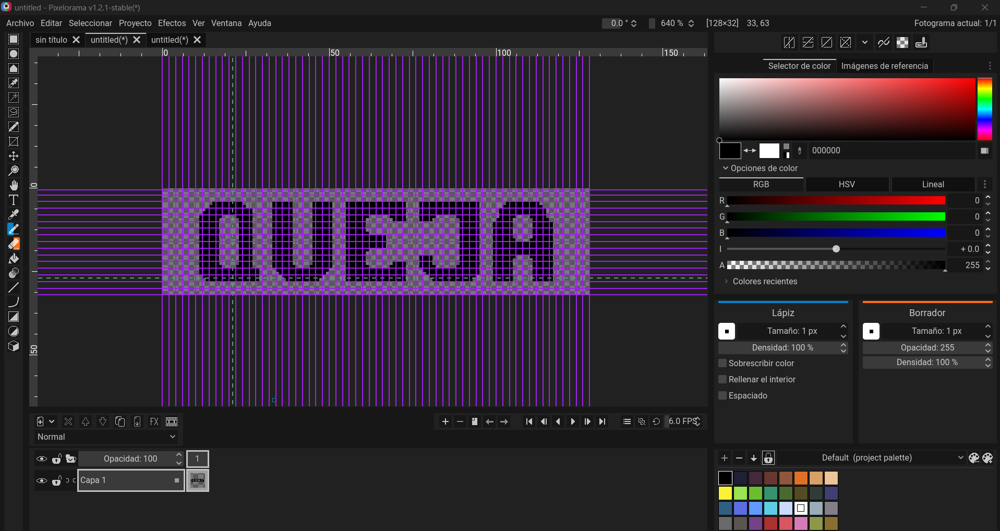

Y también el resultado de los frames por separado:

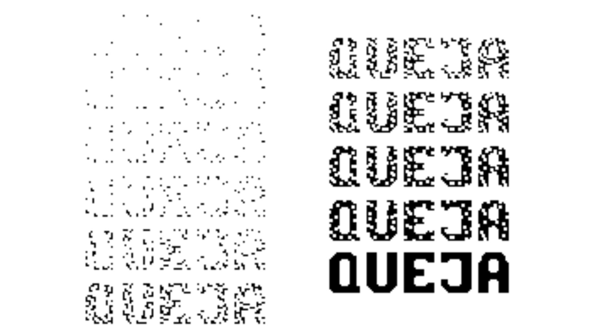

**Código de la animación "queja":** todo esto se encuentra dentro del archivo animacionQueja.h en la carpeta [2026-09-06](https://github.com/disenoUDP/dis8645-2026-2-procesos-1/tree/main/00-proyecto-1/grupo-07/codigos/2026-09-06) dentro de la carpeta de nuestro proyecto.

```cpp
 // frame 00

// Bitmap generated for 128x32 display
// Image: quejaFrame13
// Method: Ordered (Bayer)
// Format: 128x32, 1 bit/pixel, LSB first

#ifndef QUEJAFRAME00_BITMAP_H
#define QUEJAFRAME00_BITMAP_H

// Width: 128
// Height: 32

static const unsigned char PROGMEM quejaFrame00_bitmap[512] = {
  0x00,0x00,0x00,0x00,0x00,0x00,0x00,0x00,0x00,0x00,0x00,0x00,0x00,0x00,0x00,0x00,
  0x00,0x00,0x00,0x00,0x00,0x00,0x00,0x00,0x00,0x00,0x00,0x00,0x00,0x00,0x00,0x00,
  0x00,0x00,0x00,0x00,0x00,0x00,0x00,0x00,0x00,0x00,0x00,0x00,0x00,0x00,0x00,0x00,
  0x00,0x00,0x00,0x00,0x00,0x00,0x00,0x00,0x00,0x00,0x00,0x00,0x00,0x00,0x00,0x00,
  0x00,0x00,0x00,0x00,0x00,0x00,0x00,0x00,0x00,0x00,0x00,0x00,0x00,0x00,0x00,0x00,
  0x00,0x00,0x00,0x00,0x00,0x00,0x00,0x00,0x00,0x00,0x00,0x00,0x00,0x00,0x00,0x00,
  0x00,0x00,0x00,0x00,0x00,0x00,0x00,0x00,0x00,0x00,0x00,0x00,0x00,0x00,0x00,0x00,
  0x00,0x00,0x00,0x00,0x00,0x00,0x00,0x00,0x00,0x00,0x00,0x00,0x00,0x00,0x00,0x00,
  0x00,0x00,0x00,0x00,0x00,0x00,0x00,0x00,0x00,0x00,0x00,0x00,0x00,0x00,0x00,0x00,
  0x00,0x00,0x00,0x00,0x00,0x00,0x00,0x00,0x00,0x00,0x00,0x00,0x00,0x00,0x00,0x00,
  0x00,0x00,0x00,0x00,0x00,0x00,0x00,0x00,0x00,0x00,0x00,0x00,0x00,0x00,0x00,0x00,
  0x00,0x00,0x00,0x00,0x00,0x00,0x00,0x00,0x00,0x00,0x00,0x00,0x00,0x00,0x00,0x00,
  0x00,0x00,0x00,0x00,0x00,0x00,0x00,0x00,0x00,0x00,0x00,0x00,0x00,0x00,0x00,0x00,
  0x00,0x00,0x00,0x00,0x00,0x00,0x00,0x00,0x00,0x00,0x00,0x00,0x00,0x00,0x00,0x00,
  0x00,0x00,0x00,0x00,0x00,0x00,0x00,0x00,0x00,0x00,0x00,0x00,0x00,0x00,0x00,0x00,
  0x00,0x00,0x00,0x00,0x00,0x00,0x00,0x00,0x00,0x00,0x00,0x00,0x00,0x00,0x00,0x00,
  0x00,0x00,0x00,0x00,0x00,0x00,0x00,0x00,0x00,0x00,0x00,0x00,0x00,0x00,0x00,0x00,
  0x00,0x00,0x00,0x00,0x00,0x00,0x00,0x00,0x00,0x00,0x00,0x00,0x00,0x00,0x00,0x00,
  0x00,0x00,0x00,0x00,0x00,0x00,0x00,0x00,0x00,0x00,0x00,0x00,0x00,0x00,0x00,0x00,
  0x00,0x00,0x00,0x00,0x00,0x00,0x00,0x00,0x00,0x00,0x00,0x00,0x00,0x00,0x00,0x00,
  0x00,0x00,0x00,0x00,0x00,0x00,0x00,0x00,0x00,0x00,0x00,0x00,0x00,0x00,0x00,0x00,
  0x00,0x00,0x00,0x00,0x00,0x00,0x00,0x00,0x00,0x00,0x00,0x00,0x00,0x00,0x00,0x00,
  0x00,0x00,0x00,0x00,0x00,0x00,0x00,0x00,0x00,0x00,0x00,0x00,0x00,0x00,0x00,0x00,
  0x00,0x00,0x00,0x00,0x00,0x00,0x00,0x00,0x00,0x00,0x00,0x00,0x00,0x00,0x00,0x00,
  0x00,0x00,0x00,0x00,0x00,0x00,0x00,0x00,0x00,0x00,0x00,0x00,0x00,0x00,0x00,0x00,
  0x00,0x00,0x00,0x00,0x00,0x00,0x00,0x00,0x00,0x00,0x00,0x00,0x00,0x00,0x00,0x00,
  0x00,0x00,0x00,0x00,0x00,0x00,0x00,0x00,0x00,0x00,0x00,0x00,0x00,0x00,0x00,0x00,
  0x00,0x00,0x00,0x00,0x00,0x00,0x00,0x00,0x00,0x00,0x00,0x00,0x00,0x00,0x00,0x00,
  0x00,0x00,0x00,0x00,0x00,0x00,0x00,0x00,0x00,0x00,0x00,0x00,0x00,0x00,0x00,0x00,
  0x00,0x00,0x00,0x00,0x00,0x00,0x00,0x00,0x00,0x00,0x00,0x00,0x00,0x00,0x00,0x00,
  0x00,0x00,0x00,0x00,0x00,0x00,0x00,0x00,0x00,0x00,0x00,0x00,0x00,0x00,0x00,0x00,
  0x00,0x00,0x00,0x00,0x00,0x00,0x00,0x00,0x00,0x00,0x00,0x00,0x00,0x00,0x00,0x00
};

 // (...) 11 frames más tarde

 // frame 12

// Bitmap generated for 128x32 display
// Image: quejaFrame01
// Method: Ordered (Bayer)
// Format: 128x32, 1 bit/pixel, LSB first

// Width: 128
// Height: 32

static const unsigned char PROGMEM quejaFrame12_bitmap[512] = {
  0x00,0x00,0x00,0x00,0x00,0x00,0x00,0x00,0x00,0x00,0x00,0x00,0x00,0x00,0x00,0x00,
  0x00,0x00,0x00,0x00,0x00,0x00,0x00,0x00,0x00,0x00,0x00,0x00,0x00,0x00,0x00,0x00,
  0x00,0x00,0x00,0x00,0x00,0x00,0x00,0x00,0x00,0x00,0x00,0x00,0x00,0x00,0x00,0x00,
  0x00,0x00,0x00,0x00,0x00,0x00,0x00,0x00,0x00,0x00,0x00,0x00,0x00,0x00,0x00,0x00,
  0x00,0x01,0xFF,0x00,0x7E,0x07,0xE1,0xFF,0xFF,0x87,0xFF,0xFE,0x01,0xFF,0x80,0x00,
  0x00,0x03,0xFF,0x80,0x7E,0x07,0xE1,0xFF,0xFF,0x87,0xFF,0xFE,0x03,0xFF,0xC0,0x00,
  0x00,0x07,0xFF,0xE0,0x7E,0x07,0xE1,0xFF,0xFF,0x87,0xFF,0xFE,0x07,0xFF,0xE0,0x00,
  0x00,0x0F,0xFF,0xE0,0x7E,0x07,0xE1,0xFF,0xFF,0x87,0xFF,0xFE,0x07,0xFF,0xE0,0x00,
  0x00,0x1F,0xC3,0xE0,0x7E,0x07,0xE1,0xFC,0x0F,0x87,0xC0,0xFE,0x07,0xC3,0xE0,0x00,
  0x00,0x1F,0x81,0xE0,0x7E,0x07,0xE1,0xF8,0x07,0x87,0x80,0x7E,0x0F,0x81,0xF0,0x00,
  0x00,0x1F,0x81,0xE0,0x7E,0x07,0xE1,0xF8,0x00,0x00,0x00,0x7E,0x1F,0x81,0xF8,0x00,
  0x00,0x1F,0x81,0xE0,0x7E,0x07,0xE1,0xF8,0x00,0x00,0x00,0x7E,0x1F,0x81,0xF8,0x00,
  0x00,0x1F,0x81,0xE0,0x7E,0x07,0xE1,0xF8,0x00,0x00,0x00,0x7E,0x1F,0x81,0xF8,0x00,
  0x00,0x1F,0x81,0xE0,0x7E,0x07,0xE1,0xFC,0x00,0x00,0x00,0x7E,0x1F,0x81,0xF8,0x00,
  0x00,0x1F,0x81,0xE0,0x7E,0x07,0xE1,0xFF,0xE0,0x00,0x00,0x7E,0x1F,0x81,0xF8,0x00,
  0x00,0x1F,0x81,0xE0,0x7E,0x07,0xE1,0xFF,0xE0,0x00,0x00,0x7E,0x1F,0xC3,0xF8,0x00,
  0x00,0x1F,0x81,0xE0,0x7E,0x07,0xE1,0xFF,0xE0,0x00,0x00,0x7E,0x1F,0xFF,0xF8,0x00,
  0x00,0x1F,0x81,0xE0,0x7E,0x07,0xE1,0xFF,0xE0,0x00,0x00,0x7E,0x1F,0xFF,0xF8,0x00,
  0x00,0x1F,0x81,0xE0,0x7E,0x07,0xE1,0xFC,0x00,0x00,0x00,0x7E,0x1F,0xFF,0xF8,0x00,
  0x00,0x1F,0x81,0xE0,0x7E,0x07,0xE1,0xF8,0x00,0x00,0x00,0x7E,0x1F,0xFF,0xF8,0x00,
  0x00,0x1F,0x81,0xE0,0x7E,0x07,0xE1,0xF8,0x00,0x07,0x80,0x7E,0x1F,0xC3,0xF8,0x00,
  0x00,0x1F,0x81,0xE0,0x7E,0x07,0xE1,0xF8,0x00,0x07,0x80,0x7E,0x1F,0x81,0xF8,0x00,
  0x00,0x1F,0x81,0xE0,0x7E,0x07,0xE1,0xF8,0x07,0x87,0x80,0x7E,0x1F,0x81,0xF8,0x00,
  0x00,0x1F,0xC3,0xE0,0x7F,0x0F,0xE1,0xFC,0x0F,0x87,0xC0,0xFE,0x1F,0x81,0xF8,0x00,
  0x00,0x1F,0xFF,0xF8,0x3F,0xFF,0xC1,0xFF,0xFF,0x83,0xFF,0xFE,0x1F,0x81,0xF8,0x00,
  0x00,0x1F,0xFF,0xF8,0x1F,0xFF,0x81,0xFF,0xFF,0x81,0xFF,0xFE,0x1F,0x81,0xF8,0x00,
  0x00,0x0F,0xFF,0xF8,0x0F,0xFF,0x01,0xFF,0xFF,0x80,0xFF,0xFC,0x1F,0x81,0xF8,0x00,
  0x00,0x07,0xFF,0xF8,0x07,0xFE,0x01,0xFF,0xFF,0x80,0x7F,0xF8,0x1F,0x81,0xF8,0x00,
  0x00,0x00,0x00,0x00,0x00,0x00,0x00,0x00,0x00,0x00,0x00,0x00,0x00,0x00,0x00,0x00,
  0x00,0x00,0x00,0x00,0x00,0x00,0x00,0x00,0x00,0x00,0x00,0x00,0x00,0x00,0x00,0x00,
  0x00,0x00,0x00,0x00,0x00,0x00,0x00,0x00,0x00,0x00,0x00,0x00,0x00,0x00,0x00,0x00,
  0x00,0x00,0x00,0x00,0x00,0x00,0x00,0x00,0x00,0x00,0x00,0x00,0x00,0x00,0x00,0x00
};

const unsigned char* const framesQueja[] = {
  quejaFrame00_bitmap,  quejaFrame01_bitmap,  quejaFrame02_bitmap,
  quejaFrame03_bitmap,  quejaFrame04_bitmap,  quejaFrame05_bitmap,
  quejaFrame06_bitmap,  quejaFrame07_bitmap,  quejaFrame08_bitmap,
  quejaFrame09_bitmap,  quejaFrame10_bitmap,  quejaFrame11_bitmap,
  quejaFrame12_bitmap

};

const int numFramesQueja = sizeof(framesQueja) / sizeof(framesQueja[0]);
 
// Delay entre frames (ms). Ajustalo a gusto para hacer el texto de "queja" más lenta o más rápida.
const int frameDelayQueja = 80;
 
#endif // ANIMACIONQUEJA_H
```

Aquí podemos ver cómo se reproduce en la pantalla una vez listo:


## Incorporación de la animación del corazón roto

Quisimos agregar esto porque representa la emoción del poema de una forma más literal, de manera en que la poetisa nos explica que no se siente capaz de amar.

Aquí podemos ver el proceso en la aplicación:

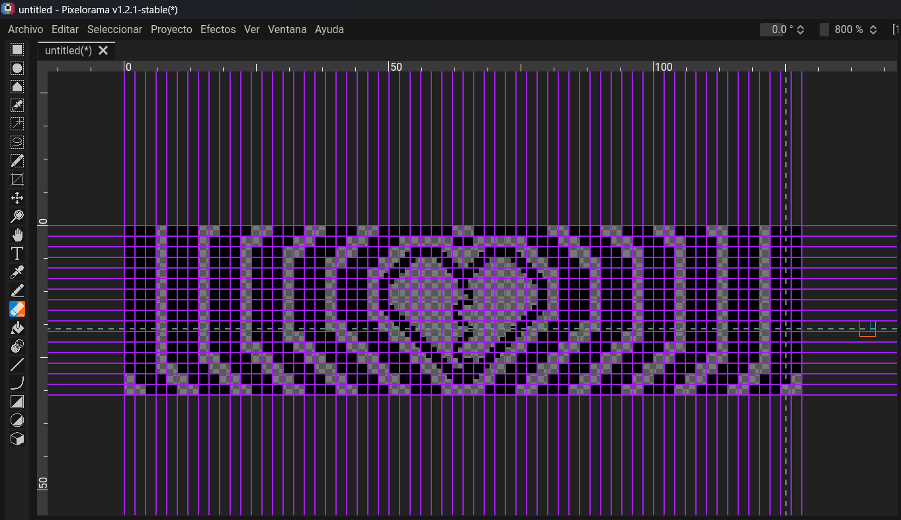

Y también el resultado de los frames por separado:

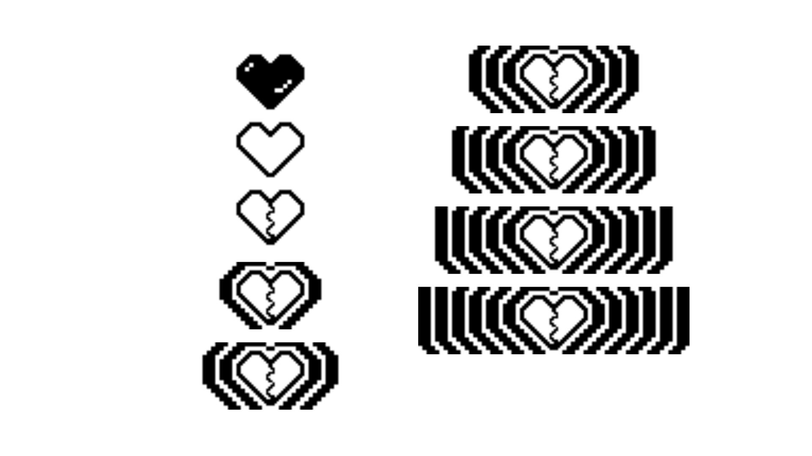

**Código de la animación del corazón roto:** todo esto se encuentra dentro del archivo animacionCorazon.h en la carpeta [2026-09-07](https://github.com/disenoUDP/dis8645-2026-2-procesos-1/tree/main/00-proyecto-1/grupo-07/codigos/2026-09-07/codigo8.0_07_09) dentro de la carpeta de nuestro proyecto.

```cpp
 // frame 00

// Bitmap generated for 128x32 display
// Image: corazonFrame01
// Method: Ordered (Bayer)
// Format: 128x32, 1 bit/pixel, LSB first

#ifndef CORAZONFRAME00_BITMAP_H
#define CORAZONFRAME00_BITMAP_H

// Width: 128
// Height: 32

static const unsigned char PROGMEM corazonFrame00_bitmap[512] = {
  0x00,0x00,0x00,0x00,0x00,0x00,0x00,0x00,0x00,0x00,0x00,0x00,0x00,0x00,0x00,0x00,
  0x00,0x00,0x00,0x00,0x00,0x00,0x00,0x00,0x00,0x00,0x00,0x00,0x00,0x00,0x00,0x00,
  0x00,0x00,0x00,0x00,0x00,0x00,0x00,0x00,0x00,0x00,0x00,0x00,0x00,0x00,0x00,0x00,
  0x00,0x00,0x00,0x00,0x00,0x00,0x00,0x00,0x00,0x00,0x00,0x00,0x00,0x00,0x00,0x00,
  0x00,0x00,0x00,0x00,0x00,0x00,0x00,0x00,0x00,0x00,0x00,0x00,0x00,0x00,0x00,0x00,
  0x00,0x00,0x00,0x00,0x00,0x00,0x00,0x00,0x00,0x00,0x00,0x00,0x00,0x00,0x00,0x00,
  0x00,0x00,0x00,0x00,0x00,0x00,0x00,0x00,0x00,0x00,0x00,0x00,0x00,0x00,0x00,0x00,
  0x00,0x00,0x00,0x00,0x00,0x00,0x00,0x00,0x00,0x00,0x00,0x00,0x00,0x00,0x00,0x00,
  0x00,0x00,0x00,0x00,0x00,0x00,0x00,0x00,0x00,0x00,0x00,0x00,0x00,0x00,0x00,0x00,
  0x00,0x00,0x00,0x00,0x00,0x00,0x00,0x00,0x00,0x00,0x00,0x00,0x00,0x00,0x00,0x00,
  0x00,0x00,0x00,0x00,0x00,0x00,0x00,0x00,0x00,0x00,0x00,0x00,0x00,0x00,0x00,0x00,
  0x00,0x00,0x00,0x00,0x00,0x00,0x00,0x00,0x00,0x00,0x00,0x00,0x00,0x00,0x00,0x00,
  0x00,0x00,0x00,0x00,0x00,0x00,0x00,0x00,0x00,0x00,0x00,0x00,0x00,0x00,0x00,0x00,
  0x00,0x00,0x00,0x00,0x00,0x00,0x00,0x00,0x00,0x00,0x00,0x00,0x00,0x00,0x00,0x00,
  0x00,0x00,0x00,0x00,0x00,0x00,0x00,0x00,0x00,0x00,0x00,0x00,0x00,0x00,0x00,0x00,
  0x00,0x00,0x00,0x00,0x00,0x00,0x00,0x00,0x00,0x00,0x00,0x00,0x00,0x00,0x00,0x00,
  0x00,0x00,0x00,0x00,0x00,0x00,0x00,0x00,0x00,0x00,0x00,0x00,0x00,0x00,0x00,0x00,
  0x00,0x00,0x00,0x00,0x00,0x00,0x00,0x00,0x00,0x00,0x00,0x00,0x00,0x00,0x00,0x00,
  0x00,0x00,0x00,0x00,0x00,0x00,0x00,0x00,0x00,0x00,0x00,0x00,0x00,0x00,0x00,0x00,
  0x00,0x00,0x00,0x00,0x00,0x00,0x00,0x00,0x00,0x00,0x00,0x00,0x00,0x00,0x00,0x00,
  0x00,0x00,0x00,0x00,0x00,0x00,0x00,0x00,0x00,0x00,0x00,0x00,0x00,0x00,0x00,0x00,
  0x00,0x00,0x00,0x00,0x00,0x00,0x00,0x00,0x00,0x00,0x00,0x00,0x00,0x00,0x00,0x00,
  0x00,0x00,0x00,0x00,0x00,0x00,0x00,0x00,0x00,0x00,0x00,0x00,0x00,0x00,0x00,0x00,
  0x00,0x00,0x00,0x00,0x00,0x00,0x00,0x00,0x00,0x00,0x00,0x00,0x00,0x00,0x00,0x00,
  0x00,0x00,0x00,0x00,0x00,0x00,0x00,0x00,0x00,0x00,0x00,0x00,0x00,0x00,0x00,0x00,
  0x00,0x00,0x00,0x00,0x00,0x00,0x00,0x00,0x00,0x00,0x00,0x00,0x00,0x00,0x00,0x00,
  0x00,0x00,0x00,0x00,0x00,0x00,0x00,0x00,0x00,0x00,0x00,0x00,0x00,0x00,0x00,0x00,
  0x00,0x00,0x00,0x00,0x00,0x00,0x00,0x00,0x00,0x00,0x00,0x00,0x00,0x00,0x00,0x00,
  0x00,0x00,0x00,0x00,0x00,0x00,0x00,0x00,0x00,0x00,0x00,0x00,0x00,0x00,0x00,0x00,
  0x00,0x00,0x00,0x00,0x00,0x00,0x00,0x00,0x00,0x00,0x00,0x00,0x00,0x00,0x00,0x00,
  0x00,0x00,0x00,0x00,0x00,0x00,0x00,0x00,0x00,0x00,0x00,0x00,0x00,0x00,0x00,0x00,
  0x00,0x00,0x00,0x00,0x00,0x00,0x00,0x00,0x00,0x00,0x00,0x00,0x00,0x00,0x00,0x00
};

 // (...) 08 frames más tarde

 // frame 09

// Bitmap generated for 128x32 display
// Image: corazonFrame09
// Method: Ordered (Bayer)
// Format: 128x32, 1 bit/pixel, LSB first

// Width: 128
// Height: 32

static const unsigned char PROGMEM corazonFrame09_bitmap[512] = {
  0xFC,0xFC,0x3F,0x0F,0xC3,0xF0,0xFF,0xFC,0x3F,0xFF,0x0F,0xC3,0xF0,0xFC,0x3F,0x3F,
  0xFC,0xFC,0x3F,0x0F,0xC3,0xF0,0xFF,0xFC,0x3F,0xFF,0x0F,0xC3,0xF0,0xFC,0x3F,0x3F,
  0xFC,0xFC,0xFC,0x3F,0x0F,0xC3,0xF0,0x03,0xC0,0x0F,0xC3,0xF0,0xFC,0x3F,0x3F,0x3F,
  0xFC,0xFC,0xFC,0x3F,0x0F,0xC3,0xF0,0x03,0xC0,0x0F,0xC3,0xF0,0xFC,0x3F,0x3F,0x3F,
  0xFC,0xFC,0xFC,0xFC,0x3F,0x0F,0xC3,0xF0,0x0F,0xC3,0xF0,0xFC,0x3F,0x3F,0x3F,0x3F,
  0xFC,0xFC,0xFC,0xFC,0x3F,0x0F,0xC7,0xF8,0x1F,0xE3,0xF0,0xFC,0x3F,0x3F,0x3F,0x3F,
  0xFC,0xFC,0xFC,0xFC,0xFC,0x3F,0x0E,0x1C,0x38,0x70,0xFC,0x3F,0x3F,0x3F,0x3F,0x3F,
  0xFC,0xFC,0xFC,0xFC,0xFC,0x3F,0x1C,0x0E,0x70,0x38,0xFC,0x3F,0x3F,0x3F,0x3F,0x3F,
  0xFC,0xFC,0xFC,0xFC,0xFC,0xFC,0x38,0x07,0xE0,0x1C,0x3F,0x3F,0x3F,0x3F,0x3F,0x3F,
  0xFC,0xFC,0xFC,0xFC,0xFC,0xFC,0x70,0x03,0xC0,0x0E,0x3F,0x3F,0x3F,0x3F,0x3F,0x3F,
  0xFC,0xFC,0xFC,0xFC,0xFC,0xFC,0xE0,0x01,0x80,0x07,0x3F,0x3F,0x3F,0x3F,0x3F,0x3F,
  0xFC,0xFC,0xFC,0xFC,0xFC,0xFC,0xC0,0x01,0x80,0x03,0x3F,0x3F,0x3F,0x3F,0x3F,0x3F,
  0xFC,0xFC,0xFC,0xFC,0xFC,0xFC,0xC0,0x00,0xC0,0x03,0x3F,0x3F,0x3F,0x3F,0x3F,0x3F,
  0xFC,0xFC,0xFC,0xFC,0xFC,0xFC,0xC0,0x00,0x40,0x03,0x3F,0x3F,0x3F,0x3F,0x3F,0x3F,
  0xFC,0xFC,0xFC,0xFC,0xFC,0xFC,0xC0,0x01,0xC0,0x03,0x3F,0x3F,0x3F,0x3F,0x3F,0x3F,
  0xFC,0xFC,0xFC,0xFC,0xFC,0xFC,0xE0,0x03,0x00,0x07,0x3F,0x3F,0x3F,0x3F,0x3F,0x3F,
  0xFC,0xFC,0xFC,0xFC,0xFC,0xFC,0x70,0x02,0x00,0x0E,0x3F,0x3F,0x3F,0x3F,0x3F,0x3F,
  0xFC,0xFC,0xFC,0xFC,0xFC,0xFC,0x38,0x03,0x00,0x1C,0x3F,0x3F,0x3F,0x3F,0x3F,0x3F,
  0xFC,0xFC,0xFC,0xFC,0xFC,0x3F,0x1C,0x01,0x80,0x38,0xFC,0x3F,0x3F,0x3F,0x3F,0x3F,
  0xFC,0xFC,0xFC,0xFC,0xFC,0x3F,0x0E,0x00,0x40,0x70,0xFC,0x3F,0x3F,0x3F,0x3F,0x3F,
  0xFC,0xFC,0xFC,0xFC,0x3F,0x0F,0xC7,0x00,0xC0,0xE3,0xF0,0xFC,0x3F,0x3F,0x3F,0x3F,
  0xFC,0xFC,0xFC,0xFC,0x3F,0x0F,0xC3,0x81,0x81,0xC3,0xF0,0xFC,0x3F,0x3F,0x3F,0x3F,
  0xFC,0xFC,0xFC,0x3F,0x0F,0xC3,0xF1,0xC3,0x03,0x8F,0xC3,0xF0,0xFC,0x3F,0x3F,0x3F,
  0xFC,0xFC,0xFC,0x3F,0x0F,0xC3,0xF0,0xE2,0x07,0x0F,0xC3,0xF0,0xFC,0x3F,0x3F,0x3F,
  0xFC,0xFC,0x3F,0x0F,0xC3,0xF0,0xFC,0x73,0x0E,0x3F,0x0F,0xC3,0xF0,0xFC,0x3F,0x3F,
  0xFC,0xFC,0x3F,0x0F,0xC3,0xF0,0xFC,0x39,0xDC,0x3F,0x0F,0xC3,0xF0,0xFC,0x3F,0x3F,
  0xFC,0x3F,0x0F,0xC3,0xF0,0xFC,0x3F,0x1C,0xF8,0xFC,0x3F,0x0F,0xC3,0xF0,0xFC,0x3F,
  0xFC,0x3F,0x0F,0xC3,0xF0,0xFC,0x3F,0x0F,0xF0,0xFC,0x3F,0x0F,0xC3,0xF0,0xFC,0x3F,
  0x3F,0x0F,0xC3,0xF0,0xFC,0x3F,0x0F,0xC7,0xE3,0xF0,0xFC,0x3F,0x0F,0xC3,0xF0,0xFC,
  0x3F,0x0F,0xC3,0xF0,0xFC,0x3F,0x0F,0xC3,0xC3,0xF0,0xFC,0x3F,0x0F,0xC3,0xF0,0xFC,
  0x0F,0xC3,0xF0,0xFC,0x3F,0x0F,0xC3,0xF0,0x0F,0xC3,0xF0,0xFC,0x3F,0x0F,0xC3,0xF0,
  0x0F,0xC3,0xF0,0xFC,0x3F,0x0F,0xC3,0xF0,0x0F,0xC3,0xF0,0xFC,0x3F,0x0F,0xC3,0xF0
};

const unsigned char* const framesCorazon[] = {
  corazonFrame00_bitmap,  corazonFrame01_bitmap,  corazonFrame02_bitmap,
  corazonFrame01_bitmap,  corazonFrame02_bitmap,  corazonFrame01_bitmap,
  corazonFrame02_bitmap,  corazonFrame03_bitmap,  corazonFrame04_bitmap,
  corazonFrame05_bitmap,  corazonFrame06_bitmap,  corazonFrame07_bitmap,
  corazonFrame08_bitmap,  corazonFrame09_bitmap
  
};

const int numFramesCorazon = sizeof(framesCorazon) / sizeof(framesCorazon[0]);
 
// Delay entre frames (ms). Ajustalo a gusto para hacer el texto de "queja" más lenta o más rápida.
const int frameDelayCorazon = 100;
 
#endif // ANIMACIONCORAZON_H
```

En este código intentamos repetir frames para generar la ilusión de que el corazón está latiendo antes de romperse y expandirse por la pantalla. En este caso repetimos el 01 y el 02:

```cpp
const unsigned char* const framesCorazon[] = {
  corazonFrame00_bitmap,  corazonFrame01_bitmap,  corazonFrame02_bitmap,
  corazonFrame01_bitmap,  corazonFrame02_bitmap,  corazonFrame01_bitmap,
  corazonFrame02_bitmap,  corazonFrame03_bitmap,  corazonFrame04_bitmap,
  corazonFrame05_bitmap,  corazonFrame06_bitmap,  corazonFrame07_bitmap,
  corazonFrame08_bitmap,  corazonFrame09_bitmap
```

Aquí podemos ver cómo se reproduce en la pantalla una vez listo:

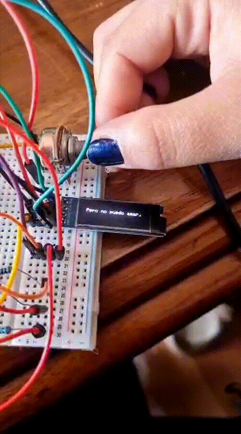

## Modificaciones al código base para que corran las nimaciones

Primero debíamos incluir (#include) los archivos .h para que corrieran junto con el código base:

```cpp
#include "animacionLlamas.h"   // framesLlamas[], numFramesLlamas, frameDelayLlamas
#include "animacionQueja.h"    // framesQueja[], numFramesQueja, frameDelayQueja
#include "animacionCorazon.h"  // framesCorazon[], numFramesCorazon, frameDelayCorazon
```

También tuvimos que modificar la cantidad de versos, que al inicio eran 13, pero al añadir las animaciones pasaron a ser más líneas que igualmente consideramos como versos:

```cpp
// Cantidad total de versos
const int totalVersos = 13;

// NUEVO: la animación de llamas ocupa una posición EXTRA en la escala
// del potenciómetro, ubicada justo después del verso de índice 8
// ("Para poder amar.") y antes del verso de índice 9
// ("Me consumo en mi fuego,"). Por eso el pot ya no recorre 13
// posiciones sino 14: 0..8 = versos 0..8, 9 = animación, 10..13 = versos 9..12.

const int posicionAnimacionQueja = 1;    // justo después del verso 0 ("Alfonsina Storni")
const int posicionAnimacionLlamas = 11;  // después del verso 8 (se corrió +1 por la nueva animación)
const int posicionAnimacionCorazon = 6;   // después del verso 5, se le suma 1 por la animacion de queja
const int totalPosiciones = totalVersos + 3; // 15
```

Luego tuvimos que explicarle esto mismo, pero para que reprodujera la animación en el lugar correcto y no en cualquier parte:

```cpp
  int valorPot = analogRead(POT_PIN);
  // En vez de map(), repartimos el rango 0..1023 en "totalPosiciones" bloques iguales
long posicionActual = (long)valorPot * totalPosiciones / 1024;
if (posicionActual >= totalPosiciones) posicionActual = totalPosiciones - 1; // por seguridad

  if (posicionActual != posicionAnterior) {

    if (posicionActual == posicionAnimacionQueja) {
      reproducirAnimacionQuejaUnaVez();

    } else if (posicionActual == posicionAnimacionLlamas) {
      reproducirAnimacionLlamasUnaVez();

    } else if (posicionActual == posicionAnimacionCorazon) {
      reproducirAnimacionCorazonUnaVez();

    } else {

  int indiceActual = posicionActual;
if (posicionActual > posicionAnimacionQueja) indiceActual--;
if (posicionActual > posicionAnimacionCorazon) indiceActual--;
if (posicionActual > posicionAnimacionLlamas) indiceActual--;
```

También tuvimos que decirle cómo reproducir los frames de cada animación, que en este caso es 1 por 1 y que quede fija en la pantalla luego de terminar de reproducirla:

```cpp
// Reproduce todos los frames de la animación de llamas, en orden, UNA
// sola vez. Es bloqueante a propósito: mientras se reproduce (dura
// unos 1-2 segundos en total) el potenciómetro no puede interrumpirla.
// El último frame queda dibujado y fijo en pantalla al terminar.
void reproducirAnimacionCorazonUnaVez() {
  for (int i = 0; i < numFramesCorazon; i++) {
    display.clearDisplay();
    display.drawBitmap(0, 0, framesCorazon[i], SCREEN_WIDTH, SCREEN_HEIGHT, SSD1306_WHITE);
    display.display();
    delay(frameDelayCorazon);
  }
}

void reproducirAnimacionQuejaUnaVez() {
  for (int i = 0; i < numFramesQueja; i++) {
    display.clearDisplay();
    display.drawBitmap(0, 0, framesQueja[i], SCREEN_WIDTH, SCREEN_HEIGHT, SSD1306_WHITE);
    display.display();
    delay(frameDelayQueja);
  }
}


void reproducirAnimacionLlamasUnaVez() {
  for (int i = 0; i < numFramesLlamas; i++) {
    display.clearDisplay();
    display.drawBitmap(0, 0, framesLlamas[i], SCREEN_WIDTH, SCREEN_HEIGHT, SSD1306_WHITE);
    display.display();
    delay(frameDelayLlamas);
  }
}
```

## Añadir LEDs al circuito

Quisimos agregar los LED gracias a una idea q nos dio Misaaa, la cual era que cuando las palabras de nuestro poema fueran más grandes que estos LED se encendieran también para demostrar la intensidad de las palabras de Alfonsina en este poema.

Para esto tuvimos que añadirlos tanto al código como a la protoboard.

Aquí podemos ver la primera modificación al código, en donde señalamos en qué pin del arduino conectamos los LED y también define que el LED se mantiene apagado hasta que sucede algo:

```cpp
#define LED_GRITO 9  // pin donde conectaste el LED

// setup() se ejecuta UNA sola vez, al encender o resetear la placa
void setup() {
  Serial.begin(9600); // Inicia la comunicación serial a 9600 baudios
   pinMode(LED_GRITO, OUTPUT);
  digitalWrite(LED_GRITO, LOW);

```

En esta segunda modificación podemos ver cómo definimos en qué estado estuviera el pin cuando una palabra más grande apareciera en la pantalla, y que sino cumplía esta variable, que no lo hiciera:

```cpp
  // Prendemos el LED solo si este verso tiene palabra "grito"
  if (strlen(palabraGrande[indiceActual]) > 0) {
    digitalWrite(LED_GRITO, HIGH);
  } else {
    digitalWrite(LED_GRITO, LOW);
  }
```

Aquí podemos ver fotos  del circuito con los LED incorporados:

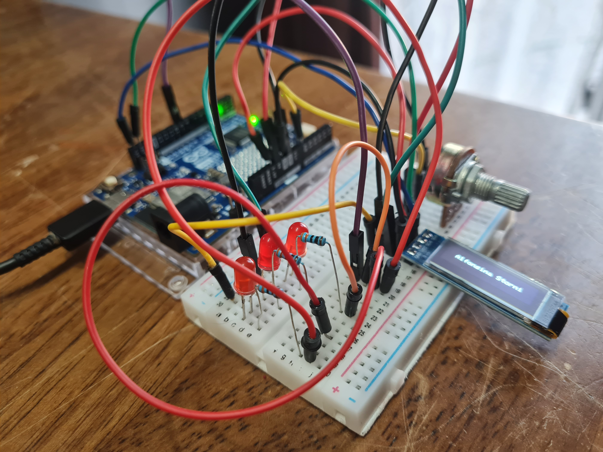

## Proceso de carcasa

Imágenes del proceso de la carcasa.

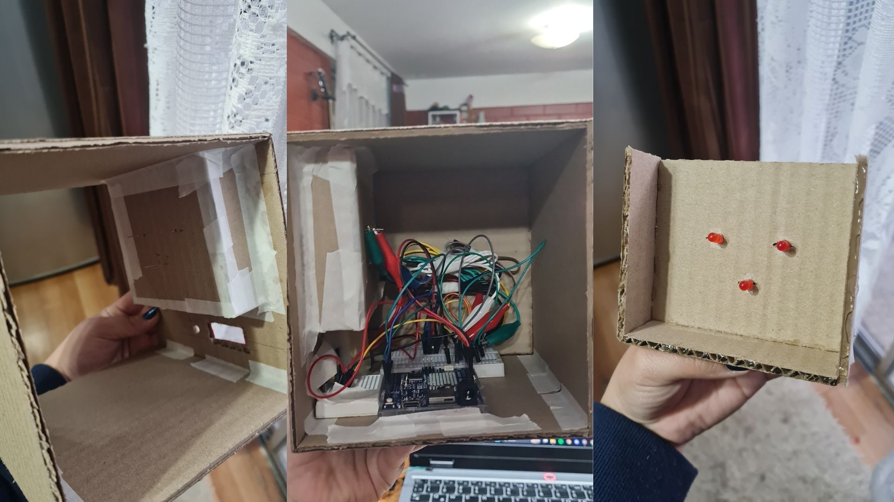

Imagen del proceso de la carcasa pt. 2.

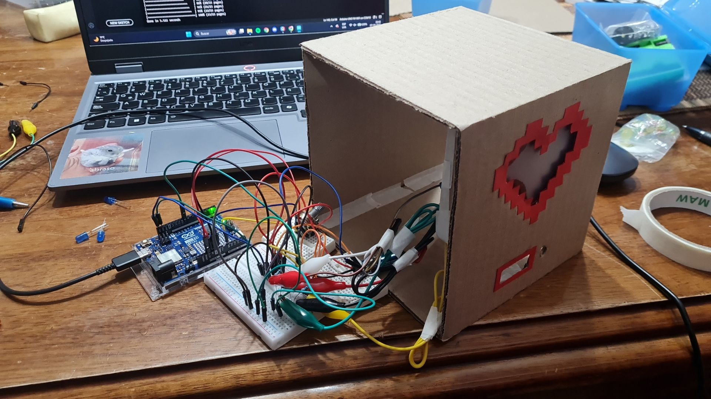

## Resultado carcasa

Una de las características del proyecto es que la carcasa fuera de cartón, por ende nosotras utilizamos cartón corrugado simple, además de cartulina española roja, mica roja y opaca.

Y con estos materiales quisimos mostrar la intensidad de las palabras de la poetisa, es por eso que el corazón se encuentra sobre la pantalla y no al revés. Así le damos más énfasis a la intensidad y ferocidad de sus palabras mediante los LED rojos.

Imagen de la carcasa final.

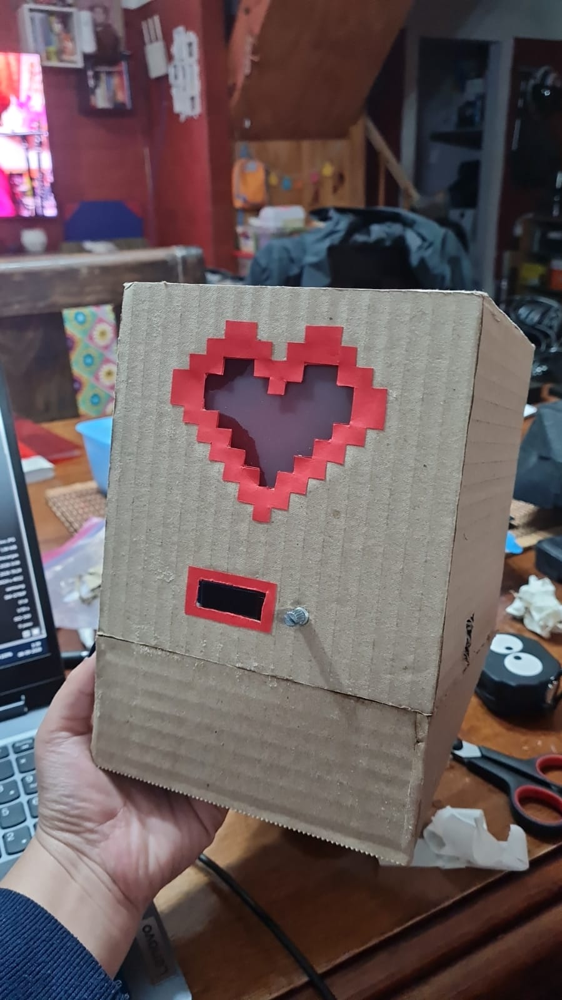

## Herramienta para animaciones pixel a pixel

No logramos encontrar imágenes adecuadas para lo que estábamos buscando representar, es por esto que buscamos una solución para poder desarrollar nuestros "frames" desde cero para generar las animaciones.

Es así que llegamos a [Pixelorama](https://pixelorama.org/) que es una aplicación que se utiliza para generar animaciones pixel a pixel, la cual tiene distintas formas de descargar y nosotras la descargamos desde su GitHub.

## Herramienta para animaciones en arduino (bitmap)

Esta herramienta nos la enseño Seba (grande Seba c:), y se llama [Stonez56](https://tools.stonez56.com/u8g2/getBitmap.php) y sirve para ingresar una imagen en el formato y que la reescriba pixel por pixel para generar una imagen en arduino.

Captura de pantalla de la página convirtiendo una imagen en bitmap pt. 1.

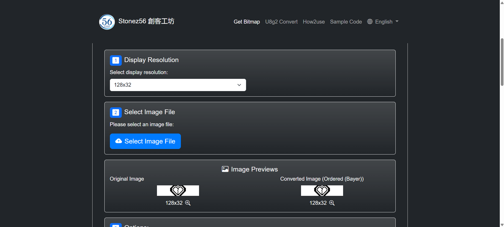

Captura de pantalla de la página convirtiendo una imagen en bitmap pt. 2.

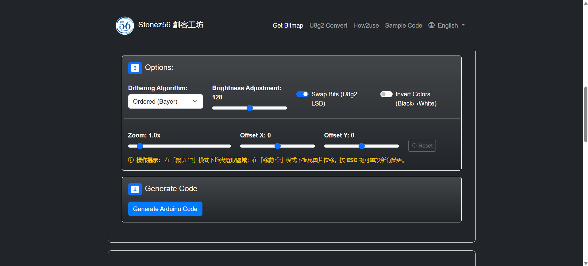

Captura de pantalla de la página convirtiendo una imagen en bitmap pt. 3.

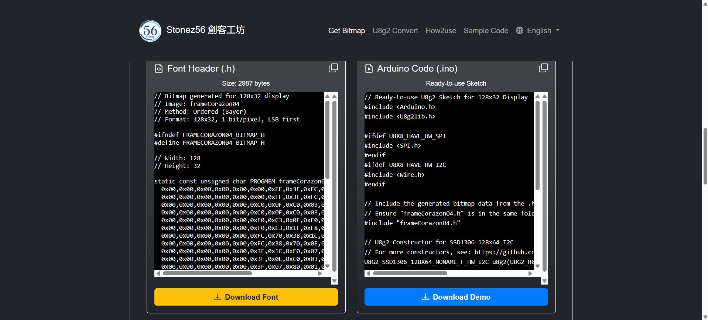

## encargos

## lectura
