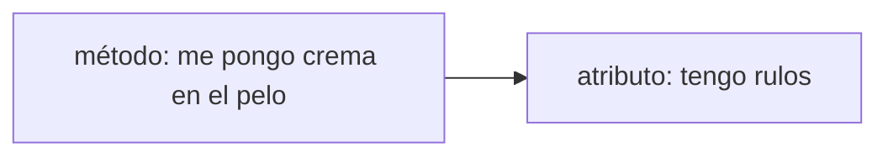

# sesion-06a

## apuntes sesión
# clase después del 18: de variables a clases

primera clase después de la semana del 18. vimos cómo guardar datos (variables) y dimos el salto a algo nuevo: las **clases**.

## 1. variables: los contenedores

cuando uno va al súper, siempre tiene que llevarse las cosas para la casa en algo: una bolsa, una caja, lo que sea. una **variable** es eso mismo: un **contenedor** donde guardo un dato para poder usarlo después.

- lo importante es el **contenedor**, no lo que lleva adentro.

### tipos de variables que vimos

cada contenedor sirve para guardar un tipo distinto de cosa:

- **`bool`**: solo dice si algo está o no está (presencia / ausencia). dos opciones: `true` o `false`.
  ejemplo: `bool hambre = true;` → el perrito tiene hambre.
- **`int`**: números enteros (1, 25, -3).
- **`uint`**: números enteros **sin signo**, o sea, solo 0 o positivos. sirve para cosas que nunca pueden ser negativas, como una cantidad.


## 2. clases: lo que viene ahora no es una variable

ojo con esto: una **`class` no es una variable**. es otra cosa. una clase es como un **molde** que junta en un solo lugar:

1. los **datos** de algo (lo que *tiene* o *es*), y
2. las **acciones** que ese algo puede *hacer*.

### el mismo concepto con tres nombres

esto me confundía, así que lo dejo clarito. son lo mismo, solo cambia quién lo dice:

- **datos** → así le decimos los humanos.
- **variables** → así se llaman en programación.
- **atributos** → así se llaman cuando están **dentro de una clase**.

y las acciones dentro de una clase se llaman **métodos**.

> **para no enredarme:**
> **atributos = lo que *tiene* o *es*.**
> **métodos = lo que *hace*.**

### clase y objeto: el molde y lo que sale de él

esta es la idea que más importa de toda la clase.

- la **clase** es el **molde**. define *qué* atributos y métodos va a tener algo. no es ninguna cosa concreta todavía.
- un **objeto** es **cada cosa concreta** que sale de ese molde. tiene los mismos atributos que define la clase, pero con **sus propios valores**.

es como cuando uno dice "todos los seres humanos tienen un corazón, se supone":

- ese "todos tienen" se define **una sola vez**, en la clase `Humano`.
- después, cada persona es un **objeto** de esa clase: todos tienen corazón (el atributo), pero cada uno con su propio ritmo cardíaco (el valor).

lo que se repite en todos los objetos es **qué atributos existen**, no cuánto valen.

> **analogía del profe: el molde de galletas.** la clase es el molde y cada objeto es una galleta que sale de él. todas tienen la misma forma, pero cada una puede tener su propio sabor o decoración.

otro ejemplo: la clase `Perrito` dice "todo perrito tiene pelaje y puede ladrar". mi perro firulais es un objeto de esa clase, con pelaje negro. el perro del vecino es otro objeto de la misma clase, con pelaje café.

### mayúsculas: la convención para nombrar

yo normalmente escribo todo en minúscula, pero en programación esto sí importa:

- **clases:** empiezan con **mayúscula** y van en **singular** → `Perrito`, `Estudiante`, `Humano`.
  va en singular porque la clase describe **un** perrito, no muchos.
- **variables, atributos y métodos:** empiezan con **minúscula** → `hambre`, `pelaje`, `ladrar`.
- si el nombre tiene varias palabras, se pegan y cada palabra nueva lleva mayúscula → `estaDurmiendo`, `ponerseCrema`.

así, con solo mirar el nombre, ya sé qué es cada cosa: si empieza con mayúscula es una clase, y si empieza con minúscula es un dato o una acción.

ojo: para el computador `perrito` y `Perrito` son **nombres distintos**, así que hay que escribirlos siempre igual.

### y las funciones, ¿qué son?

una **función** es un bloque de código que tiene un **nombre** y "palabras adentro": las instrucciones que se ejecutan cada vez que la llamo. se reconoce porque lleva paréntesis `()`.

cuando una función vive dentro de una clase, se llama **método**.

```cpp
void ladrar(int volumen, int frecuencia) {
    // acá adentro van las "palabras": las instrucciones
}
```

lo que va entre paréntesis (`volumen`, `frecuencia`) son datos que le paso a la función para que sepa **cómo** hacer la acción. por ejemplo, no es lo mismo ladrar fuerte y seguido que ladrar bajito y de vez en cuando.

### ejemplo: la clase `Perrito`

```cpp
class Perrito {
    // atributos (lo que tiene / es)
    bool hambre = true;
    bool durmiendo = true;
    int pelaje = 0x000000;   // el color en código hexadecimal (#000000 = negro)

    // métodos (lo que hace)
    void comer();
    void dormir();
    void popo();
    void ladrar(int volumen, int frecuencia);
};
```

lo que tengo que rescatar de este ejemplo:

- armar una clase es **decidir qué atributos y qué métodos** va a tener.

## 3. ejercicio en clase: la clase `Estudiante`

tuvimos que definir los atributos y métodos de cada alumno. la **clase** es `Estudiante` (el molde) y **yo soy un objeto** de esa clase, con mis valores concretos.

**mis 3 atributos** (cómo soy):
1. estoy sentada
2. tengo pelo
3. tengo rulos

**mis 3 métodos** (lo que hago). la clave: los métodos son los que **leen** o **modifican** los atributos. ejemplo:
1. me pongo crema en el pelo → **modifica** cómo están mis rulos
2. *(completar)*
3. *(completar)*

cada compañero es otro objeto de la misma clase `Estudiante`: mismos atributos, pero con valores distintos (alguien con el pelo liso, alguien de pie, etc.).

**regla del diagrama:** las flechas van **desde los métodos hacia los atributos**. tiene sentido: el método es el que actúa sobre el atributo.



## 5. recomendaciones

-  **tímidos radicales** (libro), recomendado por misa.
-  **sketch "plan z, hagamos un asado, altiro"** (comedia, 2001), video recomendado por aaron.


## encargos y cosas para pensar

- [ ] **elegir un objeto y analizarlo de forma aristotélica.** pensar el objeto como propiedad física de las cosas, usando las **categorías de aristóteles**.
- [ ] **bajar mis datos de una red social** (pedirle a la red mi perfil) 

## lectura
