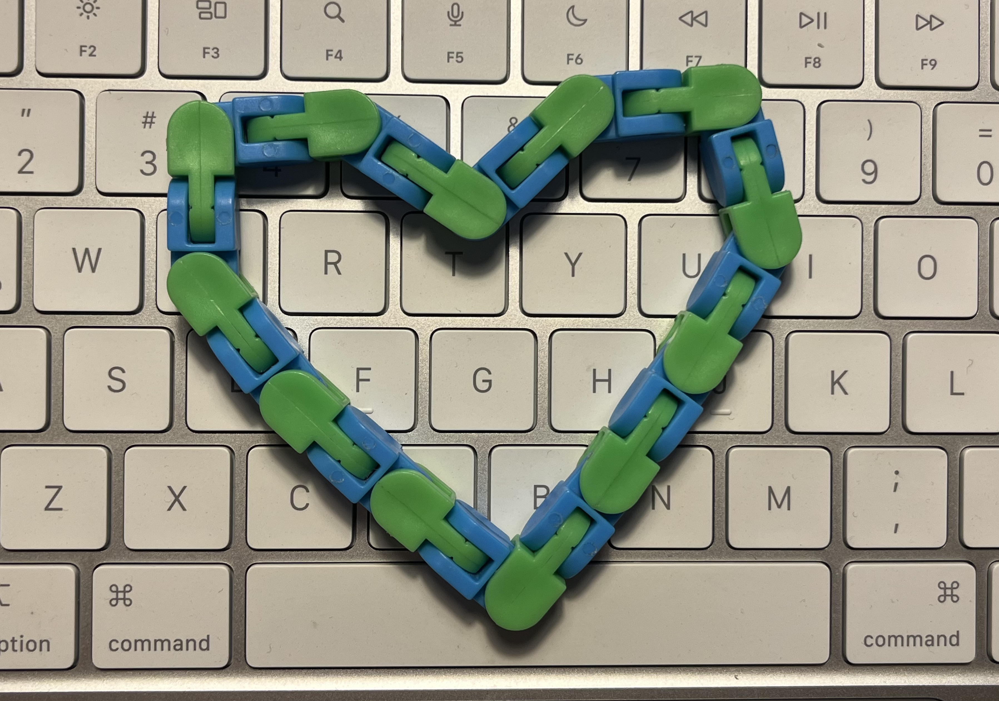

# sesion-06b

## apuntes sesión

## encargos
### elegir un objeto y analizarlo de forma aristotélica

un objeto cualquiera y verlo con los ojos de aristóteles, usando sus categorías para ordenar lo que digo de él.

es la misma lógica que vimos en clase con los atributos y métodos, pero llevada a la filosofía: aristóteles armó como diez formas distintas de decir algo sobre un objeto (qué es, cómo es, dónde está, qué hace, etc).

**categorías del ser**

> mi objeto: el fidget de eslabones 

+ **sustancia:** es un fidget toy, o sea, un juguete hecho para manipular con las manos, armado de piezas plásticas que se conectan entre sí.
+ **cantidad:** tiene como 12-14 eslabones, cada uno con dos colores: verde y celeste.
+ **cualidad:** es flexible, se dobla en distintos ángulos por cada conexión y es plástico liviano.
+ **relación:** se relaciona directo conmigo cuando estoy sobre estimulada, estresada o ansiosa. no tiene mucho sentido solo, existe en función de que yo lo use.
+ **lugar:** normalmente lo tengo en la cartera, bolsillo, al alcance de la mano.
+ **tiempo:** lo uso en los momentos en que lo necesito, no todo el rato. 
+ **posición/estado:** puede estar estirado en línea recta, doblado en zigzag, o armado en una forma, como un corazón.
+ **acción:** lo doblo, lo desarmo, lo vuelvo a acomodar, lo aprieto entre los dedos. la acción principal es manipularlo con las manos de forma repetitiva.
+ **pasión (lo que le hacen a él, no lo que hace):** yo lo tuerzo, lo estiro, lo curvo en distintas direcciones, cada eslabón cede un poco de presión.

## lectura
