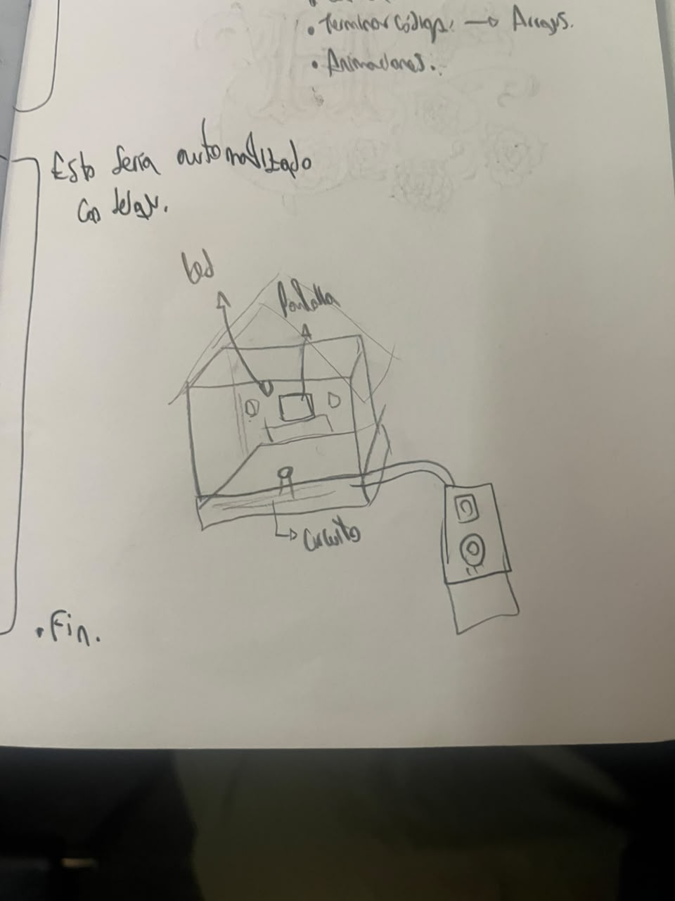
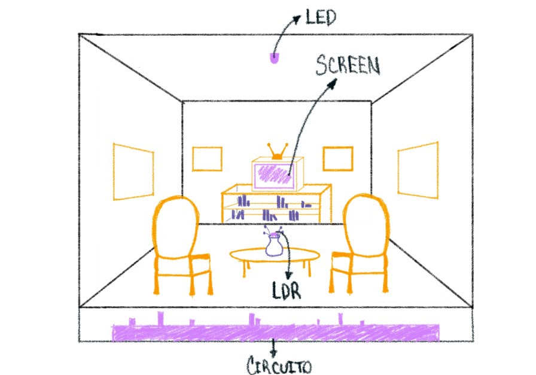
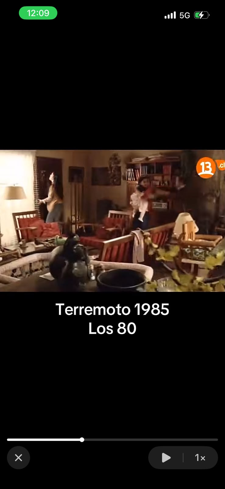
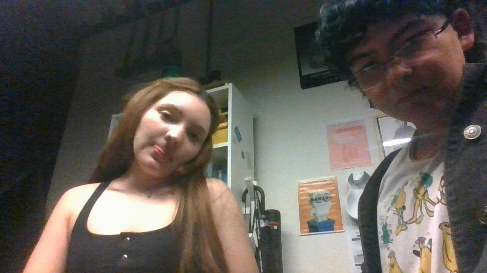
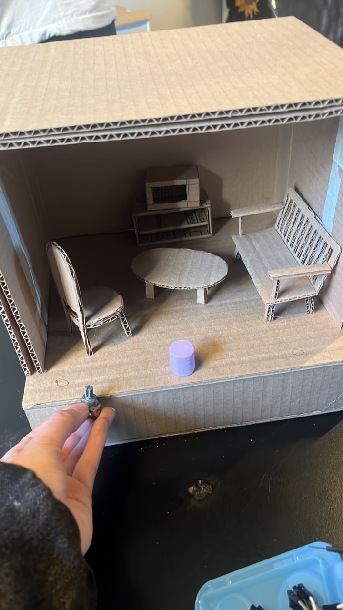
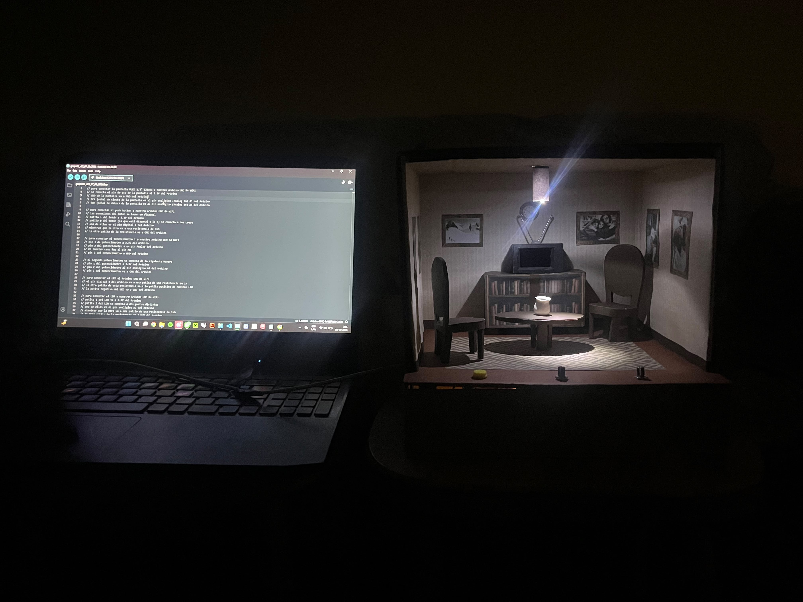

# sesion-04b

## apuntes sesión

Esta clase fue de avance, el Nico compró por la página la nueva pantalla que usamos, esta pantalla es más grande y tiene letras azules (Pantalla OLED gráfica monocromática de 1.3 pulgadas con controlador SSH1106), y la fue a retirar a la tienda para que no nos cobraran envío jiji, con el Santi no podíamos ir porque teníamos clases después de taller. También en esta clase intentamos entender cómo hacer animaciones (no nos resultó, era un spoiler de lo mucho que nos iba a costar y tartar hacerlas). Durante la clase no hicimmos mucho más pero nos organizamos para venir el fin de semana a la u.

Sábado, domingo y lunes:
Hice un croquis rápido para ver si estaba entendiendo el boceto del Santi para la estructuración de la maqueta ya qu ela iba a hacer yo

Boceto del Santi para la maqueta

Acá un video del Nico mostrándome que que ya funcionaba el LDR pero estaba muy sensible el umbral

Yo buscando referentes de casas de los 80 para inspirarme en la fabricación

Foto para el Santi para que no nos olvide y le vaya muy bien en su proyecto de título

Foto de la maqueta sin ser forrada aún

Primeras pruebas con todo ya funcionando bien

## encargos

## lectura
