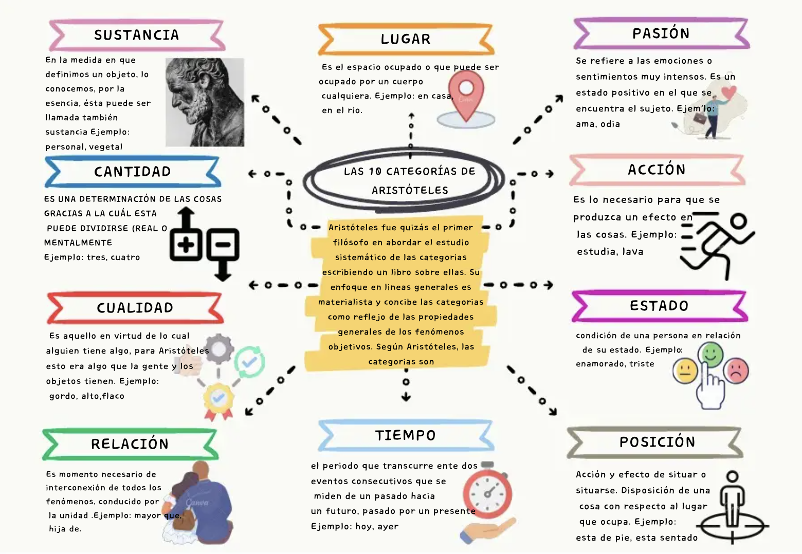

# sesion-06a → 22 septiembre

## apuntes sesión

int: variable que solo ve números, un tipo de elemento

ver una clase (Class) de programación llamada estudiante 

Es una plantilla

Con las clases se puden hacer dos cosas

 
Estos son los datos: sustantivos 

datos - humor

variables - programación

atributos

---

Esto es lo que hago con esos datos: verbos 

(...) acciones 

funciones

métodos 

---

class Perrite{

Atributos

bool hambre = true;

bool durmiendo = true;

int pelaje = #000000;

métodos: variables 

comer();

dormir();

cagar();

---

superclass
ejemplo minecraft: serian los enemigos de minecraf → atributos y métodos para interactuar con uno

la clase seria un perrito → hacerme cargo de que exista → mostrar lo que hace 

superclass → muestra el cómo lo hace, en base a funciones especificas 

tarea: plan z hagamos un asado 2001

Atributos:

- gatos
- accesorios
- velocidad (movimiento)
- maquillaje
- posicion
- ropa
- color pelo
- uñas

método:

- cuidar a los gatos
- ponerme anillos 
- andar en bicicleta 
- estar maquillada
- caminar
- vestirse 
- teñir pelo
- pintar las uñas

El método siempre tendran flechas que van a los atributos (datos)

## encargos

viernes 25-09: 

- seleccionar un objeto y clasificarlo según las categorías del ser de aristóteles 

Las categorías son como cajones para meter distintas descripciones de cualquier cosa que existe o que podemos pensar. 

Las 10 categorías del ser de aristóteles:

1. sustancia → ¿Qué es?
2. cantidad  → ¿Cuánto? ¿Cuántos?
3. calidad o cualidad  → ¿Cómo es? ¿Qué características tiene?
4. relación  → ¿Con qué se relaciona?
5. lugar → ¿Dónde está?
6. tiempo  → ¿Cuándo?
7. posición  → ¿Cómo está dispuesto o colocado?
8. estado  → ¿Qué tiene puesto o de qué está provisto?
9. acción  → ¿Qué hace?
10. pasión  → ¿Qué recibe o qué le hacen?
    
Es como mirar cualquier cosa y desmenuzarla en sus maneras de aparecer en el mundo.

Informacion sacada de → <https://filosofia.net/piezas/categorias.htm> y <https://encyclopaedia.herdereditorial.com/wiki/Recurso%3AArist%C3%B3teles%3A_las_categor%C3%ADas>

imagen sacada de → https://es.scribd.com/document/857431863/CATEGORIAS-DE-ARISTOTELES

### Objeto seleccionado 1 → MacBook (material y funcional)

1. sustancia → computador portátil
2. cantidad → una unidad
3. calidad o cualidad → color azul marino, diseño delgado y portátil, superficie metalica, diseño minimalista, pantalla de alta resolución
4. relación → herramienta central para diseño gráfico, universidad, práctica y comunicaciones de uso perosnal 
5. lugar → mi escritorio, espacio de trabajo y universidad 
6. tiempo → durante clases, proyectos o tu práctica profesional
7. posición → abierta frente a mi, cerrada cuando no la ocupo
8. estado → nueva con poco desgaste por el uso
9. acción → diseñar, escribir, editar, presentar
10. pasión →  actualizaciones, archivos que guardo, atajos de teclado 

### Objeto seleccionado 2 → delineado maquillaje (personal y estético)

1. sustancia → delineado de ojos en forma de gato
2. cantidad →  dos delineados, uno en cada ojo, su tamaño y grosor pueden variar
3. calidad o cualidad → color negro, trazo definido, forma alargada, terminación puntiaguda, expresivo
4. relación → se vincula con mi identidad, mi estética y cómo quiero presentarme ante otros
5. lugar → se encuentra sobre mis párpados, es decir, en mis ojos
6. tiempo → lo realizo diariamente, antes de salir de mi casa o para clases o actividades
7. posición → se aplica siguiendo la forma del ojo y se extiende hacia afuera formando la cola típica del delineado de gato
8. estado → un elemento que llevo puesto y que forma parte de mi apariencia durante el día
9. acción → define y resalta los ojos; además, es algo que yo realizo, lo aplico cada día
10. pasión → puede ser retocado, desmaquillado o alterado durante el transcurso del día.

---

martes 29-09:

- bajar una red social e investigar que piensa esa red de mi, cuál es mi algoritmo
(listar 10 categorías que deciden qué y quién eres)

- algoritmo de instagram, pedirlo para saber quien soy segun la empresa en atributos (para vendernos cosas)
 
- categorías sobre la interpretación (10)

Links vistos en clases:

<https://www.tinkercad.com/>

<https://wokwi.com/>

<https://wokwi.com/projects/298013072042230285>

## lectura

Libro: A New Program for Graphic Design

Autor: David Reinfurt

El libro está dividido en 3 grandes capítulos.

I. T--Y-P-O-G-R-A-P-H-Y

II. G-E-S-T-A-L-T

III. I-N-T-E-R-F-A-C-E

BLOQUE 4 — Typography: Warde (cont.), fototipografía y Moholy-Nagy (pp. 40-52)

1. Análisis

- Warde compara la tipografía con una copa de cristal: si te importa el contenido, elegís la que no le pone nada encima. Diseño invisible no es ausencia de diseño, es no competir con lo que transmite.
  
- La Assignment 1 hace vivir en el cuerpo lo que Warde predicaba: armar tipos a mano para imprimir un texto sobre "invisibilidad" tipográfica.

- Farewell, Etaoin Shrdlu muestra el apagón de una tecnología de 500 años. Lo fuerte es la voz de los operarios, tristes pero también aliviados: el cambio tecnológico también es pérdida de trabajo, no solo progreso.

 - Linotype y Monotype prueban que cada letra impresa fue, por un siglo, plomo caliente fundido. La letra digital de hoy hereda esa lógica de piezas sueltas.
   
- La fototipografía es un parche: cambia plomo por luz, pero nunca se estabiliza como sistema comercial. Tecnología de transición, ni vieja ni nueva.
  
- Moholy-Nagy usa la letra como imagen: su tipo "mal puesto" para que impreso se vea bien muestra que la letra siempre es construcción técnica, no forma natural.
  
- Sus fotogramas y el Light Prop tratan la luz como material de diseño, igual que el plomo o el papel: la misma pregunta de todo el bloque, qué pasa con la tipografía cuando cambia su soporte.

2. Glosario

| Término (IMGLÉS) | Traducción (ESPAÑOL) | Explicación |
|---|---|---|
| Letterpress | Tipografía (impresión con tipos) | Imprimir con tipos de metal entintados. |
| Linotype | Linotipia | Máquina que funde líneas completas de plomo. |
| Monotype | Monotipia | Máquina que funde letras sueltas de plomo. |
| Phototypesetting | Fotocomposición | Composición de texto usando luz sobre película. |
| Camera-ready | Listo para imprenta | Material ya preparado para pasar directo a placa. |
| Photogram | Fotograma | Imagen hecha poniendo un objeto sobre papel sensible a la luz. |
| Kinetic sculpture | Escultura cinética | Escultura con partes que se mueven, a veces con motor. |
| Stereotype (mat) | Estereotipo / matriz | Molde curvo usado para imprimir en rotativas. |

3. Citas

Cita 1 (p. 40)

INGLÉS: "This is a printing office, crossroads of civilization, refuge of all the arts against the ravages of time, armory of fearless truth against whispering rumor... Friend, you stand on sacred ground. This is a printing office."

ESPAÑOL: "Esto es una imprenta, cruce de caminos de la civilización, refugio de todas las artes contra los estragos del tiempo, arsenal de la verdad sin miedo contra el rumor susurrado... Amigo, estás parado en terreno sagrado. Esto es una imprenta."

Análisis: Warde no habla de estética, habla de función social: la imprenta como lugar que fija la verdad frente al rumor. Es una defensa del diseño gráfico como infraestructura de confianza pública, no como adorno.

Cita 2 (p. 40)

INGLÉS: "If you're a member of that vanishing tribe, the amateurs of fine vintages, you will choose the crystal, because everything about it is calculated to reveal rather than hide the beautiful thing which it was meant to contain."

ESPAÑOL: "Si sos parte de esa tribu en extinción, los amantes de los buenos vinos, vas a elegir la copa de cristal, porque todo en ella está calculado para revelar, y no esconder, la cosa hermosa que estaba destinada a contener."

Análisis: Acá está la tesis completa de Warde: buen diseño es el que no le roba protagonismo al contenido. Aplicado a tipografía, significa que la letra ideal es la que casi no se nota mientras cumple su función.

Cita 3 (p. 43)

INGLÉS: "Schlesinger: We are fast approaching press time for the first edition of tomorrow morning's paper... Makeup man: I find it very sad. Very sad... And I think probably most jobs are going to end up the same way."

ESPAÑOL: "Schlesinger: Se acerca rápido la hora de cierre para la primera edición del diario de mañana... Makeup man: Me parece muy triste. Muy triste... Y creo que probablemente la mayoría de los trabajos van a terminar igual."

Análisis: Es el testimonio real de un trabajador viendo desaparecer su oficio frente a la computadora. Reinfurt lo deja hablar sin comentario extra: el cambio tecnológico en diseño gráfico no es solo progreso, también es pérdida de trabajo y de saber-hacer.
