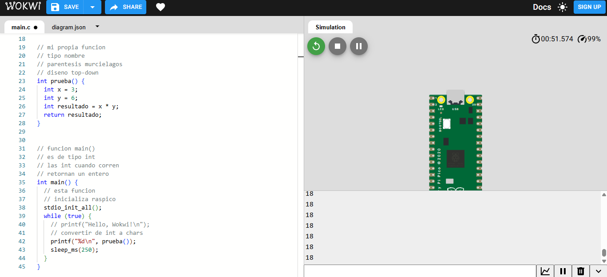

# sesion-06b

viernes 2026-09-25

## apuntes sesión

empezamos hablando del encargo pasado **"elegir un objeto y analizarlo bajo Las categorías de Aristóteles"**

- uno puede elegir como describir cada objeto
- en cantidad no necesariamente son las dimensiones del objeto, también puede ser cantidad de cuantos objetos tienes disponibles a tu dispocisión
- en cualidad se pude describir a tu modo/gusto (elegir que tanto puedes describir las caracteristicas fisicas del objeto)


### ejemplo de compañera visto en clases:
   - sustancia: miTermo
   - cantidad: 800ml (cantidad aproximada de contenido liquido y támbien se puede poner 1, ya que es solo un termo y no una colección)
   - cualidad: blanco, metálico/acero inoxidable (¿Qué tan inoxidable?), térmico (¿Qué tan termico?)
   - relación: contenedor de té (¿Qué té?)
   - lugar: es relativo, uno puede poner el lugar que quiera o estime (favorito conmigo a mi la izquierda de mi manito)
   - tiempo: ahora (¿Qué significa ahora? siempre conmigo)
   - posición: adecuado
   - posesión: líquido (contenedor de 800ml o ¿De quién es?)
   - acción: mantener frío o calor del líquido que contenga
   - pasión: al ser un objeto inanimado no tiene pasión, ya que no se le puede preguntar


### ejercicio en wokwi


```cpp

// copia y pega ese archivo
// ojo que esta entre <>
// este archivo esta en un lugar lejano
// que tiene que ver con C
#include <stdio.h>
// este otro esta entre ""
// entre "" es literalmente
// en ese lugar
// en este caso
// al lado de este archivo
// hay una carpeta pico/
// y adentro esta stdlib.h
#include "pico/stdlib.h"


// mi propia funcion
// tipo nombre
// parentesis murcielagos
// diseno top-down
int prueba() {
  int x = 3;
  int y = 6;
  int resultado = x * y;
  return resultado;
}


// funcion main()
// es de tipo int
// las int cuando corren
// retornan un entero
int main() {
  // esta funcion
  // inicializa raspico
  stdio_init_all();
  while (true) {
    // printf("Hello, Wokwi!\n");
    // convertir de int a chars
    printf("%d\n", prueba());
    sleep_ms(250);
  }
}
```

captura de pantalla de wokwi



## encargos

## lectura
