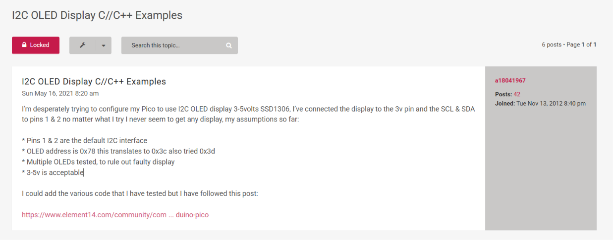

# sesion-04a

## apuntes clase 01/09

> hexorcismo. queremos menos bombas.

_akai_ -> rojo en japonés
_mpc_ -> music production center

## trabajo en proyecto 01

como ya habíamos logrado hacer cambios en el código de ejemplo de Adafruit, nos confiamos y decidimos probar cambiar de Arduino a Raspberry, por lo que conectamos la Raspberry Pi Pico 2W y decidimos probar el código de ejemplo de Adafruit (original, sin los cambios que habíamos realizado durante la semana) y nos dimos cuenta de que no pasaba nada. como no entendíamos, Seba se acercó a nosotros y nos dijo que no iba a funcionar ya que el ejemplo de Adafruit estaba hecho para Arduino, no para Raspis.

como el código de ejemplo no nos funcionaba en el microcontrolador que queríamos usar, decidimos buscar en internet algún ejemplo para este pero todo lo que encontrábamos era en base a _MicroPython_, y lo que pillamos sobre C++ eran problemas como el siguiente: <https://forums.raspberrypi.com/viewtopic.php>, en donde se menciona que a pesar de hacer las conexiones de manera correcta, no se logra mostrar ningún display dentro de la pantalla.

cuando ya habíamos usado más de media hora en esto, Seba nos recomendó soltar el sueño de cambiar a la Raspberry Pi Pico 2W y seguir trabajando con lo que ya teníamos (Arduino R4 WiFi) para poder llegar bien a la entrega y no pasarla mal tratando de hacer algo que aún no nos pedían (Seba the goat).

el resto del día nos dedicamos a trabajar en el proyecto, lo cual se puede ver en el siguiente repo: <https://github.com/nicolasvaldesgreve/dis8645-2026-2-procesos-1/tree/main/00-proyecto-1/grupo-02/codigos/2026-09-01>

---

## lectura: Program Or Be Programmed: Ten Commands for a Digital Age - Douglas Rushkoff

"Anytime anyone or anything wants to message, email, tweet, update, notify, or alert us, something dings on our desktop or vibrates in our pocket. Our devices and, by extension, our nervous systems are now a" ached to the entire online universe, all the time. Is that my phone vibrating?" cada vez que leo cosas de este estilo (que me hacen más consciente del efecto que causan en nuestro cuerpo las nuevas tecnologías al utilizarlas de manera tan cotidiana) me da un poco de miedo(? ya que creo que es algo que no quiero pensar tanto, pero esto debiese de ser todo lo contrario ya que el estar consciente y reflexionar en esto es lo que todos deberíamos estar haciendo, no? no sé si la acción correcta sea el dejar de lado estos dispositivos, sino que deberíamos de controlar de mejor manera el cómo estos nos afectan a nivel personal(? me thinks…

"We have no time to make considered responses, feeling instead obligated to reply to every incoming message on impulse." #real LOL honestamente que pena el pensar en que pasamos de nosotros controlar el cuando veíamos toda la información que nos llegaba a ahora ser nosotros los controlados sobre el momento en el que nos llegan las cosas, ya que debido a la eficiencia de la tecnología digital (honestamente muy bueno pero que lata) la información nos llega de inmediato, haciendo casi imposible el no notar su llegada lo cual nos obliga a tener que reaccionar a esto con la misma inmediatez con la que llegó a nosotros #momossad.
