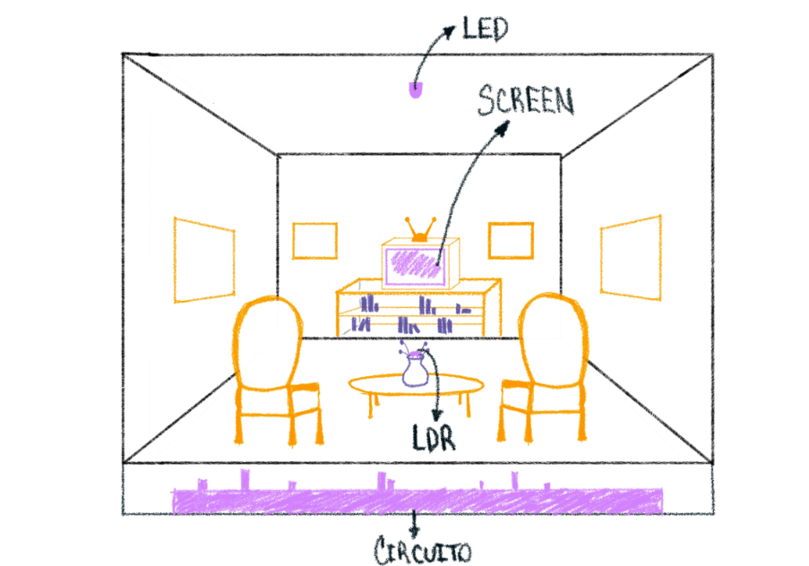

# sesion-04b

## apuntes clase 04/09

semana dedicada de manera completa a trabajo grupal!! durante la semana con mi grupo estuvimos yendo a trabajar a la biblioteca Nicanor Parra ya que a nuestro compañero (Santi) le encanta trabajar ahí lololololol.

como avance en código hemos agregado el segundo poema, el cual se mostrará mediante un potenciómetro (pote2) el cual dependiendo de su valor mostrará poema1 o poemaLuz! solo se muestra poemaLuz al pasar el umbral de 100 (teniendo el rango de 0–1023), para así poder mostrar poemaLuz solo cuando la resistencia del potenciómetro esté baja, ya que este en un futuro controlará un LED que cuando esté encendido en su mayor esplendor será señal de que estamos mostrando poema1, mientras que cuando esté con su intensidad baja será señal de que se muestra poemaLuz.

en el caso de la carcasa, Santi hizo un croquis sobre cómo se vería esta para poder empezar a trabajar en la construcción lo antes posible!! se ve así:

como estamos enfocados en el avance del proyecto, no hay tiempo para poder documentar todo en las bitácoras personales, pero pueden ver todo el avance de esta fecha en el siguiente repo: <https://github.com/nicolasvaldesgreve/dis8645-2026-2-procesos-1/tree/main/00-proyecto-1/grupo-02/codigos/2026-09-04> :)

---

## lectura: Program Or Be Programmed: Ten Commands for a Digital Age - Douglas Rushkoff

"Try as we might, we are slow to adapt to the random flood of pings. And our nervous systems are not happy with this arrangement." a todos nos pasa que a veces sentimos nuestros celulares vibrar como señal de que llegó una notificación, pero al momento de revisar notamos de que no ha llegado nada y solo fue nuestra imaginación? mama i'm scared.

"Cell phone users now complain of “phantom vibration syndrome,” the sensation of a cell phone vibrating on your thigh, even though there’s no phone in your pocket." OMG ES LO QUE DECÍA ANTES QAKSFHKAFHPAFJS MIEDOOO LOL.

"So instead of simply offloading our memory to external hard drives, we’re beginning to offload our thinking as well." is this play about us? lololol esto es completamente lo que está sucediendo con las personas y la IA!! entiendo que hay personas que lo usan por motivos educativos y logran aprender gracias a esta, pero hay personas que genuinamente no intentan ni siquiera el entender lo que están haciendo cuando le mandan proyectos o problemas a la IA para que esta resuelva las cosas(??? estas mismas personas eventualmente van a perder su autonomía y habilidad de poder pensar y resolver cosas por si mismos lol.
