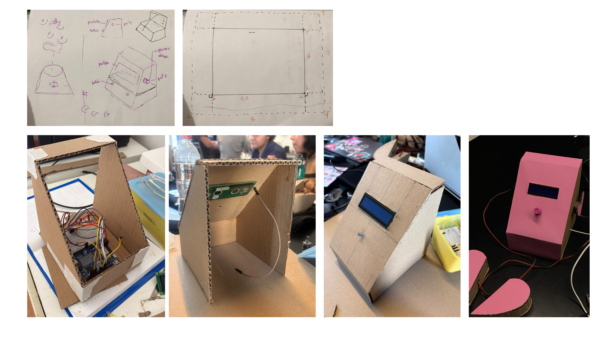

# sesion-04b

## apuntes sesión

## última clase antes de la entrega: afinando algunas cosas

en esta última clase antes de la entrega empezamos a afinar algunas cosas:

- ajustes de delay
- ajustes de pantalla
- asignarle tiempo a los botones

estas son las cosas que fui aprendiendo.

### ajustes de delay

el delay es lo que define el ritmo con el que el texto se mueve. en el loop normal (sin botones presionados), el delay que controla el scroll del verso actual se calcula con `map()` a partir de la lectura del potenciómetro (`poteFiltrado`), en vez de ser un número fijo:

- si el pote está sobre 135, avanza, y el delay se mapea entre 600 ms (lento) y 50 ms (rápido) a medida que el pote sube hasta 255.
- si el pote está bajo 120, retrocede, con la misma lógica pero en reversa.
- entre 121 y 134 queda una "zona muerta": no avanza ni retrocede, y el delay se fija en 200 ms de espera.

esto evita que con cualquier micro-movimiento del pote el texto tiemble entre avanzar y retroceder.

aparte de ese delay dinámico, hay delays fijos para los textos de introducción (licencia, título, autora): 4000 ms para dar tiempo a leer cada pantalla completa, y 500 ms por paso en el scroll del título cuando es más largo que 16 caracteres (con una pausa más larga, 2000 ms, en el primer cuadro, para que se alcance a empezar a leer antes de que se mueva).

para el estado de "dos botones presionados", también se ajustaron delays específicos: si se soltaron los dos botones después de un toque corto (menos de 1200 ms), se agrega una pausa de 3000 ms (si venía de mostrar la palabra clave) o 2000 ms (si venía de retomar el modo normal), para que la palabra clave alcance a leerse antes de que la pantalla cambie.

encontré esto en mis anotaciones donde cami explicaba algunas cosas, e intenté hacer un mejor resumen para poder entenderlo mejor.

### asignarle tiempo a los botones


acá es donde se define la máquina de estados de los botones, con `estadoActual` (0 = normal, 1 = un botón, 2 = dos botones) y una marca de tiempo `tiempoInicioDosBotones = millis()` que se guarda apenas se detecta que ambos botones quedan presionados:

```cpp
if (b1 && b2) {
  if (estadoActual != 2) {
    estadoActual = 2;
    tiempoInicioDosBotones = millis();
    lcd.clear();
    posNuevoPoema = 0;
    lastScrollNuevoPoema = millis();
  }

  unsigned long tiempoPresionado = millis() - tiempoInicioDosBotones;

  if (tiempoPresionado < 1000) { 
    // Acción A: menos de 1 segundo → muestra la palabra clave del verso actual
    ...
  } else { 
    // Acción B: más de 1 segundo → poema nuevo hecho de palabras clave, con scroll propio
    ...
  }
}
```

### aprendizajes y agradecimientos

luego de aprender a ocupar el chart, el delay, agregar los millis, ir probando, asignar variables, y aprender a asignar tiempo al potenciómetro y a conectar cables, le agradezco a mi grupo por ir enseñándome cada cosa de a poco e integrar cada idea que tenía.

### carcasa

luego me tocó hacer la carcasa. agregaré fotos de los dibujos iniciales, las medidas, y el resultado final.




## encargos

## lectura
